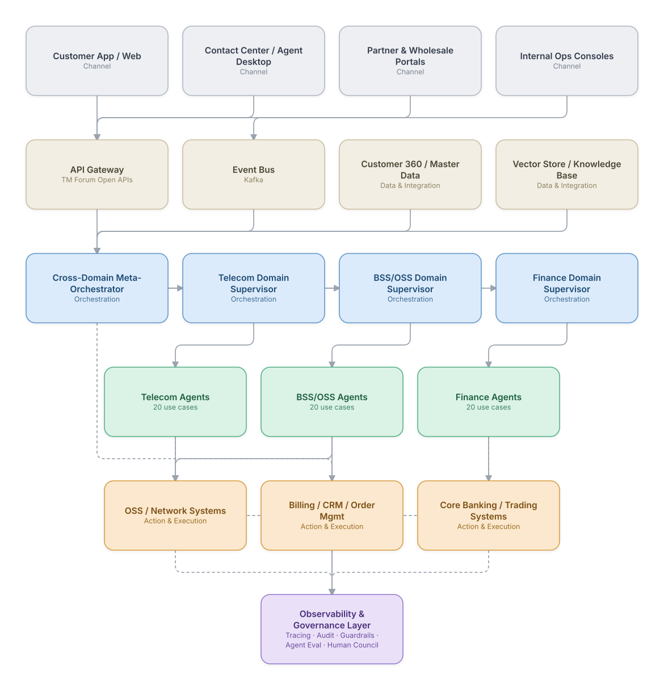

# E2E Platform Reference Architecture

Every use case in this catalog is a slice of one underlying platform shape. This document zooms out to the
full picture: how channels, orchestration, the agent mesh, systems of record, and observability/governance fit
together across all three domains (Telecom, BSS/OSS, Financial Services) at once.

It uses the same five-layer visual language as every individual use case diagram in `docs/`, so once you're
oriented here, every per-use-case diagram reads the same way.

## The layers

| Layer | What lives here | Why it's separated out |
|---|---|---|
| **Channel / Experience** | Customer apps, contact-center/agent desktops, partner & wholesale portals, internal ops consoles | Where a request enters the platform — decoupled from how it gets resolved |
| **Data & Integration** | API gateway (TM Forum Open APIs, REST), event bus (Kafka), Customer 360/MDM, vector store / knowledge base | The shared nervous system every agent reads from and writes to, so agents aren't each wiring up their own integrations |
| **Orchestration** | Per-domain supervisors (Telecom, BSS/OSS, Finance) plus a cross-domain meta-orchestrator for requests that span domains (e.g., a churn save that touches both a network SLA credit and a billing adjustment) | Keeps routing/coordination logic in one place per domain instead of scattered across agents |
| **Agent Mesh** | The 60 use cases in this catalog, grouped by domain — each internally following one of the 8 architecture patterns documented in `patterns/` | The actual specialist reasoning and decisioning work |
| **Action & Execution** | OSS/network systems, billing/CRM/order management, core banking/trading systems — the systems of record everything ultimately writes to | Where agent decisions become real-world effects |
| **Observability & Governance** *(cross-cutting)* | Tracing/telemetry, immutable audit log, guardrail/policy engine, agent evaluation & drift monitoring, and a human governance council for policy exceptions | Applies uniformly across every other layer — this is what makes 60+ autonomous/semi-autonomous agents operable and auditable at once, not just individually correct |

## Diagram

*(A [Mermaid text source](e2e-platform-architecture.mmd) of the same structure is not maintained separately for
this diagram — it's a one-off reference view rather than a generated per-use-case artifact. To edit it, change
`scripts/svg_patterns.py::e2e_platform()` and re-run `python3 scripts/build.py`.)*

## Technology reference per layer

| Layer | Representative technology choices used across this catalog |
|---|---|
| Channel / Experience | React/Next.js self-service portals, Genesys Cloud / Amazon Connect, Salesforce Service Cloud agent desktop |
| Data & Integration | TM Forum Open APIs (TMF620/629/638/641), Kafka event bus, Informatica MDM / Reltio (Customer 360), pgvector/Weaviate (knowledge base) |
| Orchestration | LangGraph supervisor graphs (per-domain), Temporal for durable long-running workflows, a thin meta-orchestrator for cross-domain requests |
| Agent Mesh | Claude for reasoning/synthesis/generation steps; deterministic rules engines and validated quantitative models for anything financial/regulatory (a repeated, deliberate pattern throughout this catalog — see individual retrospectives) |
| Action & Execution | OSS activation systems, billing/CRM/order management platforms, core banking and trading systems, all reached via each domain's native APIs rather than direct database access |
| Observability & Governance | OpenTelemetry tracing, immutable audit logging, a policy/guardrail engine that gates high-risk agent actions, ongoing agent evaluation/drift monitoring, and a human governance council for anything a guardrail can't resolve automatically |

## How this maps to individual use cases

Each of the 60 use case diagrams in `docs/telecom/`, `docs/bssoss/`, and `docs/finance/` is a zoomed-in view of one
slice through **L2 → L3 → L4 (+ OBS)** above, using whichever of the 8 [architecture patterns](../../patterns/)
fits that specific problem. The Observability & Governance layer is not optional per use case — it's the same
cross-cutting concern shown here, repeated at the use-case level so each diagram is self-contained.

---
[← Back to home](../../README.md)
