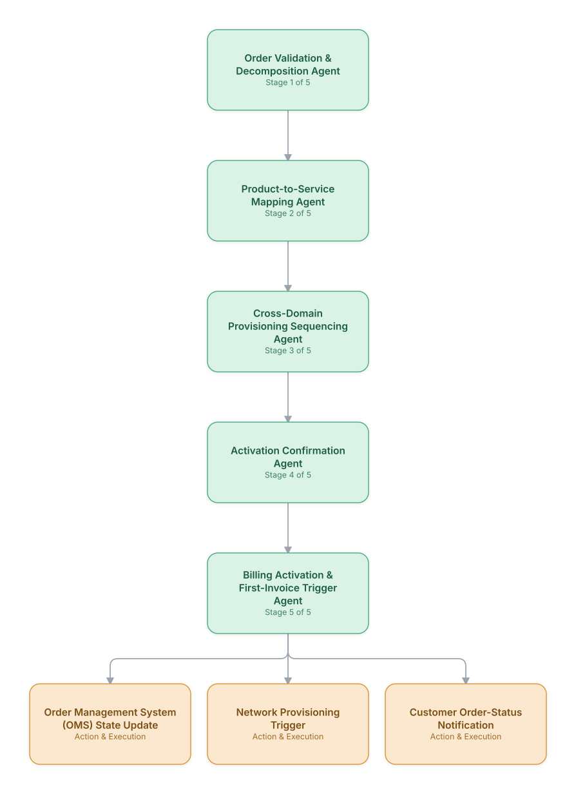

# 01. Order-to-Activation Orchestration

**Domain:** BSS/OSS &nbsp;|&nbsp; **Architecture pattern:** [Sequential Pipeline]({{ '/patterns/pipeline/' | relative_url }})

> 🧠 **Deep dive available:** this use case also has a full [8-Layer Regenerative Architecture breakdown]({{ '/deep8/bssoss/01-order-to-activation-orchestration/' | relative_url }}) — the same problem mapped through L1–L8, with an agent-level tools/technologies stack and a suggested build order by layer.

## 1. Problem Statement & Use Case

A single customer order (e.g., broadband + mobile bundle with a new router) fans out into dozens of downstream tasks across CRM, product catalog, provisioning, network activation, and billing systems. Order orchestration engines today are largely static workflow engines that break silently when a product combination or a network element behaves unexpectedly, leaving orders stuck in fallout queues for days. An agentic order orchestrator can reason about failures in context and self-correct rather than just halting.

## 2. End-to-End Multi-Agent Architecture

The solution is implemented as a **Sequential Pipeline** architecture. 
### 2.1 Agents & Sub-Agents

| Agent | Responsibility |
|---|---|
| Order Validation & Decomposition Agent | Validates the order against catalog rules and decomposes it into an ordered set of fulfillment tasks |
| Product-to-Service Mapping Agent | Maps commercial product/offer definitions to the technical service specifications each system needs |
| Cross-Domain Provisioning Sequencing Agent | Determines the correct execution order across CRM/network/billing to avoid race conditions (e.g., number must be ported before SIM activation) |
| Activation Confirmation Agent | Confirms successful activation at each domain and reconciles partial failures |
| Billing Activation Agent | Triggers billing-plan activation and proration only once service is confirmed live |

### 2.2 Architecture Diagram

> This diagram is organized as a **layered architecture**: Data &amp; Integration → Orchestration → Agent →
> Action &amp; Execution, plus a cross-cutting Observability &amp; Governance layer (tracing, audit log,
> guardrails, and any human review checkpoint — shown in lavender). See the
> [E2E Platform Architecture]({{ '/architecture/e2e-platform-architecture/' | relative_url }}) for how this
> layering looks across all 60 use cases at once. A [Mermaid text source](architecture.mmd) of the same
> diagram is also available in this folder.

## 3. Technologies Used (per step)

| Step / Layer | Technology |
|---|---|
| Order capture | CRM/eCommerce front-end (Salesforce Industries / Amdocs CRM) |
| Product catalog | TM Forum SID-based product catalog (Amdocs/Netcracker Catalog) |
| Orchestration engine | Temporal workflow with agent-based decision steps at each stage |
| Provisioning APIs | TM Forum Open API (TMF641 Service Ordering) calls into OSS activation systems |
| LLM reasoning | Claude for fallout diagnosis and next-best-recovery-action reasoning at each stage |
| State tracking | Order state machine persisted in a durable workflow store (Temporal/Camunda) |
| Notification | Customer status updates via SMS/app push tied to order milestones |
| Observability | End-to-end order tracing (OpenTelemetry) across all downstream systems |

## 4. Suggested Build Order

**Phase 1 — the first two stages only.** Get Order Validation & Decomposition Agent feeding Product-to-Service Mapping Agent correctly, with the rest of the pipeline stubbed out. Durability matters more than completeness here — make sure a crash mid-pipeline doesn't lose or duplicate work.

**Phase 2 — the full chain.** Add the remaining 3 stages in order, testing each newly-added stage against real output from the stage before it, not synthetic test data.

**Phase 3 — add retry and partial-failure handling.** Decide, stage by stage, what happens when that specific stage fails: retry, skip, or halt the whole pipeline. This decision is different per stage and shouldn't be a single global policy.

**Phase 4 — observability and feedback.** Add per-stage tracing so a slow or wrong pipeline run can be attributed to one specific stage, and track output quality over time to catch silent degradation in an early stage before it compounds downstream.

## 5. If We Rebuilt This: What Would Improve

- Kept strict sequential staging (not parallel) after an early parallel-execution prototype created race conditions between number-porting and SIM activation — order matters more than speed here.
- Would add a fallout-pattern library from day one; the same handful of failure signatures (address mismatch, duplicate MSISDN, catalog version drift) accounted for most fallout and could have been auto-resolved sooner.
- Customers valued milestone-level status updates far more than a single 'processing' message — added granular status mapping after early NPS feedback.
- Would separate 'diagnose' and 'auto-fix' permissions per stage; early version let the agent both diagnose and silently retry indefinitely on some failure types, masking systemic catalog bugs.

> ⚙️ **Built with the AI-Regenesis engine.** Every diagram and build order on this page was generated from a
> compact spec by the same engine packaged as the free
> [`quick-reference-engine` skill]({{ '/skills/#quick-reference-engine' | relative_url }}) — drop your
> own use case in and get the same output.

---
[← Back to BSS/OSS index]({{ '/bssoss/' | relative_url }}) &nbsp;|&nbsp; [← Back to home]({{ '/' | relative_url }})
