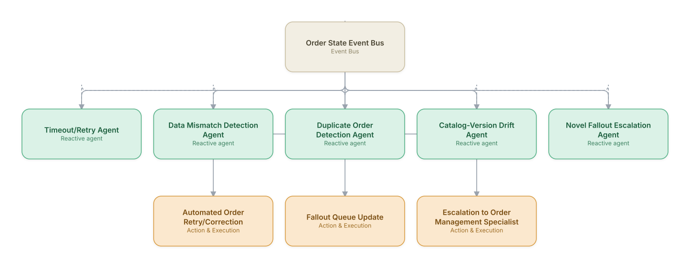

# 04. Order Fallout Detection & Auto-Recovery

**Domain:** BSS/OSS &nbsp;|&nbsp; **Architecture pattern:** [Event-Driven Reactive Swarm]({{ '/patterns/event-swarm/' | relative_url }})

> 🧠 **Deep dive available:** this use case also has a full [8-Layer Regenerative Architecture breakdown]({{ '/deep8/bssoss/04-order-fallout-detection-recovery/' | relative_url }}) — the same problem mapped through L1–L8, with an agent-level tools/technologies stack and a suggested build order by layer.

## 1. Problem Statement & Use Case

Orders that stall mid-fulfillment ('fallout') due to system timeouts, data mismatches, or catalog/network inconsistencies pile up in manual work queues, delaying customer activations for days. Most fallout falls into a small number of recurring, well-understood patterns that a swarm of reactive agents can detect and resolve automatically the moment an order-state event indicates trouble, rather than waiting for a nightly batch report.

## 2. End-to-End Multi-Agent Architecture

The solution is implemented as a **Event-Driven Reactive Swarm** architecture. 
### 2.1 Agents & Sub-Agents

| Agent | Responsibility |
|---|---|
| Timeout/Retry Agent | Detects orders stalled on a downstream system timeout and retries with backoff before escalating |
| Data Mismatch Detection Agent | Identifies field-level mismatches (address format, MSISDN format) between systems causing rejection |
| Duplicate Order Detection Agent | Detects and merges duplicate orders created by customer retries or channel double-submission |
| Catalog-Version Drift Agent | Flags fallout caused by a catalog change that orphaned in-flight orders on the old version |
| Novel Fallout Escalation Agent | Recognizes fallout patterns not matching any known signature and routes to a human specialist with full context |

### 2.2 Architecture Diagram

> This diagram is organized as a **layered architecture**: Data &amp; Integration → Orchestration → Agent →
> Action &amp; Execution, plus a cross-cutting Observability &amp; Governance layer (tracing, audit log,
> guardrails, and any human review checkpoint — shown in lavender). See the
> [E2E Platform Architecture]({{ '/architecture/e2e-platform-architecture/' | relative_url }}) for how this
> layering looks across all 60 use cases at once. A [Mermaid text source](architecture.mmd) of the same
> diagram is also available in this folder.

## 3. Technologies Used (per step)

| Step / Layer | Technology |
|---|---|
| Event bus | Kafka topics per order-state transition |
| Agent runtime | Event-driven microservices (Python asyncio) per fallout-pattern agent |
| Pattern matching | Rules engine for known fallout signatures + embedding-similarity search against historical resolved cases |
| Data correction | Tool-calling into CRM/OMS APIs for approved auto-correction actions |
| Novelty detection | Anomaly scoring on fallout event feature vectors to catch unseen patterns |
| Escalation | Structured case handoff to order management specialists via ServiceNow/Jira |
| Guardrails | Retry-count caps and blast-radius limits per correction type |
| Analytics | Fallout-rate and auto-resolution-rate dashboard by fallout category |

## 4. Suggested Build Order

**Phase 1 — one reactive agent.** Get Timeout/Retry Agent subscribed to Order State Event Bus and reacting to real events, with no other agents listening yet. Prove the event-driven mechanics work under real event volume before adding more subscribers.

**Phase 2 — add the remaining agents.** Bring Data Mismatch Detection Agent, Duplicate Order Detection Agent, Catalog-Version Drift Agent, Novel Fallout Escalation Agent online as independent subscribers. Test what happens when multiple agents react to the *same* event — this is where swarm-specific bugs (duplicate actions, conflicting responses) show up.

**Phase 3 — add rate limits and blast-radius guardrails.** A reactive swarm with no shared coordination can act on the same trigger repeatedly; add per-agent and global rate limits before connecting real downstream actions.

**Phase 4 — observability and feedback.** Add distributed tracing across the event bus so a cascading reaction across multiple agents can be reconstructed after the fact, not just guessed at.

## 5. If We Rebuilt This: What Would Improve

- Would add hard retry-count caps from day one — an early version retried a doomed order dozens of times against a permanently-broken downstream dependency before a cap was added.
- Catalog-version drift turned out to be a much bigger fallout driver than expected; would build this detector earlier rather than treating it as a rare edge case.
- Novel fallout escalation needed richer context handoff (full event history, not just the current state) — early escalations left specialists re-investigating from scratch.
- Would track auto-resolution accuracy per pattern type over time and auto-disable a pattern's automation if its false-fix rate rises, rather than assuming static reliability.

> ⚙️ **Built with the AI-Regenesis engine.** Every diagram and build order on this page was generated from a
> compact spec by the same engine packaged as the free
> [`quick-reference-engine` skill]({{ '/skills/#quick-reference-engine' | relative_url }}) — drop your
> own use case in and get the same output.

---
[← Back to BSS/OSS index]({{ '/bssoss/' | relative_url }}) &nbsp;|&nbsp; [← Back to home]({{ '/' | relative_url }})
