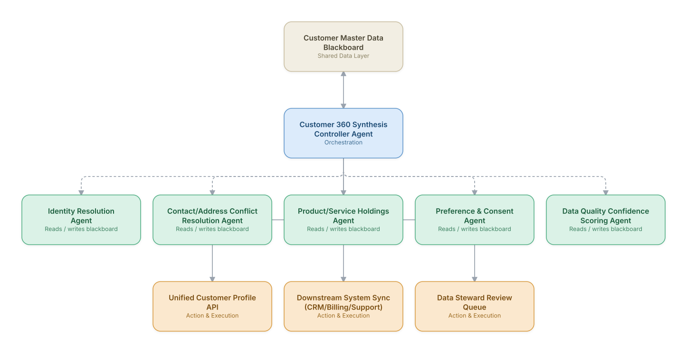

# 08. Customer 360 / Master Data Unification

**Domain:** BSS/OSS &nbsp;|&nbsp; **Architecture pattern:** [Blackboard / Shared-Memory]({{ '/patterns/blackboard/' | relative_url }})

> 🧠 **Deep dive available:** this use case also has a full [8-Layer Regenerative Architecture breakdown]({{ '/deep8/bssoss/08-customer-360-master-data-unification/' | relative_url }}) — the same problem mapped through L1–L8, with an agent-level tools/technologies stack and a suggested build order by layer.

## 1. Problem Statement & Use Case

Customer data is fragmented across CRM, billing, provisioning, loyalty, and support systems, each with its own partial and sometimes conflicting view of 'who this customer is.' Building a trustworthy unified customer profile in real time — needed for personalization, support, and fraud/risk decisions across many of this catalog's other use cases — requires synthesizing partial, conflicting evidence continuously as source systems change.

## 2. End-to-End Multi-Agent Architecture

The solution is implemented as a **Blackboard / Shared-Memory** architecture. 
### 2.1 Agents & Sub-Agents

| Agent | Responsibility |
|---|---|
| Customer 360 Synthesis Controller Agent | Watches the blackboard for new/conflicting source-system events and synthesizes the authoritative unified profile |
| Identity Resolution Agent | Resolves whether records across systems represent the same real-world customer/household |
| Contact/Address Conflict Resolution Agent | Determines the most current, trustworthy contact details when source systems disagree |
| Product/Service Holdings Agent | Maintains an accurate real-time view of everything the customer currently holds across product lines |
| Preference & Consent Agent | Consolidates marketing/communication consent and channel preferences, respecting the most restrictive valid consent |
| Data Quality Confidence Scoring Agent | Scores the overall profile's confidence/freshness so downstream consumers know how much to trust it |

### 2.2 Architecture Diagram

> This diagram is organized as a **layered architecture**: Data &amp; Integration → Orchestration → Agent →
> Action &amp; Execution, plus a cross-cutting Observability &amp; Governance layer (tracing, audit log,
> guardrails, and any human review checkpoint — shown in lavender). See the
> [E2E Platform Architecture]({{ '/architecture/e2e-platform-architecture/' | relative_url }}) for how this
> layering looks across all 60 use cases at once. A [Mermaid text source](architecture.mmd) of the same
> diagram is also available in this folder.

## 3. Technologies Used (per step)

| Step / Layer | Technology |
|---|---|
| Source systems | CRM, billing, provisioning, loyalty, and support platforms feeding change events |
| Blackboard store | Master data management platform (Informatica MDM/Reltio) as the shared entity store |
| Identity resolution | Probabilistic entity resolution (fuzzy matching + graph clustering) on customer identifiers |
| Controller reasoning | Claude synthesizing conflicting source-system evidence into a resolved profile field with a rationale |
| Consent management | Consent-tracking layer enforcing most-restrictive-wins logic for compliance (GDPR/TCPA) |
| Sync mechanism | Event-driven sync back to consuming systems via Kafka/CDC (change data capture) |
| API layer | TM Forum TMF629 Customer Management API exposing the unified profile |
| Governance | Data steward review workflow for low-confidence or high-impact conflicting fields |

## 4. Suggested Build Order

**Phase 1 — one agent writing to the blackboard.** Get Identity Resolution Agent reading and writing the shared store with Customer 360 Synthesis Controller Agent just reading it back out, no synthesis logic yet. Prove the shared-state read/write mechanics before adding more writers.

**Phase 2 — add the remaining agents.** Bring Contact/Address Conflict Resolution Agent, Product/Service Holdings Agent, Preference & Consent Agent, Data Quality Confidence Scoring Agent online, each writing independently to the blackboard. Build Customer 360 Synthesis Controller Agent's synthesis logic — deciding which agent to trigger next and how to combine partial, sometimes-conflicting findings.

**Phase 3 — add a minimum-evidence threshold.** An early blackboard system will over-synthesize from sparse data; require a minimum number of corroborating agent findings before the controller surfaces a conclusion.

**Phase 4 — observability and feedback.** Snapshot the blackboard's state history so any synthesized conclusion can be traced back to exactly which agent findings produced it.

## 5. If We Rebuilt This: What Would Improve

- Consent/preference conflicts needed a hard 'most restrictive wins' rule with no agent override — this was made non-negotiable after an early version optimistically resolved a consent conflict in favor of marketing reach.
- Identity resolution false-merges (incorrectly linking two different real customers) were far more damaging than false-splits, so would tune matching thresholds more conservatively from the start.
- Confidence scoring for the unified profile turned out to be as valuable to downstream consumers as the profile data itself — several other use cases in this catalog now check profile confidence before acting.
- Would build the data steward review queue earlier; without a clear human escalation path for genuinely ambiguous conflicts, the controller was pressured into low-confidence auto-resolutions in v1.

> ⚙️ **Built with the AI-Regenesis engine.** Every diagram and build order on this page was generated from a
> compact spec by the same engine packaged as the free
> [`quick-reference-engine` skill]({{ '/skills/#quick-reference-engine' | relative_url }}) — drop your
> own use case in and get the same output.

---
[← Back to BSS/OSS index]({{ '/bssoss/' | relative_url }}) &nbsp;|&nbsp; [← Back to home]({{ '/' | relative_url }})
