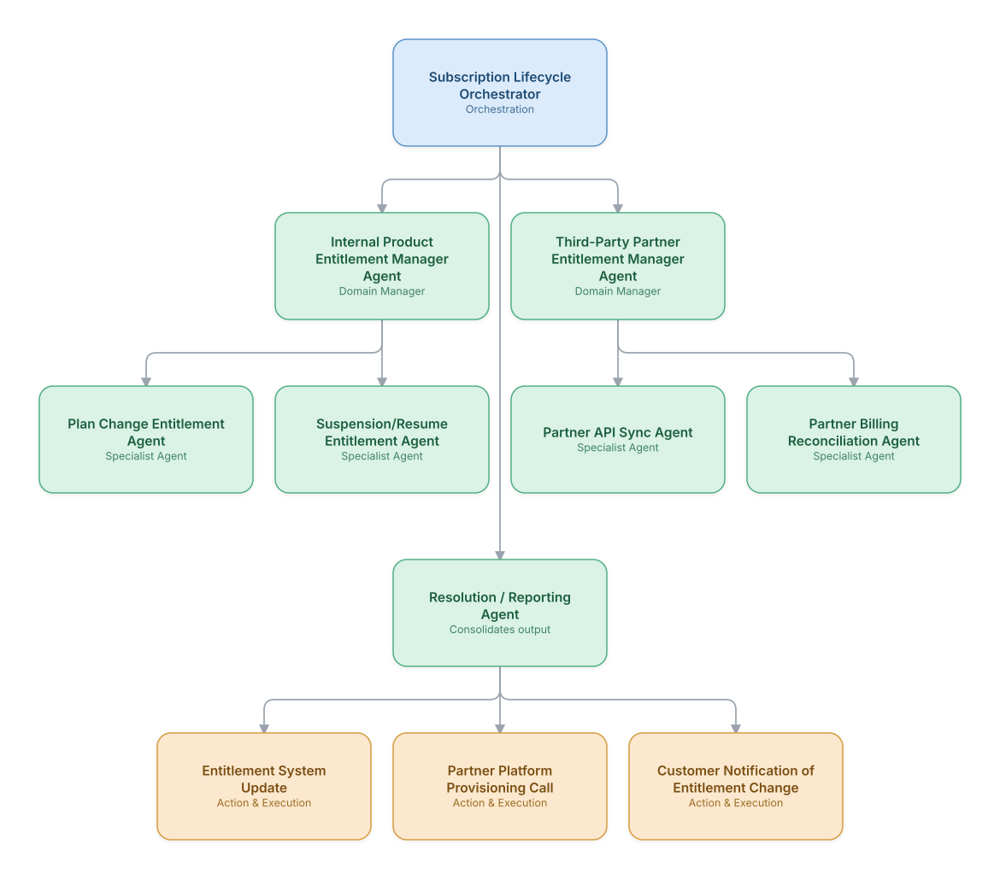

# 09. Subscription Lifecycle & Entitlement Management

**Domain:** BSS/OSS &nbsp;|&nbsp; **Architecture pattern:** [Hierarchical Multi-Agent (Manager-of-Managers)]({{ '/patterns/hierarchical/' | relative_url }})

> 🧠 **Deep dive available:** this use case also has a full [8-Layer Regenerative Architecture breakdown]({{ '/deep8/bssoss/09-subscription-lifecycle-entitlement/' | relative_url }}) — the same problem mapped through L1–L8, with an agent-level tools/technologies stack and a suggested build order by layer.

## 1. Problem Statement & Use Case

Modern telecom offers bundle subscriptions (streaming partnerships, cloud storage, device insurance) whose entitlements must stay perfectly synchronized with billing state across upgrades, downgrades, suspensions, and cancellations — a coordination problem that grows combinatorially with each new partner integration. A hierarchical agent team keeps entitlement state correct across the subscription's full lifecycle.

## 2. End-to-End Multi-Agent Architecture

The solution is implemented as a **Hierarchical Multi-Agent (Manager-of-Managers)** architecture. 
### 2.1 Agents & Sub-Agents

| Agent | Responsibility |
|---|---|
| Subscription Lifecycle Orchestrator | Tracks every subscription's lifecycle state and coordinates internal and partner entitlement managers on any change |
| Internal Product Entitlement Manager | Oversees entitlement changes for the operator's own bundled products |
| Third-Party Partner Entitlement Manager | Oversees synchronization with external partner platforms (streaming, cloud, insurance providers) |
| Plan Change Entitlement Agent | Updates entitlements correctly on upgrade/downgrade, handling proration and grandfathering rules |
| Partner API Sync Agent | Calls partner provisioning APIs to activate/deactivate the partner service in lockstep with billing state |
| Partner Billing Reconciliation Agent | Reconciles what the operator billed the customer against what it owes/is owed by the partner |

### 2.2 Architecture Diagram

> This diagram is organized as a **layered architecture**: Data &amp; Integration → Orchestration → Agent →
> Action &amp; Execution, plus a cross-cutting Observability &amp; Governance layer (tracing, audit log,
> guardrails, and any human review checkpoint — shown in lavender). See the
> [E2E Platform Architecture]({{ '/architecture/e2e-platform-architecture/' | relative_url }}) for how this
> layering looks across all 60 use cases at once. A [Mermaid text source](architecture.mmd) of the same
> diagram is also available in this folder.

## 3. Technologies Used (per step)

| Step / Layer | Technology |
|---|---|
| Entitlement store | Central entitlement management system (or extension of the OSS inventory platform) |
| Orchestration | Hierarchical LangGraph with an internal/partner split mirroring organizational ownership |
| Partner integration | Partner-specific REST/SOAP APIs, normalized through an internal adapter layer |
| Proration logic | Deterministic billing-proration rules engine, not LLM-generated, for calculation accuracy |
| Reconciliation | Scheduled reconciliation jobs comparing internal billing records against partner settlement statements |
| Notification | Customer-facing entitlement-change notifications (e.g., 'your streaming subscription is now active') |
| Monitoring | Entitlement drift dashboard flagging customers whose billing and entitlement state have diverged |
| Audit | Full change history per subscription for dispute resolution and partner settlement audit |

## 4. Suggested Build Order

**Phase 1 — one branch only.** Build Subscription Lifecycle Orchestrator talking to just Internal Product Entitlement Manager Agent and that manager's own leaf agents, ignoring the other 1 branch entirely. Prove one full manager-to-leaf chain before replicating it.

**Phase 2 — add the remaining branches.** Bring Third-Party Partner Entitlement Manager Agent online, each with their own leaf agents. Build Subscription Lifecycle Orchestrator's cross-branch consolidation logic — this is the actual hard part of the hierarchical pattern, not any single branch.

**Phase 3 — resolve cross-branch conflicts.** Real inputs will disagree across managers (different branches recommending incompatible actions); add explicit conflict-resolution logic at Subscription Lifecycle Orchestrator rather than letting the last branch to report silently win.

**Phase 4 — observability and feedback.** Trace decisions at every level of the hierarchy separately (top orchestrator, each manager, each leaf) so a bad outcome can be traced to the specific branch and level that caused it.

## 5. If We Rebuilt This: What Would Improve

- Would build the entitlement-drift monitoring dashboard from day one rather than discovering drift reactively through customer complaints — this became the most valuable proactive signal post-launch.
- Partner API reliability varied enormously; would design the Partner API Sync Agent with robust async retry/reconciliation from the start rather than assuming synchronous success.
- Kept proration math in a deterministic rules engine after seeing the same lesson play out in the billing-dispute and redress-calculation use cases elsewhere in this catalog.
- Grandfathering rules (customers on legacy plans keeping old entitlement terms) were undocumented tribal knowledge; would formalize this into the entitlement rules engine earlier instead of hardcoding exceptions ad hoc.

> ⚙️ **Built with the AI-Regenesis engine.** Every diagram and build order on this page was generated from a
> compact spec by the same engine packaged as the free
> [`quick-reference-engine` skill]({{ '/skills/#quick-reference-engine' | relative_url }}) — drop your
> own use case in and get the same output.

---
[← Back to BSS/OSS index]({{ '/bssoss/' | relative_url }}) &nbsp;|&nbsp; [← Back to home]({{ '/' | relative_url }})
