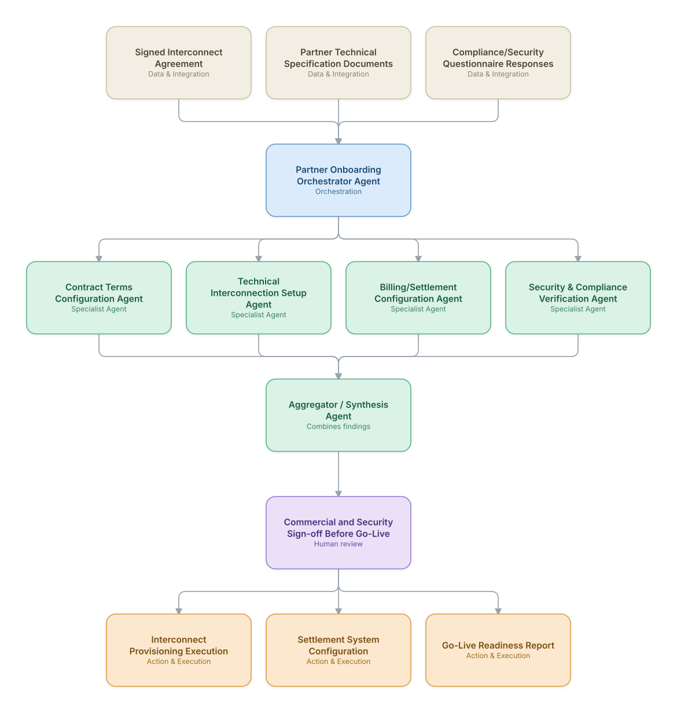

# 11. Wholesale/Partner Interconnect Onboarding

**Domain:** BSS/OSS &nbsp;|&nbsp; **Architecture pattern:** [Orchestrator-Worker (Supervisor fan-out/fan-in)]({{ '/patterns/orchestrator-worker/' | relative_url }})

> 🧠 **Deep dive available:** this use case also has a full [8-Layer Regenerative Architecture breakdown]({{ '/deep8/bssoss/11-wholesale-partner-interconnect-onboarding/' | relative_url }}) — the same problem mapped through L1–L8, with an agent-level tools/technologies stack and a suggested build order by layer.

## 1. Problem Statement & Use Case

Onboarding a new wholesale/interconnect partner (MVNO, roaming partner, transit provider) requires coordinating commercial contract terms, technical interconnection setup, billing/settlement configuration, and security/compliance checks — traditionally a multi-month project with heavy manual project management overhead. An agent team can parallelize the workstreams and produce a single onboarding-readiness view.

## 2. End-to-End Multi-Agent Architecture

The solution is implemented as a **Orchestrator-Worker (Supervisor fan-out/fan-in)** architecture. 
**Human-in-the-loop checkpoint:** Commercial and Security Sign-off Before Go-Live

### 2.1 Agents & Sub-Agents

| Agent | Responsibility |
|---|---|
| Partner Onboarding Orchestrator | Tracks all workstreams in parallel and produces a unified go-live readiness assessment |
| Contract Terms Configuration Agent | Extracts commercial terms (rates, volume commitments, SLAs) from the signed agreement and configures the rating/billing systems accordingly |
| Technical Interconnection Setup Agent | Coordinates SS7/Diameter/SIP interconnection configuration per the partner's technical specification |
| Billing/Settlement Configuration Agent | Sets up the settlement rate cards and invoicing cadence matching the contract terms |
| Security & Compliance Verification Agent | Verifies the partner's security posture and compliance documentation meets interconnection requirements |

### 2.2 Architecture Diagram

> This diagram is organized as a **layered architecture**: Data &amp; Integration → Orchestration → Agent →
> Action &amp; Execution, plus a cross-cutting Observability &amp; Governance layer (tracing, audit log,
> guardrails, and any human review checkpoint — shown in lavender). See the
> [E2E Platform Architecture]({{ '/architecture/e2e-platform-architecture/' | relative_url }}) for how this
> layering looks across all 60 use cases at once. A [Mermaid text source](architecture.mmd) of the same
> diagram is also available in this folder.

## 3. Technologies Used (per step)

| Step / Layer | Technology |
|---|---|
| Contract extraction | Claude + RAG over the signed interconnect agreement (docx/pdf skill patterns) |
| Technical setup | Signaling gateway/session border controller (SBC) configuration APIs |
| Billing configuration | Rating engine and settlement system (mirrors Telecom's roaming settlement use case) rate-card setup |
| Orchestration | LangGraph supervisor with parallel workstream tracking and a unified readiness dashboard |
| Security verification | Security questionnaire analysis against a standardized interconnection security baseline |
| Project tracking | Integration with a project management tool (Jira/Smartsheet) for cross-team visibility |
| Testing | Automated interconnection test-call/test-transaction validation before go-live |
| Documentation | Auto-generated onboarding runbook and go-live checklist per partner |

## 4. Suggested Build Order

**Phase 1 — one worker, no fan-out.** Wire a single path end to end: Contract Terms Configuration Agent reading real data and producing a result, with Partner Onboarding Orchestrator Agent just passing data through untouched. Prove the data pipeline and one agent's reasoning before adding parallelism.

**Phase 2 — add the fan-out.** Bring the remaining 3 worker agents online in parallel and build Partner Onboarding Orchestrator Agent's aggregation/synthesis logic. This is where the orchestrator-worker pattern is actually learned — watch for race conditions and partial-failure handling here, not before.

**Phase 3 — add the governance gate.** Wire in the human checkpoint: Commercial and Security Sign-off Before Go-Live.

**Phase 4 — observability and feedback.** Trace every worker call, monitor the aggregator's decision quality against real outcomes, and add a feedback loop that catches drift before it becomes a production incident.

## 5. If We Rebuilt This: What Would Improve

- Would add the automated test-call/test-transaction validation earlier in the process — several early onboardings passed all individual workstream checks but failed on first real traffic due to an untested configuration interaction.
- Contract term extraction accuracy needed a mandatory commercial-team review step; automated extraction was a strong first draft but rate-card errors carry direct financial risk.
- Would formalize the security baseline checklist earlier — early onboardings applied inconsistent ad hoc security standards per partner before this was standardized.
- Cross-workstream dependency awareness was missing in v1 (e.g., billing configuration proceeding before technical setup confirmed a required parameter) — added explicit dependency gates between workers.

> ⚙️ **Built with the AI-Regenesis engine.** Every diagram and build order on this page was generated from a
> compact spec by the same engine packaged as the free
> [`quick-reference-engine` skill]({{ '/skills/#quick-reference-engine' | relative_url }}) — drop your
> own use case in and get the same output.

---
[← Back to BSS/OSS index]({{ '/bssoss/' | relative_url }}) &nbsp;|&nbsp; [← Back to home]({{ '/' | relative_url }})
