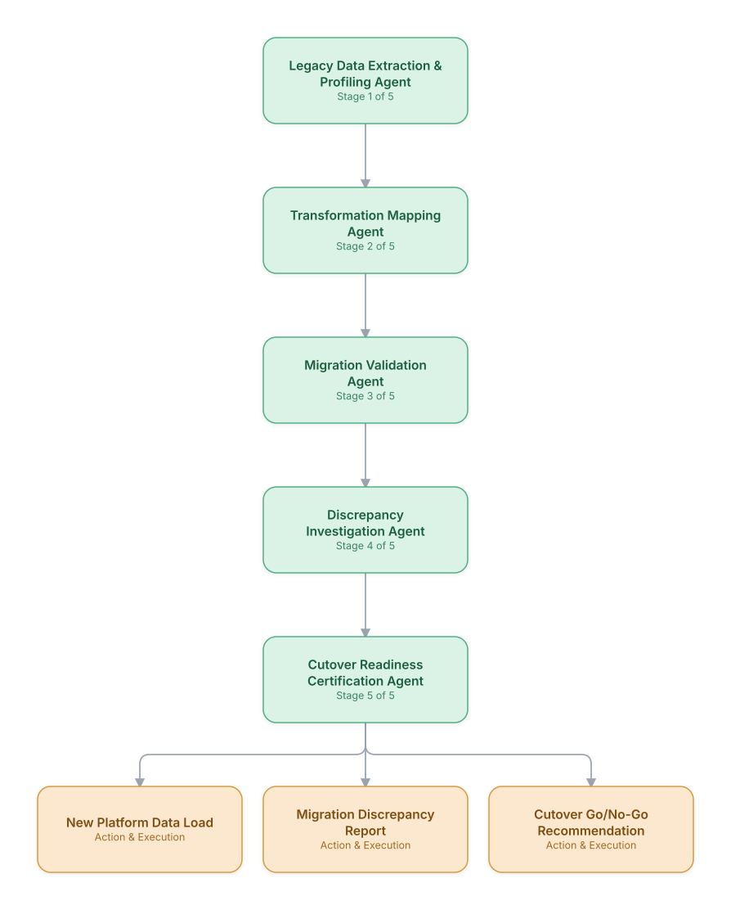

# 14. Digital BSS/OSS Migration & Data Reconciliation

**Domain:** BSS/OSS &nbsp;|&nbsp; **Architecture pattern:** [Sequential Pipeline]({{ '/patterns/pipeline/' | relative_url }})

> 🧠 **Deep dive available:** this use case also has a full [8-Layer Regenerative Architecture breakdown]({{ '/deep8/bssoss/14-digital-bss-oss-migration-reconciliation/' | relative_url }}) — the same problem mapped through L1–L8, with an agent-level tools/technologies stack and a suggested build order by layer.

## 1. Problem Statement & Use Case

Migrating customers from a legacy BSS/OSS stack to a modern digital platform (common after an M&A or a multi-year transformation program) requires migrating millions of customer, product, and billing records without service disruption or billing errors — historically requiring large manual reconciliation teams working through cutover weekends. An agent pipeline can validate and reconcile migrated data continuously throughout the program rather than only at cutover.

## 2. End-to-End Multi-Agent Architecture

The solution is implemented as a **Sequential Pipeline** architecture. 
### 2.1 Agents & Sub-Agents

| Agent | Responsibility |
|---|---|
| Legacy Data Extraction & Profiling Agent | Extracts and profiles legacy data quality/completeness before migration begins |
| Transformation Mapping Agent | Applies the legacy-to-new-platform field/schema transformation rules |
| Migration Validation Agent | Compares migrated records in the new platform against the legacy source for accuracy |
| Discrepancy Investigation Agent | Investigates root cause for any record that fails validation (mapping bug vs. legacy data quality issue) |
| Cutover Readiness Certification Agent | Aggregates validation results into a data-driven go/no-go recommendation per migration wave |

### 2.2 Architecture Diagram

> This diagram is organized as a **layered architecture**: Data &amp; Integration → Orchestration → Agent →
> Action &amp; Execution, plus a cross-cutting Observability &amp; Governance layer (tracing, audit log,
> guardrails, and any human review checkpoint — shown in lavender). See the
> [E2E Platform Architecture]({{ '/architecture/e2e-platform-architecture/' | relative_url }}) for how this
> layering looks across all 60 use cases at once. A [Mermaid text source](architecture.mmd) of the same
> diagram is also available in this folder.

## 3. Technologies Used (per step)

| Step / Layer | Technology |
|---|---|
| Legacy extraction | ETL from legacy BSS/OSS databases (often decades-old schemas) via custom connectors |
| Transformation | dbt-based transformation pipeline encoding legacy-to-new-platform mapping rules |
| Validation | Automated record-level and aggregate-level reconciliation (counts, sums, sampled deep-diffs) |
| Orchestration | Airflow pipeline processing migration waves with agent-based validation gates between stages |
| Discrepancy diagnosis | Claude reasoning over failed-validation records to classify root cause |
| Reporting | Wave-by-wave migration health dashboard for the program management office |
| Rollback capability | Defined rollback procedure per wave if cutover certification fails |
| Audit | Full before/after record comparison retained for regulatory and financial audit of the migration |

## 4. Suggested Build Order

**Phase 1 — the first two stages only.** Get Legacy Data Extraction & Profiling Agent feeding Transformation Mapping Agent correctly, with the rest of the pipeline stubbed out. Durability matters more than completeness here — make sure a crash mid-pipeline doesn't lose or duplicate work.

**Phase 2 — the full chain.** Add the remaining 3 stages in order, testing each newly-added stage against real output from the stage before it, not synthetic test data.

**Phase 3 — add retry and partial-failure handling.** Decide, stage by stage, what happens when that specific stage fails: retry, skip, or halt the whole pipeline. This decision is different per stage and shouldn't be a single global policy.

**Phase 4 — observability and feedback.** Add per-stage tracing so a slow or wrong pipeline run can be attributed to one specific stage, and track output quality over time to catch silent degradation in an early stage before it compounds downstream.

## 5. If We Rebuilt This: What Would Improve

- Would run continuous validation throughout each migration wave rather than only at the cutover checkpoint — catching mapping bugs weeks earlier saved significant rework in later waves.
- Discrepancy root-cause classification (mapping bug vs. legacy data quality issue) was essential for prioritization — without it, engineering and data-quality teams both assumed issues were the other team's problem.
- Would build rollback procedures with equal investment to forward migration logic from the start; one wave's rollback in v1 took far longer than the original migration due to under-investment here.
- Sampled deep-diffs (not just aggregate counts) caught systematic errors that count-based validation completely missed — would make deep-diff sampling the default validation method, not an optional extra check.

> ⚙️ **Built with the AI-Regenesis engine.** Every diagram and build order on this page was generated from a
> compact spec by the same engine packaged as the free
> [`quick-reference-engine` skill]({{ '/skills/#quick-reference-engine' | relative_url }}) — drop your
> own use case in and get the same output.

---
[← Back to BSS/OSS index]({{ '/bssoss/' | relative_url }}) &nbsp;|&nbsp; [← Back to home]({{ '/' | relative_url }})
