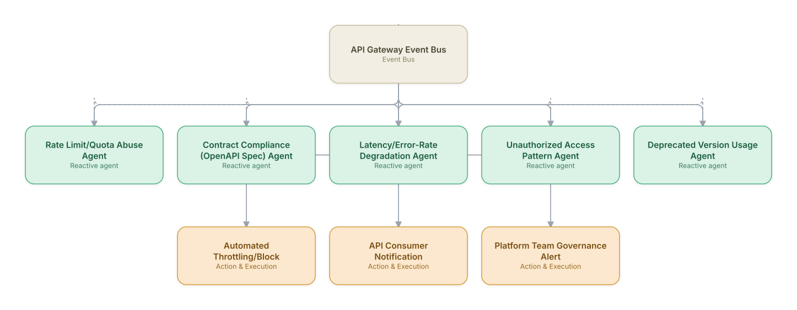

# 17. API Gateway & TMF Open API Orchestration Governance

**Domain:** BSS/OSS &nbsp;|&nbsp; **Architecture pattern:** [Event-Driven Reactive Swarm]({{ '/patterns/event-swarm/' | relative_url }})

> 🧠 **Deep dive available:** this use case also has a full [8-Layer Regenerative Architecture breakdown]({{ '/deep8/bssoss/17-api-gateway-tmf-governance/' | relative_url }}) — the same problem mapped through L1–L8, with an agent-level tools/technologies stack and a suggested build order by layer.

## 1. Problem Statement & Use Case

As operators expose more TM Forum Open APIs to partners, MVNOs, and internal digital channels, API misuse, quota abuse, contract-breaking changes, and performance degradation need real-time detection across a growing API surface. A swarm of lightweight agents subscribed to the API gateway's event stream can enforce governance continuously rather than through periodic manual API audits.

## 2. End-to-End Multi-Agent Architecture

The solution is implemented as a **Event-Driven Reactive Swarm** architecture. 
### 2.1 Agents & Sub-Agents

| Agent | Responsibility |
|---|---|
| Rate Limit/Quota Abuse Agent | Detects API consumers exceeding contracted rate limits or exhibiting abusive call patterns |
| Contract Compliance Agent | Validates that API responses/requests conform to the published OpenAPI/TMF specification, flagging drift |
| Latency/Error-Rate Degradation Agent | Detects when a specific API or backend is degrading and could breach partner SLAs |
| Unauthorized Access Pattern Agent | Flags access patterns suggesting credential misuse or scope escalation attempts |
| Deprecated Version Usage Agent | Tracks consumers still calling deprecated API versions and drives migration outreach before sunset |

### 2.2 Architecture Diagram

> This diagram is organized as a **layered architecture**: Data &amp; Integration → Orchestration → Agent →
> Action &amp; Execution, plus a cross-cutting Observability &amp; Governance layer (tracing, audit log,
> guardrails, and any human review checkpoint — shown in lavender). See the
> [E2E Platform Architecture]({{ '/architecture/e2e-platform-architecture/' | relative_url }}) for how this
> layering looks across all 60 use cases at once. A [Mermaid text source](architecture.mmd) of the same
> diagram is also available in this folder.

## 3. Technologies Used (per step)

| Step / Layer | Technology |
|---|---|
| API gateway | Kong/Apigee/MuleSoft as the API gateway emitting a real-time event stream |
| Event bus | Kafka topics per event category (rate-limit, contract-violation, latency, security) |
| Contract validation | OpenAPI spec validation middleware comparing live traffic against the published TMF contract |
| Abuse detection | Anomaly detection on per-consumer call-pattern time series |
| Security detection | Correlation with IAM/OAuth scope logs for unauthorized access pattern detection |
| Automated response | Gateway-level throttling/blocking policy execution for confirmed abuse |
| Consumer communication | Automated developer-portal notifications for quota warnings and deprecated-version usage |
| Governance dashboard | API health, compliance, and consumer-behavior dashboard for the platform team |

## 4. Suggested Build Order

**Phase 1 — one reactive agent.** Get Rate Limit/Quota Abuse Agent subscribed to API Gateway Event Bus and reacting to real events, with no other agents listening yet. Prove the event-driven mechanics work under real event volume before adding more subscribers.

**Phase 2 — add the remaining agents.** Bring Contract Compliance (OpenAPI Spec) Agent, Latency/Error-Rate Degradation Agent, Unauthorized Access Pattern Agent, Deprecated Version Usage Agent online as independent subscribers. Test what happens when multiple agents react to the *same* event — this is where swarm-specific bugs (duplicate actions, conflicting responses) show up.

**Phase 3 — add rate limits and blast-radius guardrails.** A reactive swarm with no shared coordination can act on the same trigger repeatedly; add per-agent and global rate limits before connecting real downstream actions.

**Phase 4 — observability and feedback.** Add distributed tracing across the event bus so a cascading reaction across multiple agents can be reconstructed after the fact, not just guessed at.

## 5. If We Rebuilt This: What Would Improve

- Would tune automated throttling conservatively from the start — an early false-positive on the abuse detector throttled a legitimate high-volume partner during a peak traffic event.
- Contract compliance validation caught internal team changes breaking the published spec before partners noticed, which became one of the most valued outputs of the whole system.
- Deprecated version usage tracking needed proactive outreach automation, not just a dashboard — early version just reported the data and migration lagged until outreach was automated.
- Would correlate rate-limit and latency-degradation signals together from the start; a partner's abusive traffic pattern was, in one incident, the actual root cause of a broader latency degradation that was initially investigated as an unrelated infrastructure issue.

> ⚙️ **Built with the AI-Regenesis engine.** Every diagram and build order on this page was generated from a
> compact spec by the same engine packaged as the free
> [`quick-reference-engine` skill]({{ '/skills/#quick-reference-engine' | relative_url }}) — drop your
> own use case in and get the same output.

---
[← Back to BSS/OSS index]({{ '/bssoss/' | relative_url }}) &nbsp;|&nbsp; [← Back to home]({{ '/' | relative_url }})
