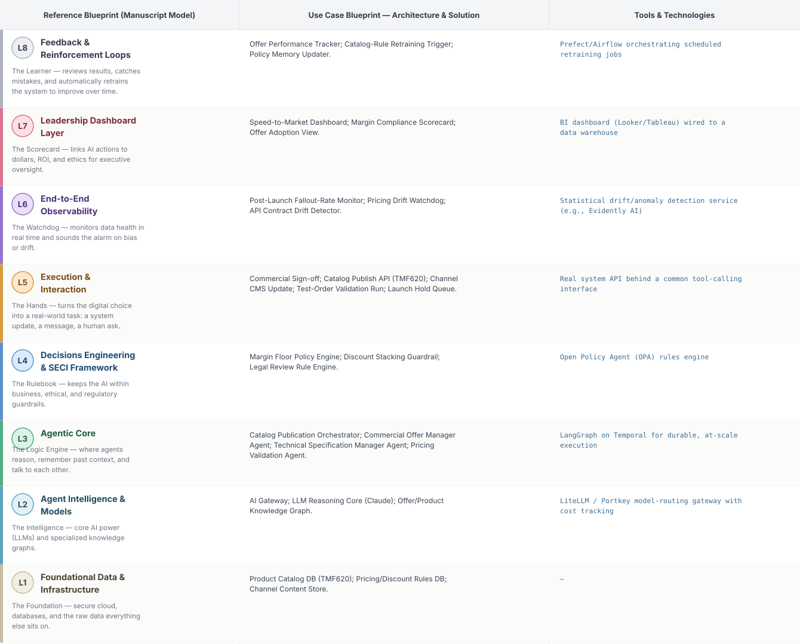
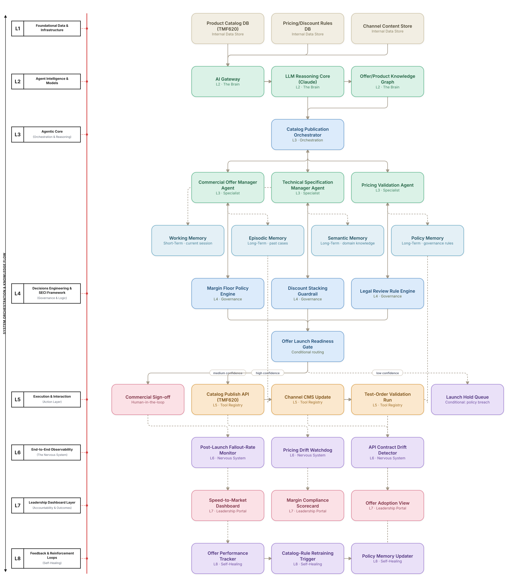

# Deep 8-Layer Regenerative Architecture: Product Catalog & Offer Launch Decisioning

**Domain:** BSS/OSS &nbsp;|&nbsp; **Quick Reference counterpart:** [Product Catalog & Offer Management Automation]({{ '/bssoss/02-product-catalog-offer-management/' | relative_url }}) (Hierarchical Multi-Agent (Manager-of-Managers))

This deep-8 view treats every catalog/offer launch as a governed decision, not just a publish action — with margin and legal guardrails before launch, drift detection after launch, and a feedback loop that improves the rules over time, not just faster publishing.

## 1. Problem Statement & Use Case

Launching a bundled offer requires coordinating pricing, eligibility, and technical service specs across a sprawling catalog. Commercial teams call this the biggest speed-to-market bottleneck, but speed without governance risks margin-eroding offers and API-breaking catalog changes with no executive visibility into either.

## 2. The 8-Layer Blueprint

## 3. Architecture Diagram (Flow View)

**Reading the diagram:** The Offer Launch Readiness Gate branches into auto-publish for validated low-risk offers, Commercial Sign-off for anything touching margin, and a hold queue for anything failing the test-order validation run.

## 4. Agent-Level Architecture Stack

| Layer | Agent Name | Agent Purpose | Inputs / Outputs | Learning Stack | Production Stack |
|---|---|---|---|---|---|
| L2 | AI Gateway | Provides AI Gateway's reasoning/knowledge capability to the Agentic Core. | Agent requests → Model responses, usage telemetry | Claude API called directly | LiteLLM / Portkey model-routing gateway with cost tracking |
| L2 | LLM Reasoning Core (Claude) | Provides LLM Reasoning Core (Claude)'s reasoning/knowledge capability to the Agentic Core. | Agent requests → Model responses, usage telemetry | Claude API called directly | LiteLLM / Portkey model-routing gateway with cost tracking |
| L2 | Offer/Product Knowledge Graph | Provides Offer/Product Knowledge Graph's reasoning/knowledge capability to the Agentic Core. | Agent requests → Model responses, usage telemetry | Claude API called directly | LiteLLM / Portkey model-routing gateway with cost tracking |
| L3 | Catalog Publication Orchestrator | Catalog Publication Orchestrator — specialist agent in the Agentic Core's reasoning chain. | Task context, Working Memory → Reasoning output, next-step decision | LangGraph agent node + Claude API | LangGraph on Temporal for durable, at-scale execution |
| L3 | Commercial Offer Manager Agent | Commercial Offer Manager Agent — specialist agent in the Agentic Core's reasoning chain. | Task context, Working Memory → Reasoning output, next-step decision | LangGraph agent node + Claude API | LangGraph on Temporal for durable, at-scale execution |
| L3 | Technical Specification Manager Agent | Technical Specification Manager Agent — specialist agent in the Agentic Core's reasoning chain. | Task context, Working Memory → Reasoning output, next-step decision | LangGraph agent node + Claude API | LangGraph on Temporal for durable, at-scale execution |
| L3 | Pricing Validation Agent | Pricing Validation Agent — specialist agent in the Agentic Core's reasoning chain. | Task context, Working Memory → Reasoning output, next-step decision | LangGraph agent node + Claude API | LangGraph on Temporal for durable, at-scale execution |
| L4 | Margin Floor Policy Engine | Enforces Margin Floor Policy Engine as a governance gate before any action reaches the Action Layer. | Proposed action, policy rules → Pass/fail decision | Plain Python rule functions | Open Policy Agent (OPA) rules engine |
| L4 | Discount Stacking Guardrail | Enforces Discount Stacking Guardrail as a governance gate before any action reaches the Action Layer. | Proposed action, policy rules → Pass/fail decision | Plain Python rule functions | Open Policy Agent (OPA) rules engine |
| L4 | Legal Review Rule Engine | Enforces Legal Review Rule Engine as a governance gate before any action reaches the Action Layer. | Proposed action, policy rules → Pass/fail decision | Plain Python rule functions | Open Policy Agent (OPA) rules engine |
| L5 | Commercial Sign-off | Executes Commercial Sign-off as part of the Action & Execution layer once a decision is approved. | Approved decision → Executed action, system update | Mock REST endpoint (FastAPI) | Real system API behind a common tool-calling interface |
| L5 | Catalog Publish API (TMF620) | Executes Catalog Publish API (TMF620) as part of the Action & Execution layer once a decision is approved. | Approved decision → Executed action, system update | Mock REST endpoint (FastAPI) | Real system API behind a common tool-calling interface |
| L5 | Channel CMS Update | Executes Channel CMS Update as part of the Action & Execution layer once a decision is approved. | Approved decision → Executed action, system update | Mock REST endpoint (FastAPI) | Real system API behind a common tool-calling interface |
| L5 | Test-Order Validation Run | Executes Test-Order Validation Run as part of the Action & Execution layer once a decision is approved. | Approved decision → Executed action, system update | Mock REST endpoint (FastAPI) | Real system API behind a common tool-calling interface |
| L5 | Launch Hold Queue | Executes Launch Hold Queue as part of the Action & Execution layer once a decision is approved. | Approved decision → Executed action, system update | Mock REST endpoint (FastAPI) | Real system API behind a common tool-calling interface |
| L6 | Post-Launch Fallout-Rate Monitor | Continuously monitors for the failure mode Post-Launch Fallout-Rate Monitor is named to catch. | Live execution/outcome telemetry → Alert, health score | Scheduled Python script / simple threshold check | Statistical drift/anomaly detection service (e.g., Evidently AI) |
| L6 | Pricing Drift Watchdog | Continuously monitors for the failure mode Pricing Drift Watchdog is named to catch. | Live execution/outcome telemetry → Alert, health score | Scheduled Python script / simple threshold check | Statistical drift/anomaly detection service (e.g., Evidently AI) |
| L6 | API Contract Drift Detector | Continuously monitors for the failure mode API Contract Drift Detector is named to catch. | Live execution/outcome telemetry → Alert, health score | Scheduled Python script / simple threshold check | Statistical drift/anomaly detection service (e.g., Evidently AI) |
| L7 | Speed-to-Market Dashboard | Gives leadership real-time visibility via Speed-to-Market Dashboard. | Outcome + financial data → Executive-facing metric | Streamlit or Metabase dashboard | BI dashboard (Looker/Tableau) wired to a data warehouse |
| L7 | Margin Compliance Scorecard | Gives leadership real-time visibility via Margin Compliance Scorecard. | Outcome + financial data → Executive-facing metric | Streamlit or Metabase dashboard | BI dashboard (Looker/Tableau) wired to a data warehouse |
| L7 | Offer Adoption View | Gives leadership real-time visibility via Offer Adoption View. | Outcome + financial data → Executive-facing metric | Streamlit or Metabase dashboard | BI dashboard (Looker/Tableau) wired to a data warehouse |
| L8 | Offer Performance Tracker | Closes the feedback loop via Offer Performance Tracker, feeding outcomes back into memory. | Outcome-accuracy data, thresholds → Retraining trigger / updated memory | Cron job checking a threshold | Prefect/Airflow orchestrating scheduled retraining jobs |
| L8 | Catalog-Rule Retraining Trigger | Closes the feedback loop via Catalog-Rule Retraining Trigger, feeding outcomes back into memory. | Outcome-accuracy data, thresholds → Retraining trigger / updated memory | Cron job checking a threshold | Prefect/Airflow orchestrating scheduled retraining jobs |
| L8 | Policy Memory Updater | Closes the feedback loop via Policy Memory Updater, feeding outcomes back into memory. | Outcome-accuracy data, thresholds → Retraining trigger / updated memory | Cron job checking a threshold | Prefect/Airflow orchestrating scheduled retraining jobs |

## 5. Suggested Build Order (by Layer)

**Phase 1 — L1 + L2 + a stub L5, nothing else.** Fake product catalog data in Postgres, a single Claude API call, and Commercial Offer Manager Agent producing a result that just gets printed, with Catalog Publication Orchestrator just passing data through untouched. No memory, no governance, no conditional routing yet.

**Phase 2 — build out L3, the Agentic Core.** Bring the remaining 2 agents online and build Catalog Publication Orchestrator's aggregation logic, and add Working + Episodic memory (Chroma). This is where the pattern is actually learned, not before.

**Phase 3 — add L4 and the conditional gate.** Wire in the governance engines as hard gates, then build the three-way Offer Launch Readiness Gate routing into auto-execute / human review / hold.

**Phase 4 — complete L5.** Build the Commercial Sign-off approval screen and the hold/escalate queue; this is the first point where a human is actually in the loop.

**Phase 5 — add L6 observability.** Drop in a drift/anomaly detection service and a data-quality check. This is usually the point where problems invisible in Phases 1–4 surface for the first time.

**Phase 6 — add L7 and L8.** Build the executive dashboard last, and the scheduled retraining/memory-update job. These teach the least new technical ground but close the loop the manuscript calls "regenerative."

> ⚙️ **Built with the AI-Regenesis engine.** This layer breakdown, the blueprint table, and the build order
> were generated from a compact spec by the same engine packaged as the free
> [`deep8-architecture-engine` skill]({{ '/skills/#deep8-architecture-engine' | relative_url }}) — map
> your own use case onto the 8-layer framework the same way.

---
[← Back to Deep 8-Layer index]({{ '/deep8/' | relative_url }}) &nbsp;|&nbsp; [← Back to home]({{ '/' | relative_url }})
