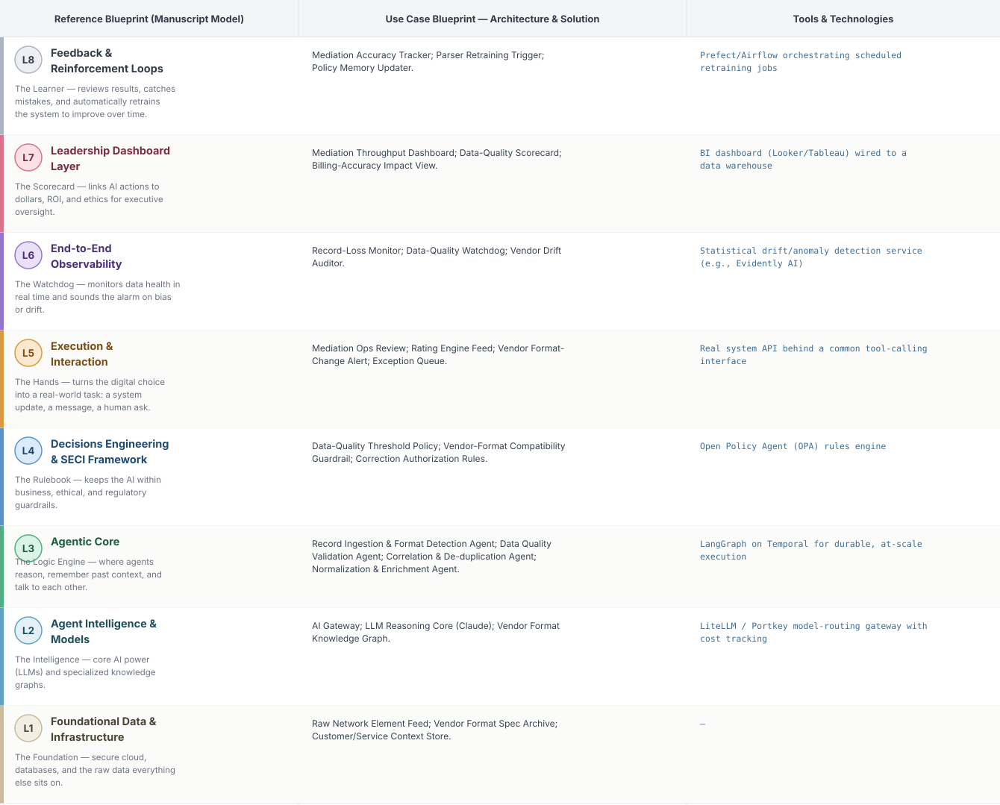
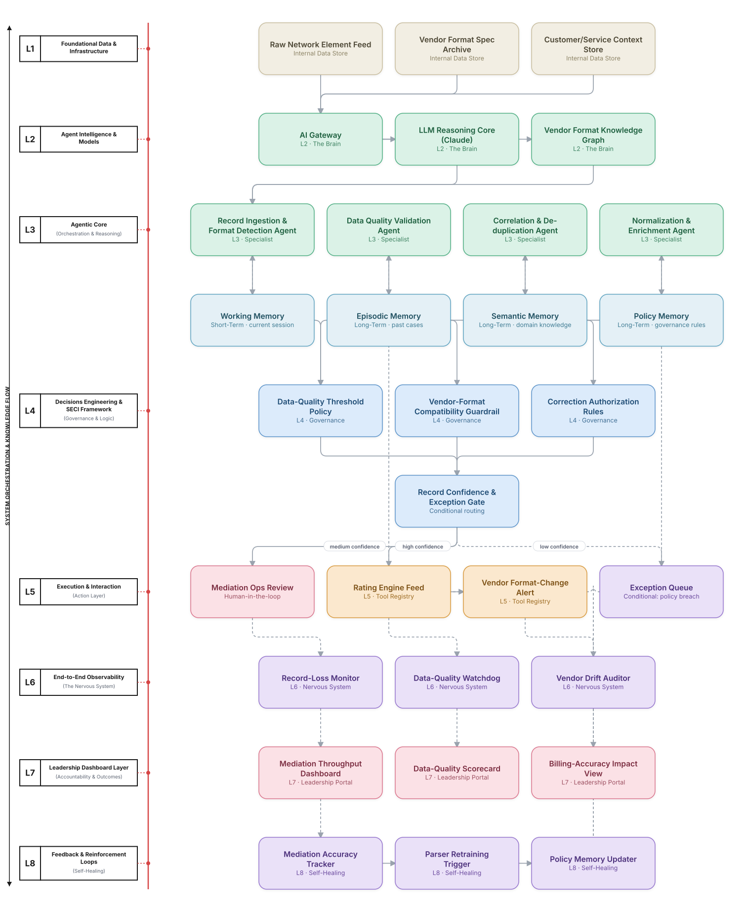

# Deep 8-Layer Regenerative Architecture: Mediation & Rating-Feed Integrity Decisioning

**Domain:** BSS/OSS &nbsp;|&nbsp; **Quick Reference counterpart:** [Mediation & CDR/xDR Processing Pipeline]({{ '/bssoss/06-mediation-cdr-xdr-processing/' | relative_url }}) (Sequential Pipeline)

This deep-8 view treats mediation as more than a data pipeline — every record's path to the rating engine now passes through explicit data-quality governance, with drift detection catching vendor format changes before they silently corrupt a billing cycle.

## 1. Problem Statement & Use Case

Mediation ingests billions of records from heterogeneous network elements. Format drift from vendor firmware updates causes downstream rating errors that go undetected for entire billing cycles — the Quick Reference retrospective specifically flags this as the most costly gap in the original design.

## 2. The 8-Layer Blueprint

## 3. Architecture Diagram (Flow View)

**Reading the diagram:** The Record Confidence & Exception Gate routes clean records straight to the rating engine, ambiguous records to mediation ops, and records failing quality thresholds to an exception queue — with L6's vendor-drift auditor specifically designed to catch the class of failure that went undetected in the original design.

## 4. Agent-Level Architecture Stack

| Layer | Agent Name | Agent Purpose | Inputs / Outputs | Learning Stack | Production Stack |
|---|---|---|---|---|---|
| L2 | AI Gateway | Provides AI Gateway's reasoning/knowledge capability to the Agentic Core. | Agent requests → Model responses, usage telemetry | Claude API called directly | LiteLLM / Portkey model-routing gateway with cost tracking |
| L2 | LLM Reasoning Core (Claude) | Provides LLM Reasoning Core (Claude)'s reasoning/knowledge capability to the Agentic Core. | Agent requests → Model responses, usage telemetry | Claude API called directly | LiteLLM / Portkey model-routing gateway with cost tracking |
| L2 | Vendor Format Knowledge Graph | Provides Vendor Format Knowledge Graph's reasoning/knowledge capability to the Agentic Core. | Agent requests → Model responses, usage telemetry | Claude API called directly | LiteLLM / Portkey model-routing gateway with cost tracking |
| L3 | Record Ingestion & Format Detection Agent | Record Ingestion & Format Detection Agent — specialist agent in the Agentic Core's reasoning chain. | Task context, Working Memory → Reasoning output, next-step decision | LangGraph agent node + Claude API | LangGraph on Temporal for durable, at-scale execution |
| L3 | Data Quality Validation Agent | Data Quality Validation Agent — specialist agent in the Agentic Core's reasoning chain. | Task context, Working Memory → Reasoning output, next-step decision | LangGraph agent node + Claude API | LangGraph on Temporal for durable, at-scale execution |
| L3 | Correlation & De-duplication Agent | Correlation & De-duplication Agent — specialist agent in the Agentic Core's reasoning chain. | Task context, Working Memory → Reasoning output, next-step decision | LangGraph agent node + Claude API | LangGraph on Temporal for durable, at-scale execution |
| L3 | Normalization & Enrichment Agent | Normalization & Enrichment Agent — specialist agent in the Agentic Core's reasoning chain. | Task context, Working Memory → Reasoning output, next-step decision | LangGraph agent node + Claude API | LangGraph on Temporal for durable, at-scale execution |
| L4 | Data-Quality Threshold Policy | Enforces Data-Quality Threshold Policy as a governance gate before any action reaches the Action Layer. | Proposed action, policy rules → Pass/fail decision | Plain Python rule functions | Open Policy Agent (OPA) rules engine |
| L4 | Vendor-Format Compatibility Guardrail | Enforces Vendor-Format Compatibility Guardrail as a governance gate before any action reaches the Action Layer. | Proposed action, policy rules → Pass/fail decision | Plain Python rule functions | Open Policy Agent (OPA) rules engine |
| L4 | Correction Authorization Rules | Enforces Correction Authorization Rules as a governance gate before any action reaches the Action Layer. | Proposed action, policy rules → Pass/fail decision | Plain Python rule functions | Open Policy Agent (OPA) rules engine |
| L5 | Mediation Ops Review | Executes Mediation Ops Review as part of the Action & Execution layer once a decision is approved. | Approved decision → Executed action, system update | Mock REST endpoint (FastAPI) | Real system API behind a common tool-calling interface |
| L5 | Rating Engine Feed | Executes Rating Engine Feed as part of the Action & Execution layer once a decision is approved. | Approved decision → Executed action, system update | Mock REST endpoint (FastAPI) | Real system API behind a common tool-calling interface |
| L5 | Vendor Format-Change Alert | Executes Vendor Format-Change Alert as part of the Action & Execution layer once a decision is approved. | Approved decision → Executed action, system update | Mock REST endpoint (FastAPI) | Real system API behind a common tool-calling interface |
| L5 | Exception Queue | Executes Exception Queue as part of the Action & Execution layer once a decision is approved. | Approved decision → Executed action, system update | Mock REST endpoint (FastAPI) | Real system API behind a common tool-calling interface |
| L6 | Record-Loss Monitor | Continuously monitors for the failure mode Record-Loss Monitor is named to catch. | Live execution/outcome telemetry → Alert, health score | Scheduled Python script / simple threshold check | Statistical drift/anomaly detection service (e.g., Evidently AI) |
| L6 | Data-Quality Watchdog | Continuously monitors for the failure mode Data-Quality Watchdog is named to catch. | Live execution/outcome telemetry → Alert, health score | Scheduled Python script / simple threshold check | Statistical drift/anomaly detection service (e.g., Evidently AI) |
| L6 | Vendor Drift Auditor | Continuously monitors for the failure mode Vendor Drift Auditor is named to catch. | Live execution/outcome telemetry → Alert, health score | Scheduled Python script / simple threshold check | Statistical drift/anomaly detection service (e.g., Evidently AI) |
| L7 | Mediation Throughput Dashboard | Gives leadership real-time visibility via Mediation Throughput Dashboard. | Outcome + financial data → Executive-facing metric | Streamlit or Metabase dashboard | BI dashboard (Looker/Tableau) wired to a data warehouse |
| L7 | Data-Quality Scorecard | Gives leadership real-time visibility via Data-Quality Scorecard. | Outcome + financial data → Executive-facing metric | Streamlit or Metabase dashboard | BI dashboard (Looker/Tableau) wired to a data warehouse |
| L7 | Billing-Accuracy Impact View | Gives leadership real-time visibility via Billing-Accuracy Impact View. | Outcome + financial data → Executive-facing metric | Streamlit or Metabase dashboard | BI dashboard (Looker/Tableau) wired to a data warehouse |
| L8 | Mediation Accuracy Tracker | Closes the feedback loop via Mediation Accuracy Tracker, feeding outcomes back into memory. | Outcome-accuracy data, thresholds → Retraining trigger / updated memory | Cron job checking a threshold | Prefect/Airflow orchestrating scheduled retraining jobs |
| L8 | Parser Retraining Trigger | Closes the feedback loop via Parser Retraining Trigger, feeding outcomes back into memory. | Outcome-accuracy data, thresholds → Retraining trigger / updated memory | Cron job checking a threshold | Prefect/Airflow orchestrating scheduled retraining jobs |
| L8 | Policy Memory Updater | Closes the feedback loop via Policy Memory Updater, feeding outcomes back into memory. | Outcome-accuracy data, thresholds → Retraining trigger / updated memory | Cron job checking a threshold | Prefect/Airflow orchestrating scheduled retraining jobs |

## 5. Suggested Build Order (by Layer)

**Phase 1 — L1 + L2 + a stub L5, nothing else.** Fake mediation data in Postgres, a single Claude API call, and Record Ingestion & Format Detection Agent producing a result that just gets printed. No memory, no governance, no conditional routing yet.

**Phase 2 — build out L3, the Agentic Core.** Bring the remaining 3 agents online, and add Working + Episodic memory (Chroma). This is where the pattern is actually learned, not before.

**Phase 3 — add L4 and the conditional gate.** Wire in the governance engines as hard gates, then build the three-way Record Confidence & Exception Gate routing into auto-execute / human review / hold.

**Phase 4 — complete L5.** Build the Mediation Ops Review approval screen and the hold/escalate queue; this is the first point where a human is actually in the loop.

**Phase 5 — add L6 observability.** Drop in a drift/anomaly detection service and a data-quality check. This is usually the point where problems invisible in Phases 1–4 surface for the first time.

**Phase 6 — add L7 and L8.** Build the executive dashboard last, and the scheduled retraining/memory-update job. These teach the least new technical ground but close the loop the manuscript calls "regenerative."

> ⚙️ **Built with the AI-Regenesis engine.** This layer breakdown, the blueprint table, and the build order
> were generated from a compact spec by the same engine packaged as the free
> [`deep8-architecture-engine` skill]({{ '/skills/#deep8-architecture-engine' | relative_url }}) — map
> your own use case onto the 8-layer framework the same way.

---
[← Back to Deep 8-Layer index]({{ '/deep8/' | relative_url }}) &nbsp;|&nbsp; [← Back to home]({{ '/' | relative_url }})
