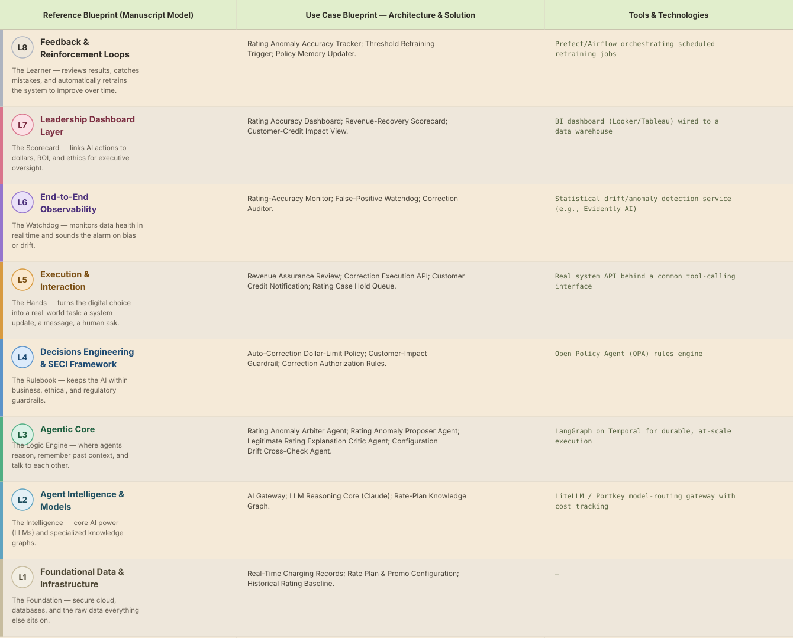
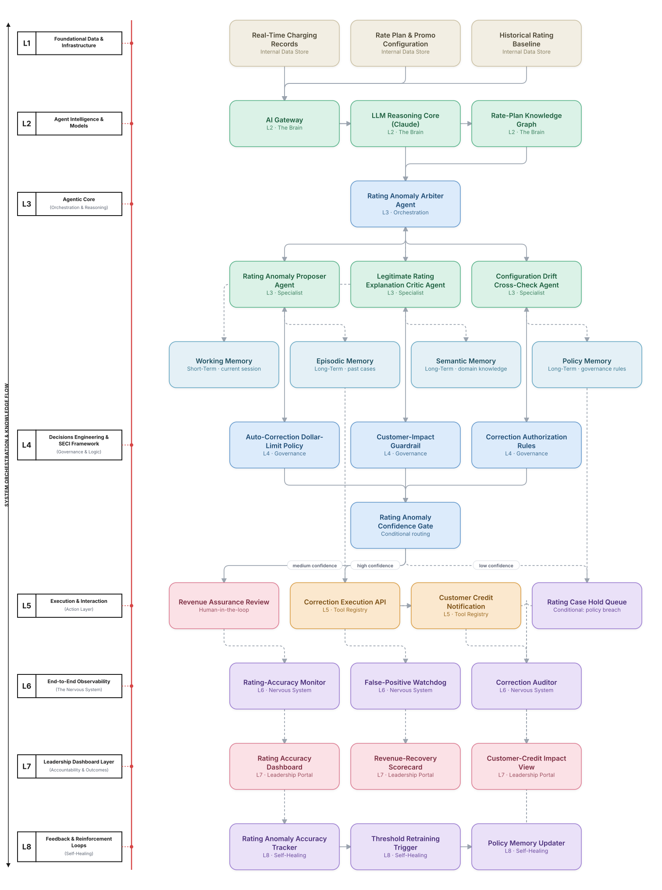

# Deep 8-Layer Regenerative Architecture: Rating Anomaly Correction Decisioning

**Domain:** BSS/OSS &nbsp;|&nbsp; **Quick Reference counterpart:** [Charging & Rating Engine Anomaly Detection]({{ '/bssoss/07-charging-rating-anomaly-detection/' | relative_url }}) (Debate-Critique-Arbiter (Reflective Loop))

This deep-8 view keeps the proposer/critic reflective loop from the Quick view but wraps it in explicit dollar-limit governance and executive revenue-recovery reporting — the debate happens inside L3, but nothing gets corrected without passing L4's guardrails.

## 1. Problem Statement & Use Case

Real-time charging engines occasionally under- or over-charge due to configuration errors or edge-case usage patterns. Auto-correction without a dollar-amount ceiling risks compounding small per-event errors into material revenue impact at scale — exactly what the Quick view's retrospective flagged after tightening its own threshold.

## 2. The 8-Layer Blueprint

## 3. Architecture Diagram (Flow View)

**Reading the diagram:** The Rating Anomaly Confidence Gate keeps auto-correction scoped to small, high-confidence, policy-bounded cases; anything larger routes to Revenue Assurance for human review before a customer sees a corrected charge.

## 4. Agent-Level Architecture Stack

| Layer | Agent Name | Agent Purpose | Inputs / Outputs | Learning Stack | Production Stack |
|---|---|---|---|---|---|
| L2 | AI Gateway | Provides AI Gateway's reasoning/knowledge capability to the Agentic Core. | Agent requests → Model responses, usage telemetry | Claude API called directly | LiteLLM / Portkey model-routing gateway with cost tracking |
| L2 | LLM Reasoning Core (Claude) | Provides LLM Reasoning Core (Claude)'s reasoning/knowledge capability to the Agentic Core. | Agent requests → Model responses, usage telemetry | Claude API called directly | LiteLLM / Portkey model-routing gateway with cost tracking |
| L2 | Rate-Plan Knowledge Graph | Provides Rate-Plan Knowledge Graph's reasoning/knowledge capability to the Agentic Core. | Agent requests → Model responses, usage telemetry | Claude API called directly | LiteLLM / Portkey model-routing gateway with cost tracking |
| L3 | Rating Anomaly Arbiter Agent | Rating Anomaly Arbiter Agent — specialist agent in the Agentic Core's reasoning chain. | Task context, Working Memory → Reasoning output, next-step decision | LangGraph agent node + Claude API | LangGraph on Temporal for durable, at-scale execution |
| L3 | Rating Anomaly Proposer Agent | Rating Anomaly Proposer Agent — specialist agent in the Agentic Core's reasoning chain. | Task context, Working Memory → Reasoning output, next-step decision | LangGraph agent node + Claude API | LangGraph on Temporal for durable, at-scale execution |
| L3 | Legitimate Rating Explanation Critic Agent | Legitimate Rating Explanation Critic Agent — specialist agent in the Agentic Core's reasoning chain. | Task context, Working Memory → Reasoning output, next-step decision | LangGraph agent node + Claude API | LangGraph on Temporal for durable, at-scale execution |
| L3 | Configuration Drift Cross-Check Agent | Configuration Drift Cross-Check Agent — specialist agent in the Agentic Core's reasoning chain. | Task context, Working Memory → Reasoning output, next-step decision | LangGraph agent node + Claude API | LangGraph on Temporal for durable, at-scale execution |
| L4 | Auto-Correction Dollar-Limit Policy | Enforces Auto-Correction Dollar-Limit Policy as a governance gate before any action reaches the Action Layer. | Proposed action, policy rules → Pass/fail decision | Plain Python rule functions | Open Policy Agent (OPA) rules engine |
| L4 | Customer-Impact Guardrail | Enforces Customer-Impact Guardrail as a governance gate before any action reaches the Action Layer. | Proposed action, policy rules → Pass/fail decision | Plain Python rule functions | Open Policy Agent (OPA) rules engine |
| L4 | Correction Authorization Rules | Enforces Correction Authorization Rules as a governance gate before any action reaches the Action Layer. | Proposed action, policy rules → Pass/fail decision | Plain Python rule functions | Open Policy Agent (OPA) rules engine |
| L5 | Revenue Assurance Review | Executes Revenue Assurance Review as part of the Action & Execution layer once a decision is approved. | Approved decision → Executed action, system update | Mock REST endpoint (FastAPI) | Real system API behind a common tool-calling interface |
| L5 | Correction Execution API | Executes Correction Execution API as part of the Action & Execution layer once a decision is approved. | Approved decision → Executed action, system update | Mock REST endpoint (FastAPI) | Real system API behind a common tool-calling interface |
| L5 | Customer Credit Notification | Executes Customer Credit Notification as part of the Action & Execution layer once a decision is approved. | Approved decision → Executed action, system update | Mock REST endpoint (FastAPI) | Real system API behind a common tool-calling interface |
| L5 | Rating Case Hold Queue | Executes Rating Case Hold Queue as part of the Action & Execution layer once a decision is approved. | Approved decision → Executed action, system update | Mock REST endpoint (FastAPI) | Real system API behind a common tool-calling interface |
| L6 | Rating-Accuracy Monitor | Continuously monitors for the failure mode Rating-Accuracy Monitor is named to catch. | Live execution/outcome telemetry → Alert, health score | Scheduled Python script / simple threshold check | Statistical drift/anomaly detection service (e.g., Evidently AI) |
| L6 | False-Positive Watchdog | Continuously monitors for the failure mode False-Positive Watchdog is named to catch. | Live execution/outcome telemetry → Alert, health score | Scheduled Python script / simple threshold check | Statistical drift/anomaly detection service (e.g., Evidently AI) |
| L6 | Correction Auditor | Continuously monitors for the failure mode Correction Auditor is named to catch. | Live execution/outcome telemetry → Alert, health score | Scheduled Python script / simple threshold check | Statistical drift/anomaly detection service (e.g., Evidently AI) |
| L7 | Rating Accuracy Dashboard | Gives leadership real-time visibility via Rating Accuracy Dashboard. | Outcome + financial data → Executive-facing metric | Streamlit or Metabase dashboard | BI dashboard (Looker/Tableau) wired to a data warehouse |
| L7 | Revenue-Recovery Scorecard | Gives leadership real-time visibility via Revenue-Recovery Scorecard. | Outcome + financial data → Executive-facing metric | Streamlit or Metabase dashboard | BI dashboard (Looker/Tableau) wired to a data warehouse |
| L7 | Customer-Credit Impact View | Gives leadership real-time visibility via Customer-Credit Impact View. | Outcome + financial data → Executive-facing metric | Streamlit or Metabase dashboard | BI dashboard (Looker/Tableau) wired to a data warehouse |
| L8 | Rating Anomaly Accuracy Tracker | Closes the feedback loop via Rating Anomaly Accuracy Tracker, feeding outcomes back into memory. | Outcome-accuracy data, thresholds → Retraining trigger / updated memory | Cron job checking a threshold | Prefect/Airflow orchestrating scheduled retraining jobs |
| L8 | Threshold Retraining Trigger | Closes the feedback loop via Threshold Retraining Trigger, feeding outcomes back into memory. | Outcome-accuracy data, thresholds → Retraining trigger / updated memory | Cron job checking a threshold | Prefect/Airflow orchestrating scheduled retraining jobs |
| L8 | Policy Memory Updater | Closes the feedback loop via Policy Memory Updater, feeding outcomes back into memory. | Outcome-accuracy data, thresholds → Retraining trigger / updated memory | Cron job checking a threshold | Prefect/Airflow orchestrating scheduled retraining jobs |

## 5. Suggested Build Order (by Layer)

**Phase 1 — L1 + L2 + a stub L5, nothing else.** Fake charging/rating data in Postgres, a single Claude API call, and Rating Anomaly Proposer Agent producing a result that just gets printed, with Rating Anomaly Arbiter Agent just passing data through untouched. No memory, no governance, no conditional routing yet.

**Phase 2 — build out L3, the Agentic Core.** Bring the remaining 2 agents online and build Rating Anomaly Arbiter Agent's aggregation logic, and add Working + Episodic memory (Chroma). This is where the pattern is actually learned, not before.

**Phase 3 — add L4 and the conditional gate.** Wire in the governance engines as hard gates, then build the three-way Rating Anomaly Confidence Gate routing into auto-execute / human review / hold.

**Phase 4 — complete L5.** Build the Revenue Assurance Review approval screen and the hold/escalate queue; this is the first point where a human is actually in the loop.

**Phase 5 — add L6 observability.** Drop in a drift/anomaly detection service and a data-quality check. This is usually the point where problems invisible in Phases 1–4 surface for the first time.

**Phase 6 — add L7 and L8.** Build the executive dashboard last, and the scheduled retraining/memory-update job. These teach the least new technical ground but close the loop the manuscript calls "regenerative."

> ⚙️ **Built with the AI-Regenesis engine.** This layer breakdown, the blueprint table, and the build order
> were generated from a compact spec by the same engine packaged as the free
> [`deep8-architecture-engine` skill]({{ '/skills/#deep8-architecture-engine' | relative_url }}) — map
> your own use case onto the 8-layer framework the same way.

---
[← Back to Deep 8-Layer index]({{ '/deep8/' | relative_url }}) &nbsp;|&nbsp; [← Back to home]({{ '/' | relative_url }})
