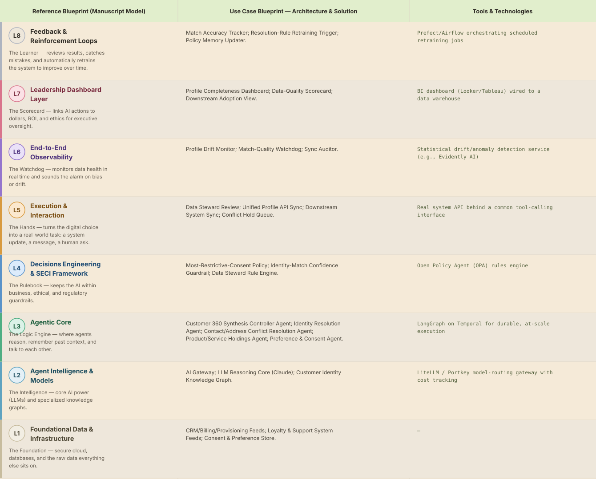
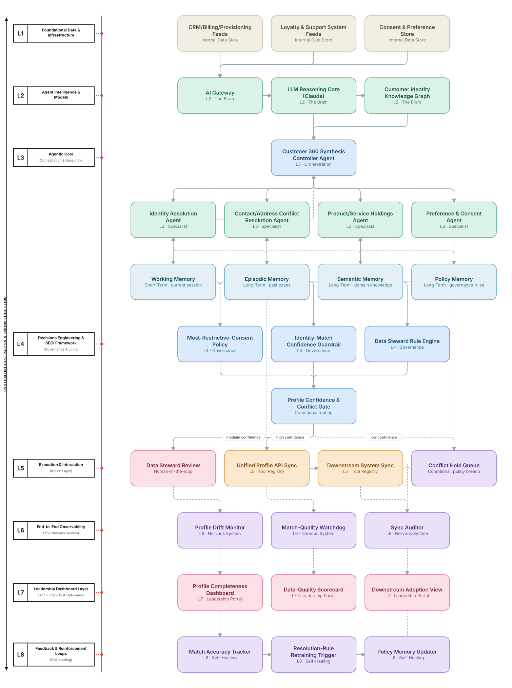

# Deep 8-Layer Regenerative Architecture: Customer Identity Resolution Decisioning

**Domain:** BSS/OSS &nbsp;|&nbsp; **Quick Reference counterpart:** [Customer 360 / Master Data Unification]({{ '/bssoss/08-customer-360-master-data-unification/' | relative_url }}) (Blackboard / Shared-Memory)

This deep-8 view makes the Quick view's 'most restrictive wins' consent rule an explicit, non-bypassable L4 policy, and adds a materiality-tiered review path for genuinely ambiguous identity conflicts rather than forcing every conflict through the same resolution path.

## 1. Problem Statement & Use Case

Customer data is fragmented across CRM, billing, provisioning, loyalty, and support systems. Identity-resolution false-merges are far more damaging than false-splits, and consent conflicts resolved in favor of marketing reach — even briefly — create real compliance exposure.

## 2. The 8-Layer Blueprint

## 3. Architecture Diagram (Flow View)

**Reading the diagram:** The Profile Confidence & Conflict Gate routes high-confidence matches to automatic sync, genuinely ambiguous conflicts to a data steward, and low-confidence matches to hold — with the consent/preference guardrail in L4 hard-coded to the most-restrictive-wins rule, no override path.

## 4. Agent-Level Architecture Stack

| Layer | Agent Name | Agent Purpose | Inputs / Outputs | Learning Stack | Production Stack |
|---|---|---|---|---|---|
| L2 | AI Gateway | Provides AI Gateway's reasoning/knowledge capability to the Agentic Core. | Agent requests → Model responses, usage telemetry | Claude API called directly | LiteLLM / Portkey model-routing gateway with cost tracking |
| L2 | LLM Reasoning Core (Claude) | Provides LLM Reasoning Core (Claude)'s reasoning/knowledge capability to the Agentic Core. | Agent requests → Model responses, usage telemetry | Claude API called directly | LiteLLM / Portkey model-routing gateway with cost tracking |
| L2 | Customer Identity Knowledge Graph | Provides Customer Identity Knowledge Graph's reasoning/knowledge capability to the Agentic Core. | Agent requests → Model responses, usage telemetry | Claude API called directly | LiteLLM / Portkey model-routing gateway with cost tracking |
| L3 | Customer 360 Synthesis Controller Agent | Customer 360 Synthesis Controller Agent — specialist agent in the Agentic Core's reasoning chain. | Task context, Working Memory → Reasoning output, next-step decision | LangGraph agent node + Claude API | LangGraph on Temporal for durable, at-scale execution |
| L3 | Identity Resolution Agent | Identity Resolution Agent — specialist agent in the Agentic Core's reasoning chain. | Task context, Working Memory → Reasoning output, next-step decision | LangGraph agent node + Claude API | LangGraph on Temporal for durable, at-scale execution |
| L3 | Contact/Address Conflict Resolution Agent | Contact/Address Conflict Resolution Agent — specialist agent in the Agentic Core's reasoning chain. | Task context, Working Memory → Reasoning output, next-step decision | LangGraph agent node + Claude API | LangGraph on Temporal for durable, at-scale execution |
| L3 | Product/Service Holdings Agent | Product/Service Holdings Agent — specialist agent in the Agentic Core's reasoning chain. | Task context, Working Memory → Reasoning output, next-step decision | LangGraph agent node + Claude API | LangGraph on Temporal for durable, at-scale execution |
| L3 | Preference & Consent Agent | Preference & Consent Agent — specialist agent in the Agentic Core's reasoning chain. | Task context, Working Memory → Reasoning output, next-step decision | LangGraph agent node + Claude API | LangGraph on Temporal for durable, at-scale execution |
| L4 | Most-Restrictive-Consent Policy | Enforces Most-Restrictive-Consent Policy as a governance gate before any action reaches the Action Layer. | Proposed action, policy rules → Pass/fail decision | Plain Python rule functions | Open Policy Agent (OPA) rules engine |
| L4 | Identity-Match Confidence Guardrail | Enforces Identity-Match Confidence Guardrail as a governance gate before any action reaches the Action Layer. | Proposed action, policy rules → Pass/fail decision | Plain Python rule functions | Open Policy Agent (OPA) rules engine |
| L4 | Data Steward Rule Engine | Enforces Data Steward Rule Engine as a governance gate before any action reaches the Action Layer. | Proposed action, policy rules → Pass/fail decision | Plain Python rule functions | Open Policy Agent (OPA) rules engine |
| L5 | Data Steward Review | Executes Data Steward Review as part of the Action & Execution layer once a decision is approved. | Approved decision → Executed action, system update | Mock REST endpoint (FastAPI) | Real system API behind a common tool-calling interface |
| L5 | Unified Profile API Sync | Executes Unified Profile API Sync as part of the Action & Execution layer once a decision is approved. | Approved decision → Executed action, system update | Mock REST endpoint (FastAPI) | Real system API behind a common tool-calling interface |
| L5 | Downstream System Sync | Executes Downstream System Sync as part of the Action & Execution layer once a decision is approved. | Approved decision → Executed action, system update | Mock REST endpoint (FastAPI) | Real system API behind a common tool-calling interface |
| L5 | Conflict Hold Queue | Executes Conflict Hold Queue as part of the Action & Execution layer once a decision is approved. | Approved decision → Executed action, system update | Mock REST endpoint (FastAPI) | Real system API behind a common tool-calling interface |
| L6 | Profile Drift Monitor | Continuously monitors for the failure mode Profile Drift Monitor is named to catch. | Live execution/outcome telemetry → Alert, health score | Scheduled Python script / simple threshold check | Statistical drift/anomaly detection service (e.g., Evidently AI) |
| L6 | Match-Quality Watchdog | Continuously monitors for the failure mode Match-Quality Watchdog is named to catch. | Live execution/outcome telemetry → Alert, health score | Scheduled Python script / simple threshold check | Statistical drift/anomaly detection service (e.g., Evidently AI) |
| L6 | Sync Auditor | Continuously monitors for the failure mode Sync Auditor is named to catch. | Live execution/outcome telemetry → Alert, health score | Scheduled Python script / simple threshold check | Statistical drift/anomaly detection service (e.g., Evidently AI) |
| L7 | Profile Completeness Dashboard | Gives leadership real-time visibility via Profile Completeness Dashboard. | Outcome + financial data → Executive-facing metric | Streamlit or Metabase dashboard | BI dashboard (Looker/Tableau) wired to a data warehouse |
| L7 | Data-Quality Scorecard | Gives leadership real-time visibility via Data-Quality Scorecard. | Outcome + financial data → Executive-facing metric | Streamlit or Metabase dashboard | BI dashboard (Looker/Tableau) wired to a data warehouse |
| L7 | Downstream Adoption View | Gives leadership real-time visibility via Downstream Adoption View. | Outcome + financial data → Executive-facing metric | Streamlit or Metabase dashboard | BI dashboard (Looker/Tableau) wired to a data warehouse |
| L8 | Match Accuracy Tracker | Closes the feedback loop via Match Accuracy Tracker, feeding outcomes back into memory. | Outcome-accuracy data, thresholds → Retraining trigger / updated memory | Cron job checking a threshold | Prefect/Airflow orchestrating scheduled retraining jobs |
| L8 | Resolution-Rule Retraining Trigger | Closes the feedback loop via Resolution-Rule Retraining Trigger, feeding outcomes back into memory. | Outcome-accuracy data, thresholds → Retraining trigger / updated memory | Cron job checking a threshold | Prefect/Airflow orchestrating scheduled retraining jobs |
| L8 | Policy Memory Updater | Closes the feedback loop via Policy Memory Updater, feeding outcomes back into memory. | Outcome-accuracy data, thresholds → Retraining trigger / updated memory | Cron job checking a threshold | Prefect/Airflow orchestrating scheduled retraining jobs |

## 5. Suggested Build Order (by Layer)

**Phase 1 — L1 + L2 + a stub L5, nothing else.** Fake customer identity data in Postgres, a single Claude API call, and Identity Resolution Agent producing a result that just gets printed, with Customer 360 Synthesis Controller Agent just passing data through untouched. No memory, no governance, no conditional routing yet.

**Phase 2 — build out L3, the Agentic Core.** Bring the remaining 3 agents online and build Customer 360 Synthesis Controller Agent's aggregation logic, and add Working + Episodic memory (Chroma). This is where the pattern is actually learned, not before.

**Phase 3 — add L4 and the conditional gate.** Wire in the governance engines as hard gates, then build the three-way Profile Confidence & Conflict Gate routing into auto-execute / human review / hold.

**Phase 4 — complete L5.** Build the Data Steward Review approval screen and the hold/escalate queue; this is the first point where a human is actually in the loop.

**Phase 5 — add L6 observability.** Drop in a drift/anomaly detection service and a data-quality check. This is usually the point where problems invisible in Phases 1–4 surface for the first time.

**Phase 6 — add L7 and L8.** Build the executive dashboard last, and the scheduled retraining/memory-update job. These teach the least new technical ground but close the loop the manuscript calls "regenerative."

> ⚙️ **Built with the AI-Regenesis engine.** This layer breakdown, the blueprint table, and the build order
> were generated from a compact spec by the same engine packaged as the free
> [`deep8-architecture-engine` skill]({{ '/skills/#deep8-architecture-engine' | relative_url }}) — map
> your own use case onto the 8-layer framework the same way.

---
[← Back to Deep 8-Layer index]({{ '/deep8/' | relative_url }}) &nbsp;|&nbsp; [← Back to home]({{ '/' | relative_url }})
