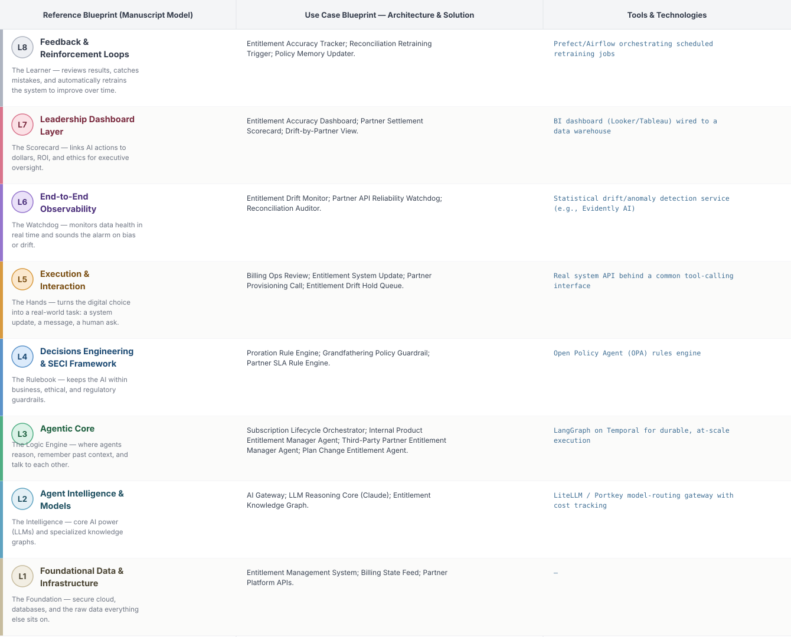
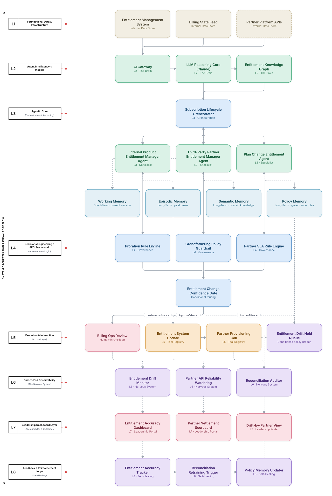

# Deep 8-Layer Regenerative Architecture: Subscription Entitlement Accuracy Decisioning

**Domain:** BSS/OSS &nbsp;|&nbsp; **Quick Reference counterpart:** [Subscription Lifecycle & Entitlement Management]({{ '/bssoss/09-subscription-lifecycle-entitlement/' | relative_url }}) (Hierarchical Multi-Agent (Manager-of-Managers))

This deep-8 view adds the entitlement-drift monitoring the Quick view's own retrospective wished it had built first — proactive drift detection is now a first-class L6 component, not an afterthought discovered through customer complaints.

## 1. Problem Statement & Use Case

Bundled subscriptions (streaming, cloud storage, device insurance) must stay perfectly synchronized between entitlement state and billing state across upgrades, downgrades, and partner integrations of wildly varying reliability. Drift between what a customer is billed for and what they actually have access to erodes trust silently until a complaint surfaces it.

## 2. The 8-Layer Blueprint

## 3. Architecture Diagram (Flow View)

**Reading the diagram:** The Entitlement Change Confidence Gate separates routine plan changes (auto-execute) from partner-API-dependent changes needing billing ops review, given how unreliable partner APIs proved to be in the Quick view's own build history.

## 4. Agent-Level Architecture Stack

| Layer | Agent Name | Agent Purpose | Inputs / Outputs | Learning Stack | Production Stack |
|---|---|---|---|---|---|
| L2 | AI Gateway | Provides AI Gateway's reasoning/knowledge capability to the Agentic Core. | Agent requests → Model responses, usage telemetry | Claude API called directly | LiteLLM / Portkey model-routing gateway with cost tracking |
| L2 | LLM Reasoning Core (Claude) | Provides LLM Reasoning Core (Claude)'s reasoning/knowledge capability to the Agentic Core. | Agent requests → Model responses, usage telemetry | Claude API called directly | LiteLLM / Portkey model-routing gateway with cost tracking |
| L2 | Entitlement Knowledge Graph | Provides Entitlement Knowledge Graph's reasoning/knowledge capability to the Agentic Core. | Agent requests → Model responses, usage telemetry | Claude API called directly | LiteLLM / Portkey model-routing gateway with cost tracking |
| L3 | Subscription Lifecycle Orchestrator | Subscription Lifecycle Orchestrator — specialist agent in the Agentic Core's reasoning chain. | Task context, Working Memory → Reasoning output, next-step decision | LangGraph agent node + Claude API | LangGraph on Temporal for durable, at-scale execution |
| L3 | Internal Product Entitlement Manager Agent | Internal Product Entitlement Manager Agent — specialist agent in the Agentic Core's reasoning chain. | Task context, Working Memory → Reasoning output, next-step decision | LangGraph agent node + Claude API | LangGraph on Temporal for durable, at-scale execution |
| L3 | Third-Party Partner Entitlement Manager Agent | Third-Party Partner Entitlement Manager Agent — specialist agent in the Agentic Core's reasoning chain. | Task context, Working Memory → Reasoning output, next-step decision | LangGraph agent node + Claude API | LangGraph on Temporal for durable, at-scale execution |
| L3 | Plan Change Entitlement Agent | Plan Change Entitlement Agent — specialist agent in the Agentic Core's reasoning chain. | Task context, Working Memory → Reasoning output, next-step decision | LangGraph agent node + Claude API | LangGraph on Temporal for durable, at-scale execution |
| L4 | Proration Rule Engine | Enforces Proration Rule Engine as a governance gate before any action reaches the Action Layer. | Proposed action, policy rules → Pass/fail decision | Plain Python rule functions | Open Policy Agent (OPA) rules engine |
| L4 | Grandfathering Policy Guardrail | Enforces Grandfathering Policy Guardrail as a governance gate before any action reaches the Action Layer. | Proposed action, policy rules → Pass/fail decision | Plain Python rule functions | Open Policy Agent (OPA) rules engine |
| L4 | Partner SLA Rule Engine | Enforces Partner SLA Rule Engine as a governance gate before any action reaches the Action Layer. | Proposed action, policy rules → Pass/fail decision | Plain Python rule functions | Open Policy Agent (OPA) rules engine |
| L5 | Billing Ops Review | Executes Billing Ops Review as part of the Action & Execution layer once a decision is approved. | Approved decision → Executed action, system update | Mock REST endpoint (FastAPI) | Real system API behind a common tool-calling interface |
| L5 | Entitlement System Update | Executes Entitlement System Update as part of the Action & Execution layer once a decision is approved. | Approved decision → Executed action, system update | Mock REST endpoint (FastAPI) | Real system API behind a common tool-calling interface |
| L5 | Partner Provisioning Call | Executes Partner Provisioning Call as part of the Action & Execution layer once a decision is approved. | Approved decision → Executed action, system update | Mock REST endpoint (FastAPI) | Real system API behind a common tool-calling interface |
| L5 | Entitlement Drift Hold Queue | Executes Entitlement Drift Hold Queue as part of the Action & Execution layer once a decision is approved. | Approved decision → Executed action, system update | Mock REST endpoint (FastAPI) | Real system API behind a common tool-calling interface |
| L6 | Entitlement Drift Monitor | Continuously monitors for the failure mode Entitlement Drift Monitor is named to catch. | Live execution/outcome telemetry → Alert, health score | Scheduled Python script / simple threshold check | Statistical drift/anomaly detection service (e.g., Evidently AI) |
| L6 | Partner API Reliability Watchdog | Continuously monitors for the failure mode Partner API Reliability Watchdog is named to catch. | Live execution/outcome telemetry → Alert, health score | Scheduled Python script / simple threshold check | Statistical drift/anomaly detection service (e.g., Evidently AI) |
| L6 | Reconciliation Auditor | Continuously monitors for the failure mode Reconciliation Auditor is named to catch. | Live execution/outcome telemetry → Alert, health score | Scheduled Python script / simple threshold check | Statistical drift/anomaly detection service (e.g., Evidently AI) |
| L7 | Entitlement Accuracy Dashboard | Gives leadership real-time visibility via Entitlement Accuracy Dashboard. | Outcome + financial data → Executive-facing metric | Streamlit or Metabase dashboard | BI dashboard (Looker/Tableau) wired to a data warehouse |
| L7 | Partner Settlement Scorecard | Gives leadership real-time visibility via Partner Settlement Scorecard. | Outcome + financial data → Executive-facing metric | Streamlit or Metabase dashboard | BI dashboard (Looker/Tableau) wired to a data warehouse |
| L7 | Drift-by-Partner View | Gives leadership real-time visibility via Drift-by-Partner View. | Outcome + financial data → Executive-facing metric | Streamlit or Metabase dashboard | BI dashboard (Looker/Tableau) wired to a data warehouse |
| L8 | Entitlement Accuracy Tracker | Closes the feedback loop via Entitlement Accuracy Tracker, feeding outcomes back into memory. | Outcome-accuracy data, thresholds → Retraining trigger / updated memory | Cron job checking a threshold | Prefect/Airflow orchestrating scheduled retraining jobs |
| L8 | Reconciliation Retraining Trigger | Closes the feedback loop via Reconciliation Retraining Trigger, feeding outcomes back into memory. | Outcome-accuracy data, thresholds → Retraining trigger / updated memory | Cron job checking a threshold | Prefect/Airflow orchestrating scheduled retraining jobs |
| L8 | Policy Memory Updater | Closes the feedback loop via Policy Memory Updater, feeding outcomes back into memory. | Outcome-accuracy data, thresholds → Retraining trigger / updated memory | Cron job checking a threshold | Prefect/Airflow orchestrating scheduled retraining jobs |

## 5. Suggested Build Order (by Layer)

**Phase 1 — L1 + L2 + a stub L5, nothing else.** Fake subscription entitlements data in Postgres, a single Claude API call, and Internal Product Entitlement Manager Agent producing a result that just gets printed, with Subscription Lifecycle Orchestrator just passing data through untouched. No memory, no governance, no conditional routing yet.

**Phase 2 — build out L3, the Agentic Core.** Bring the remaining 2 agents online and build Subscription Lifecycle Orchestrator's aggregation logic, and add Working + Episodic memory (Chroma). This is where the pattern is actually learned, not before.

**Phase 3 — add L4 and the conditional gate.** Wire in the governance engines as hard gates, then build the three-way Entitlement Change Confidence Gate routing into auto-execute / human review / hold.

**Phase 4 — complete L5.** Build the Billing Ops Review approval screen and the hold/escalate queue; this is the first point where a human is actually in the loop.

**Phase 5 — add L6 observability.** Drop in a drift/anomaly detection service and a data-quality check. This is usually the point where problems invisible in Phases 1–4 surface for the first time.

**Phase 6 — add L7 and L8.** Build the executive dashboard last, and the scheduled retraining/memory-update job. These teach the least new technical ground but close the loop the manuscript calls "regenerative."

> ⚙️ **Built with the AI-Regenesis engine.** This layer breakdown, the blueprint table, and the build order
> were generated from a compact spec by the same engine packaged as the free
> [`deep8-architecture-engine` skill]({{ '/skills/#deep8-architecture-engine' | relative_url }}) — map
> your own use case onto the 8-layer framework the same way.

---
[← Back to Deep 8-Layer index]({{ '/deep8/' | relative_url }}) &nbsp;|&nbsp; [← Back to home]({{ '/' | relative_url }})
