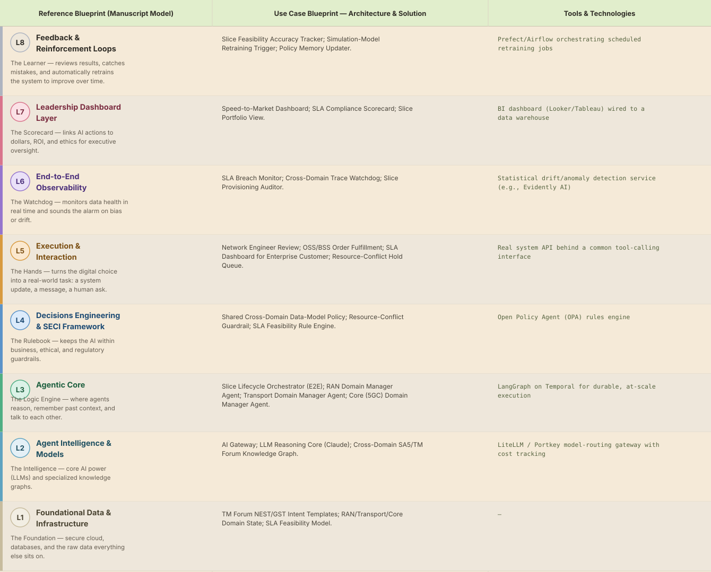
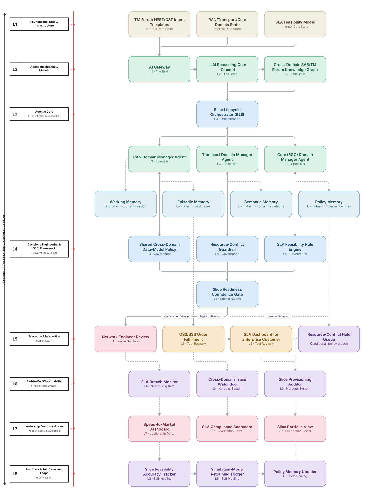

# Deep 8-Layer Regenerative Architecture: 5G Network Slice Design & Assurance Decisioning

**Domain:** Telecommunications &nbsp;|&nbsp; **Quick Reference counterpart:** [5G Network Slice Lifecycle Orchestration]({{ '/telecom/02-5g-network-slicing-orchestration/' | relative_url }}) (Hierarchical Multi-Agent (Manager-of-Managers))

This deep-8 view makes cross-domain conflict resolution an explicit L4 governance function — the Quick view's own retrospective found domain managers initially couldn't jointly resolve conflicting resource constraints, only escalate past each other.

## 1. Problem Statement & Use Case

Enterprises request bespoke 5G slices with different SLAs, and manually designing and assuring each slice across RAN, transport, and core takes weeks. Retrofitting a shared cross-domain data model after each domain manager had its own schema cost a full sprint in the Quick view's own build history.

## 2. The 8-Layer Blueprint

## 3. Architecture Diagram (Flow View)

**Reading the diagram:** The Slice Readiness Confidence Gate routes any cross-domain resource conflict to a network engineer rather than letting one domain manager silently override another; L4's shared data-model policy is the fix for the schema-fragmentation issue the Quick view hit.

## 4. Agent-Level Architecture Stack

| Layer | Agent Name | Agent Purpose | Inputs / Outputs | Learning Stack | Production Stack |
|---|---|---|---|---|---|
| L2 | AI Gateway | Provides AI Gateway's reasoning/knowledge capability to the Agentic Core. | Agent requests → Model responses, usage telemetry | Claude API called directly | LiteLLM / Portkey model-routing gateway with cost tracking |
| L2 | LLM Reasoning Core (Claude) | Provides LLM Reasoning Core (Claude)'s reasoning/knowledge capability to the Agentic Core. | Agent requests → Model responses, usage telemetry | Claude API called directly | LiteLLM / Portkey model-routing gateway with cost tracking |
| L2 | Cross-Domain SA5/TM Forum Knowledge Graph | Provides Cross-Domain SA5/TM Forum Knowledge Graph's reasoning/knowledge capability to the Agentic Core. | Agent requests → Model responses, usage telemetry | Claude API called directly | LiteLLM / Portkey model-routing gateway with cost tracking |
| L3 | Slice Lifecycle Orchestrator (E2E) | Slice Lifecycle Orchestrator (E2E) — specialist agent in the Agentic Core's reasoning chain. | Task context, Working Memory → Reasoning output, next-step decision | LangGraph agent node + Claude API | LangGraph on Temporal for durable, at-scale execution |
| L3 | RAN Domain Manager Agent | RAN Domain Manager Agent — specialist agent in the Agentic Core's reasoning chain. | Task context, Working Memory → Reasoning output, next-step decision | LangGraph agent node + Claude API | LangGraph on Temporal for durable, at-scale execution |
| L3 | Transport Domain Manager Agent | Transport Domain Manager Agent — specialist agent in the Agentic Core's reasoning chain. | Task context, Working Memory → Reasoning output, next-step decision | LangGraph agent node + Claude API | LangGraph on Temporal for durable, at-scale execution |
| L3 | Core (5GC) Domain Manager Agent | Core (5GC) Domain Manager Agent — specialist agent in the Agentic Core's reasoning chain. | Task context, Working Memory → Reasoning output, next-step decision | LangGraph agent node + Claude API | LangGraph on Temporal for durable, at-scale execution |
| L4 | Shared Cross-Domain Data-Model Policy | Enforces Shared Cross-Domain Data-Model Policy as a governance gate before any action reaches the Action Layer. | Proposed action, policy rules → Pass/fail decision | Plain Python rule functions | Open Policy Agent (OPA) rules engine |
| L4 | Resource-Conflict Guardrail | Enforces Resource-Conflict Guardrail as a governance gate before any action reaches the Action Layer. | Proposed action, policy rules → Pass/fail decision | Plain Python rule functions | Open Policy Agent (OPA) rules engine |
| L4 | SLA Feasibility Rule Engine | Enforces SLA Feasibility Rule Engine as a governance gate before any action reaches the Action Layer. | Proposed action, policy rules → Pass/fail decision | Plain Python rule functions | Open Policy Agent (OPA) rules engine |
| L5 | Network Engineer Review | Executes Network Engineer Review as part of the Action & Execution layer once a decision is approved. | Approved decision → Executed action, system update | Mock REST endpoint (FastAPI) | Real system API behind a common tool-calling interface |
| L5 | OSS/BSS Order Fulfillment | Executes OSS/BSS Order Fulfillment as part of the Action & Execution layer once a decision is approved. | Approved decision → Executed action, system update | Mock REST endpoint (FastAPI) | Real system API behind a common tool-calling interface |
| L5 | SLA Dashboard for Enterprise Customer | Executes SLA Dashboard for Enterprise Customer as part of the Action & Execution layer once a decision is approved. | Approved decision → Executed action, system update | Mock REST endpoint (FastAPI) | Real system API behind a common tool-calling interface |
| L5 | Resource-Conflict Hold Queue | Executes Resource-Conflict Hold Queue as part of the Action & Execution layer once a decision is approved. | Approved decision → Executed action, system update | Mock REST endpoint (FastAPI) | Real system API behind a common tool-calling interface |
| L6 | SLA Breach Monitor | Continuously monitors for the failure mode SLA Breach Monitor is named to catch. | Live execution/outcome telemetry → Alert, health score | Scheduled Python script / simple threshold check | Statistical drift/anomaly detection service (e.g., Evidently AI) |
| L6 | Cross-Domain Trace Watchdog | Continuously monitors for the failure mode Cross-Domain Trace Watchdog is named to catch. | Live execution/outcome telemetry → Alert, health score | Scheduled Python script / simple threshold check | Statistical drift/anomaly detection service (e.g., Evidently AI) |
| L6 | Slice Provisioning Auditor | Continuously monitors for the failure mode Slice Provisioning Auditor is named to catch. | Live execution/outcome telemetry → Alert, health score | Scheduled Python script / simple threshold check | Statistical drift/anomaly detection service (e.g., Evidently AI) |
| L7 | Speed-to-Market Dashboard | Gives leadership real-time visibility via Speed-to-Market Dashboard. | Outcome + financial data → Executive-facing metric | Streamlit or Metabase dashboard | BI dashboard (Looker/Tableau) wired to a data warehouse |
| L7 | SLA Compliance Scorecard | Gives leadership real-time visibility via SLA Compliance Scorecard. | Outcome + financial data → Executive-facing metric | Streamlit or Metabase dashboard | BI dashboard (Looker/Tableau) wired to a data warehouse |
| L7 | Slice Portfolio View | Gives leadership real-time visibility via Slice Portfolio View. | Outcome + financial data → Executive-facing metric | Streamlit or Metabase dashboard | BI dashboard (Looker/Tableau) wired to a data warehouse |
| L8 | Slice Feasibility Accuracy Tracker | Closes the feedback loop via Slice Feasibility Accuracy Tracker, feeding outcomes back into memory. | Outcome-accuracy data, thresholds → Retraining trigger / updated memory | Cron job checking a threshold | Prefect/Airflow orchestrating scheduled retraining jobs |
| L8 | Simulation-Model Retraining Trigger | Closes the feedback loop via Simulation-Model Retraining Trigger, feeding outcomes back into memory. | Outcome-accuracy data, thresholds → Retraining trigger / updated memory | Cron job checking a threshold | Prefect/Airflow orchestrating scheduled retraining jobs |
| L8 | Policy Memory Updater | Closes the feedback loop via Policy Memory Updater, feeding outcomes back into memory. | Outcome-accuracy data, thresholds → Retraining trigger / updated memory | Cron job checking a threshold | Prefect/Airflow orchestrating scheduled retraining jobs |

## 5. Suggested Build Order (by Layer)

**Phase 1 — L1 + L2 + a stub L5, nothing else.** Fake 5G network slicing data in Postgres, a single Claude API call, and RAN Domain Manager Agent producing a result that just gets printed, with Slice Lifecycle Orchestrator (E2E) just passing data through untouched. No memory, no governance, no conditional routing yet.

**Phase 2 — build out L3, the Agentic Core.** Bring the remaining 2 agents online and build Slice Lifecycle Orchestrator (E2E)'s aggregation logic, and add Working + Episodic memory (Chroma). This is where the pattern is actually learned, not before.

**Phase 3 — add L4 and the conditional gate.** Wire in the governance engines as hard gates, then build the three-way Slice Readiness Confidence Gate routing into auto-execute / human review / hold.

**Phase 4 — complete L5.** Build the Network Engineer Review approval screen and the hold/escalate queue; this is the first point where a human is actually in the loop.

**Phase 5 — add L6 observability.** Drop in a drift/anomaly detection service and a data-quality check. This is usually the point where problems invisible in Phases 1–4 surface for the first time.

**Phase 6 — add L7 and L8.** Build the executive dashboard last, and the scheduled retraining/memory-update job. These teach the least new technical ground but close the loop the manuscript calls "regenerative."

> ⚙️ **Built with the AI-Regenesis engine.** This layer breakdown, the blueprint table, and the build order
> were generated from a compact spec by the same engine packaged as the free
> [`deep8-architecture-engine` skill]({{ '/skills/#deep8-architecture-engine' | relative_url }}) — map
> your own use case onto the 8-layer framework the same way.

---
[← Back to Deep 8-Layer index]({{ '/deep8/' | relative_url }}) &nbsp;|&nbsp; [← Back to home]({{ '/' | relative_url }})
