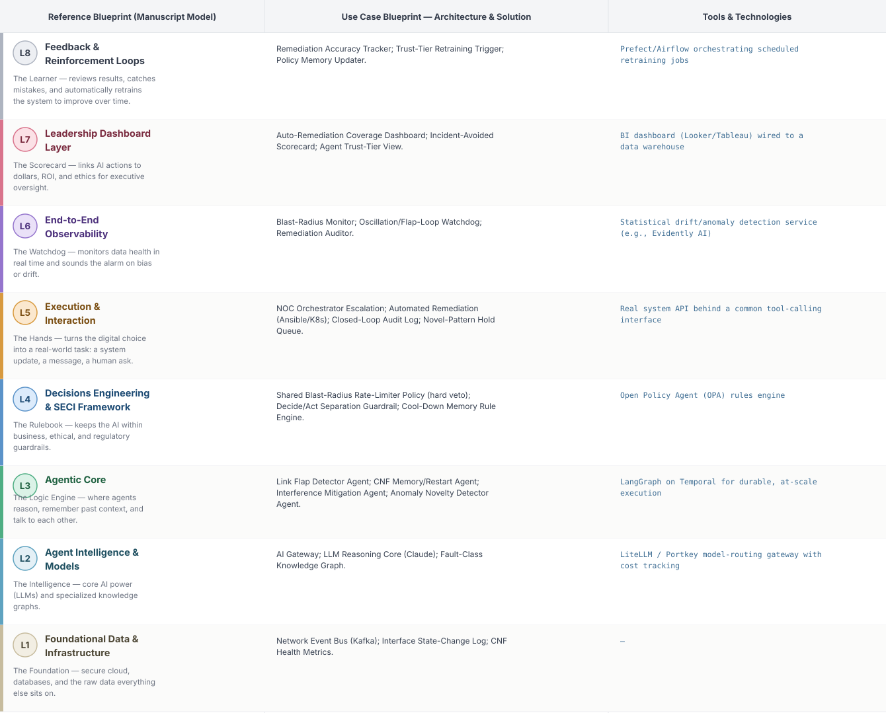
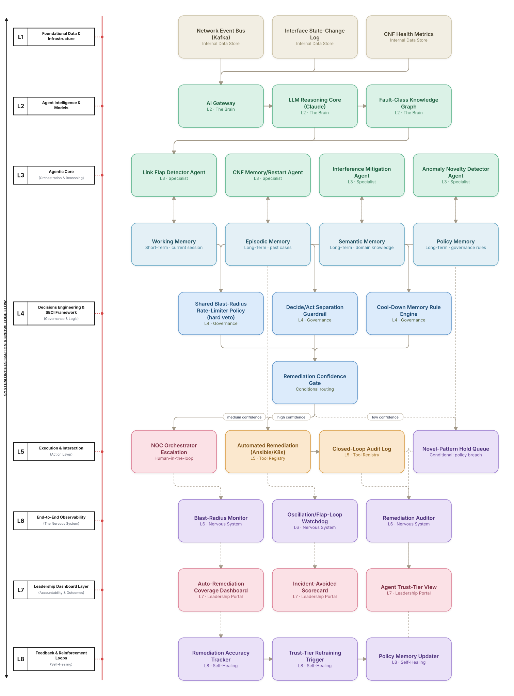

# Deep 8-Layer Regenerative Architecture: Closed-Loop Network Remediation Decisioning

**Domain:** Telecommunications &nbsp;|&nbsp; **Quick Reference counterpart:** [Self-Healing Network (Closed-Loop Automation)]({{ '/telecom/04-self-healing-network-closed-loop/' | relative_url }}) (Event-Driven Reactive Swarm)

This deep-8 view makes the shared blast-radius rate-limiter — added only after two agents independently restarting adjacent CNFs caused a cascading outage in the Quick view — a non-negotiable L4 policy from the start, and separates 'decide' from 'act' permissions per agent as the Quick view's own retrospective recommended.

## 1. Problem Statement & Use Case

Transient network degradations need sub-minute autonomous reaction. A shared blast-radius guardrail was missing in v1, and lower-trust agents initially had the same execute authority as proven ones — the retrospective specifically calls for graduated trust based on track record.

## 2. The 8-Layer Blueprint

## 3. Architecture Diagram (Flow View)

**Reading the diagram:** The Remediation Confidence Gate enforces a shared rate-limiter across all reactive agents at L4, regardless of which agent is acting — this is the direct fix for the Quick view's cascading-outage near-miss, and new agents start in 'recommend only' mode until proven reliable over N cycles.

## 4. Agent-Level Architecture Stack

| Layer | Agent Name | Agent Purpose | Inputs / Outputs | Learning Stack | Production Stack |
|---|---|---|---|---|---|
| L2 | AI Gateway | Provides AI Gateway's reasoning/knowledge capability to the Agentic Core. | Agent requests → Model responses, usage telemetry | Claude API called directly | LiteLLM / Portkey model-routing gateway with cost tracking |
| L2 | LLM Reasoning Core (Claude) | Provides LLM Reasoning Core (Claude)'s reasoning/knowledge capability to the Agentic Core. | Agent requests → Model responses, usage telemetry | Claude API called directly | LiteLLM / Portkey model-routing gateway with cost tracking |
| L2 | Fault-Class Knowledge Graph | Provides Fault-Class Knowledge Graph's reasoning/knowledge capability to the Agentic Core. | Agent requests → Model responses, usage telemetry | Claude API called directly | LiteLLM / Portkey model-routing gateway with cost tracking |
| L3 | Link Flap Detector Agent | Link Flap Detector Agent — specialist agent in the Agentic Core's reasoning chain. | Task context, Working Memory → Reasoning output, next-step decision | LangGraph agent node + Claude API | LangGraph on Temporal for durable, at-scale execution |
| L3 | CNF Memory/Restart Agent | CNF Memory/Restart Agent — specialist agent in the Agentic Core's reasoning chain. | Task context, Working Memory → Reasoning output, next-step decision | LangGraph agent node + Claude API | LangGraph on Temporal for durable, at-scale execution |
| L3 | Interference Mitigation Agent | Interference Mitigation Agent — specialist agent in the Agentic Core's reasoning chain. | Task context, Working Memory → Reasoning output, next-step decision | LangGraph agent node + Claude API | LangGraph on Temporal for durable, at-scale execution |
| L3 | Anomaly Novelty Detector Agent | Anomaly Novelty Detector Agent — specialist agent in the Agentic Core's reasoning chain. | Task context, Working Memory → Reasoning output, next-step decision | LangGraph agent node + Claude API | LangGraph on Temporal for durable, at-scale execution |
| L4 | Shared Blast-Radius Rate-Limiter Policy (hard veto) | Enforces Shared Blast-Radius Rate-Limiter Policy (hard veto) as a governance gate before any action reaches the Action Layer. | Proposed action, policy rules → Pass/fail decision | Plain Python rule functions | Open Policy Agent (OPA) rules engine |
| L4 | Decide/Act Separation Guardrail | Enforces Decide/Act Separation Guardrail as a governance gate before any action reaches the Action Layer. | Proposed action, policy rules → Pass/fail decision | Plain Python rule functions | Open Policy Agent (OPA) rules engine |
| L4 | Cool-Down Memory Rule Engine | Enforces Cool-Down Memory Rule Engine as a governance gate before any action reaches the Action Layer. | Proposed action, policy rules → Pass/fail decision | Plain Python rule functions | Open Policy Agent (OPA) rules engine |
| L5 | NOC Orchestrator Escalation | Executes NOC Orchestrator Escalation as part of the Action & Execution layer once a decision is approved. | Approved decision → Executed action, system update | Mock REST endpoint (FastAPI) | Real system API behind a common tool-calling interface |
| L5 | Automated Remediation (Ansible/K8s) | Executes Automated Remediation (Ansible/K8s) as part of the Action & Execution layer once a decision is approved. | Approved decision → Executed action, system update | Mock REST endpoint (FastAPI) | Real system API behind a common tool-calling interface |
| L5 | Closed-Loop Audit Log | Executes Closed-Loop Audit Log as part of the Action & Execution layer once a decision is approved. | Approved decision → Executed action, system update | Mock REST endpoint (FastAPI) | Real system API behind a common tool-calling interface |
| L5 | Novel-Pattern Hold Queue | Executes Novel-Pattern Hold Queue as part of the Action & Execution layer once a decision is approved. | Approved decision → Executed action, system update | Mock REST endpoint (FastAPI) | Real system API behind a common tool-calling interface |
| L6 | Blast-Radius Monitor | Continuously monitors for the failure mode Blast-Radius Monitor is named to catch. | Live execution/outcome telemetry → Alert, health score | Scheduled Python script / simple threshold check | Statistical drift/anomaly detection service (e.g., Evidently AI) |
| L6 | Oscillation/Flap-Loop Watchdog | Continuously monitors for the failure mode Oscillation/Flap-Loop Watchdog is named to catch. | Live execution/outcome telemetry → Alert, health score | Scheduled Python script / simple threshold check | Statistical drift/anomaly detection service (e.g., Evidently AI) |
| L6 | Remediation Auditor | Continuously monitors for the failure mode Remediation Auditor is named to catch. | Live execution/outcome telemetry → Alert, health score | Scheduled Python script / simple threshold check | Statistical drift/anomaly detection service (e.g., Evidently AI) |
| L7 | Auto-Remediation Coverage Dashboard | Gives leadership real-time visibility via Auto-Remediation Coverage Dashboard. | Outcome + financial data → Executive-facing metric | Streamlit or Metabase dashboard | BI dashboard (Looker/Tableau) wired to a data warehouse |
| L7 | Incident-Avoided Scorecard | Gives leadership real-time visibility via Incident-Avoided Scorecard. | Outcome + financial data → Executive-facing metric | Streamlit or Metabase dashboard | BI dashboard (Looker/Tableau) wired to a data warehouse |
| L7 | Agent Trust-Tier View | Gives leadership real-time visibility via Agent Trust-Tier View. | Outcome + financial data → Executive-facing metric | Streamlit or Metabase dashboard | BI dashboard (Looker/Tableau) wired to a data warehouse |
| L8 | Remediation Accuracy Tracker | Closes the feedback loop via Remediation Accuracy Tracker, feeding outcomes back into memory. | Outcome-accuracy data, thresholds → Retraining trigger / updated memory | Cron job checking a threshold | Prefect/Airflow orchestrating scheduled retraining jobs |
| L8 | Trust-Tier Retraining Trigger | Closes the feedback loop via Trust-Tier Retraining Trigger, feeding outcomes back into memory. | Outcome-accuracy data, thresholds → Retraining trigger / updated memory | Cron job checking a threshold | Prefect/Airflow orchestrating scheduled retraining jobs |
| L8 | Policy Memory Updater | Closes the feedback loop via Policy Memory Updater, feeding outcomes back into memory. | Outcome-accuracy data, thresholds → Retraining trigger / updated memory | Cron job checking a threshold | Prefect/Airflow orchestrating scheduled retraining jobs |

## 5. Suggested Build Order (by Layer)

**Phase 1 — L1 + L2 + a stub L5, nothing else.** Fake self-healing network data in Postgres, a single Claude API call, and Link Flap Detector Agent producing a result that just gets printed. No memory, no governance, no conditional routing yet.

**Phase 2 — build out L3, the Agentic Core.** Bring the remaining 3 agents online, and add Working + Episodic memory (Chroma). This is where the pattern is actually learned, not before.

**Phase 3 — add L4 and the conditional gate.** Wire in the governance engines as hard gates, then build the three-way Remediation Confidence Gate routing into auto-execute / human review / hold.

**Phase 4 — complete L5.** Build the NOC Orchestrator Escalation approval screen and the hold/escalate queue; this is the first point where a human is actually in the loop.

**Phase 5 — add L6 observability.** Drop in a drift/anomaly detection service and a data-quality check. This is usually the point where problems invisible in Phases 1–4 surface for the first time.

**Phase 6 — add L7 and L8.** Build the executive dashboard last, and the scheduled retraining/memory-update job. These teach the least new technical ground but close the loop the manuscript calls "regenerative."

> ⚙️ **Built with the AI-Regenesis engine.** This layer breakdown, the blueprint table, and the build order
> were generated from a compact spec by the same engine packaged as the free
> [`deep8-architecture-engine` skill]({{ '/skills/#deep8-architecture-engine' | relative_url }}) — map
> your own use case onto the 8-layer framework the same way.

---
[← Back to Deep 8-Layer index]({{ '/deep8/' | relative_url }}) &nbsp;|&nbsp; [← Back to home]({{ '/' | relative_url }})
