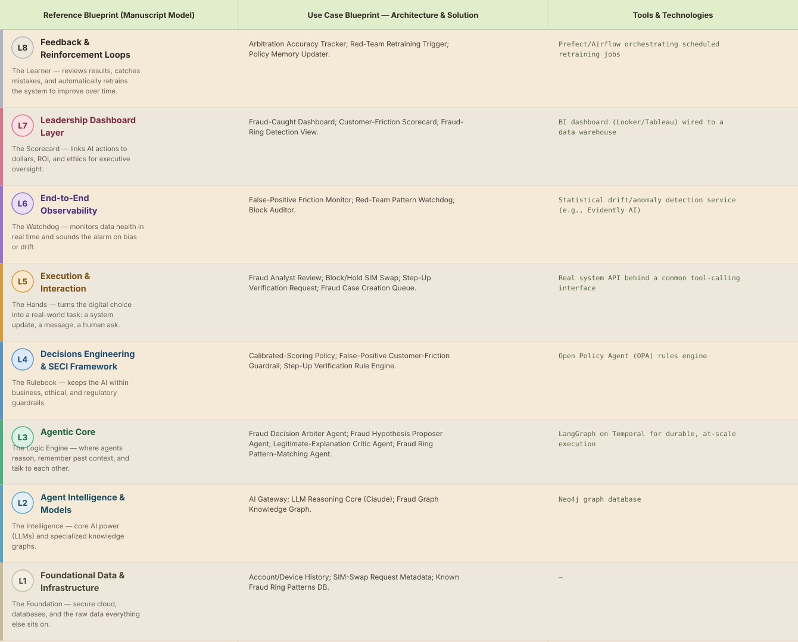
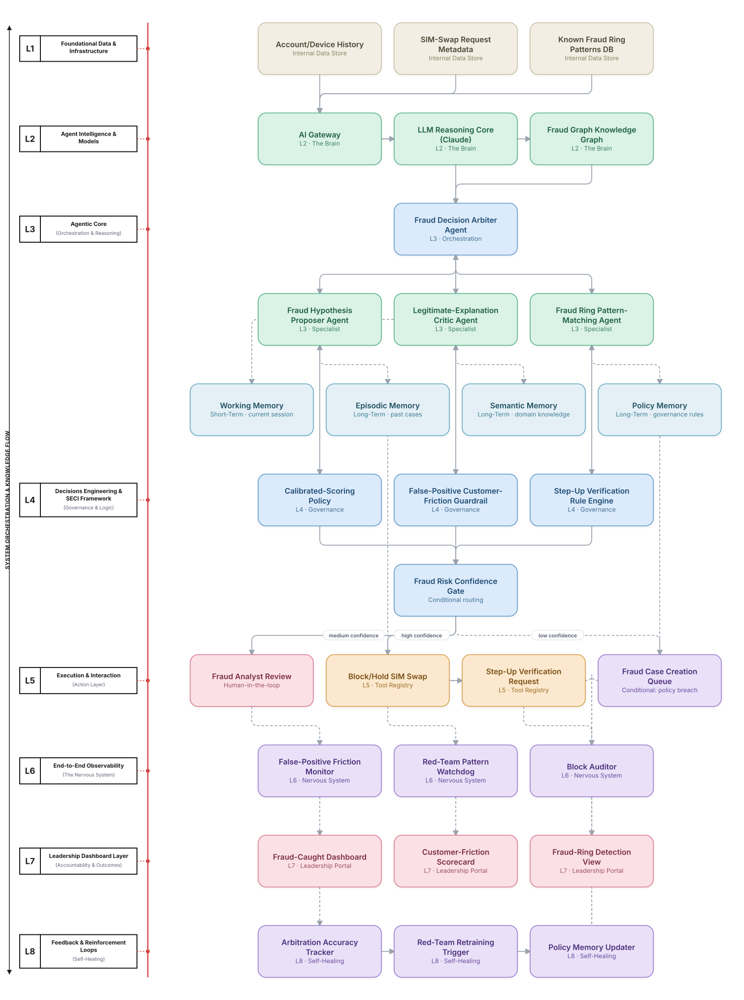

# Deep 8-Layer Regenerative Architecture: SIM-Swap Fraud Decisioning

**Domain:** Telecommunications &nbsp;|&nbsp; **Quick Reference counterpart:** [SIM-Swap & Account-Takeover Fraud Detection]({{ '/telecom/07-sim-swap-fraud-detection/' | relative_url }}) (Debate-Critique-Arbiter (Reflective Loop))

This deep-8 view keeps the proposer/critic independence discipline shared with the AML and insider-trading use cases — the same design lesson (shared context causes confirmation bias) was independently re-confirmed here.

## 1. Problem Statement & Use Case

SIM-swap fraud bypasses SMS 2FA to take over banking/crypto accounts. Letting the arbiter be a third LLM vote correlated too much with the proposer's own framing; calibrated scoring using both agents' extracted evidence separately was needed instead.

## 2. The 8-Layer Blueprint

## 3. Architecture Diagram (Flow View)

**Reading the diagram:** The Fraud Risk Confidence Gate never lets the arbiter's determination be a simple vote — L4's calibrated-scoring rule engine weighs the proposer's and critic's independently-gathered evidence, not a re-ask of either agent's opinion.

## 4. Agent-Level Architecture Stack

| Layer | Agent Name | Agent Purpose | Inputs / Outputs | Learning Stack | Production Stack |
|---|---|---|---|---|---|
| L2 | AI Gateway | Provides AI Gateway's reasoning/knowledge capability to the Agentic Core. | Agent requests → Model responses, usage telemetry | Claude API called directly | LiteLLM / Portkey model-routing gateway with cost tracking |
| L2 | LLM Reasoning Core (Claude) | Provides LLM Reasoning Core (Claude)'s reasoning/knowledge capability to the Agentic Core. | Agent requests → Model responses, usage telemetry | Claude API called directly | LiteLLM / Portkey model-routing gateway with cost tracking |
| L2 | Fraud Graph Knowledge Graph | Provides Fraud Graph Knowledge Graph's reasoning/knowledge capability to the Agentic Core. | Agent requests → Model responses, usage telemetry | Claude API called directly | Neo4j graph database |
| L3 | Fraud Decision Arbiter Agent | Fraud Decision Arbiter Agent — specialist agent in the Agentic Core's reasoning chain. | Task context, Working Memory → Reasoning output, next-step decision | LangGraph agent node + Claude API | LangGraph on Temporal for durable, at-scale execution |
| L3 | Fraud Hypothesis Proposer Agent | Fraud Hypothesis Proposer Agent — specialist agent in the Agentic Core's reasoning chain. | Task context, Working Memory → Reasoning output, next-step decision | LangGraph agent node + Claude API | LangGraph on Temporal for durable, at-scale execution |
| L3 | Legitimate-Explanation Critic Agent | Legitimate-Explanation Critic Agent — specialist agent in the Agentic Core's reasoning chain. | Task context, Working Memory → Reasoning output, next-step decision | LangGraph agent node + Claude API | LangGraph on Temporal for durable, at-scale execution |
| L3 | Fraud Ring Pattern-Matching Agent | Fraud Ring Pattern-Matching Agent — specialist agent in the Agentic Core's reasoning chain. | Task context, Working Memory → Reasoning output, next-step decision | LangGraph agent node + Claude API | LangGraph on Temporal for durable, at-scale execution |
| L4 | Calibrated-Scoring Policy | Enforces Calibrated-Scoring Policy as a governance gate before any action reaches the Action Layer. | Proposed action, policy rules → Pass/fail decision | Plain Python rule functions | Open Policy Agent (OPA) rules engine |
| L4 | False-Positive Customer-Friction Guardrail | Enforces False-Positive Customer-Friction Guardrail as a governance gate before any action reaches the Action Layer. | Proposed action, policy rules → Pass/fail decision | Plain Python rule functions | Open Policy Agent (OPA) rules engine |
| L4 | Step-Up Verification Rule Engine | Enforces Step-Up Verification Rule Engine as a governance gate before any action reaches the Action Layer. | Proposed action, policy rules → Pass/fail decision | Plain Python rule functions | Open Policy Agent (OPA) rules engine |
| L5 | Fraud Analyst Review | Executes Fraud Analyst Review as part of the Action & Execution layer once a decision is approved. | Approved decision → Executed action, system update | Mock REST endpoint (FastAPI) | Real system API behind a common tool-calling interface |
| L5 | Block/Hold SIM Swap | Executes Block/Hold SIM Swap as part of the Action & Execution layer once a decision is approved. | Approved decision → Executed action, system update | Mock REST endpoint (FastAPI) | Real system API behind a common tool-calling interface |
| L5 | Step-Up Verification Request | Executes Step-Up Verification Request as part of the Action & Execution layer once a decision is approved. | Approved decision → Executed action, system update | Mock REST endpoint (FastAPI) | Real system API behind a common tool-calling interface |
| L5 | Fraud Case Creation Queue | Executes Fraud Case Creation Queue as part of the Action & Execution layer once a decision is approved. | Approved decision → Executed action, system update | Mock REST endpoint (FastAPI) | Real system API behind a common tool-calling interface |
| L6 | False-Positive Friction Monitor | Continuously monitors for the failure mode False-Positive Friction Monitor is named to catch. | Live execution/outcome telemetry → Alert, health score | Scheduled Python script / simple threshold check | Statistical drift/anomaly detection service (e.g., Evidently AI) |
| L6 | Red-Team Pattern Watchdog | Continuously monitors for the failure mode Red-Team Pattern Watchdog is named to catch. | Live execution/outcome telemetry → Alert, health score | Scheduled Python script / simple threshold check | Statistical drift/anomaly detection service (e.g., Evidently AI) |
| L6 | Block Auditor | Continuously monitors for the failure mode Block Auditor is named to catch. | Live execution/outcome telemetry → Alert, health score | Scheduled Python script / simple threshold check | Statistical drift/anomaly detection service (e.g., Evidently AI) |
| L7 | Fraud-Caught Dashboard | Gives leadership real-time visibility via Fraud-Caught Dashboard. | Outcome + financial data → Executive-facing metric | Streamlit or Metabase dashboard | BI dashboard (Looker/Tableau) wired to a data warehouse |
| L7 | Customer-Friction Scorecard | Gives leadership real-time visibility via Customer-Friction Scorecard. | Outcome + financial data → Executive-facing metric | Streamlit or Metabase dashboard | BI dashboard (Looker/Tableau) wired to a data warehouse |
| L7 | Fraud-Ring Detection View | Gives leadership real-time visibility via Fraud-Ring Detection View. | Outcome + financial data → Executive-facing metric | Streamlit or Metabase dashboard | BI dashboard (Looker/Tableau) wired to a data warehouse |
| L8 | Arbitration Accuracy Tracker | Closes the feedback loop via Arbitration Accuracy Tracker, feeding outcomes back into memory. | Outcome-accuracy data, thresholds → Retraining trigger / updated memory | Cron job checking a threshold | Prefect/Airflow orchestrating scheduled retraining jobs |
| L8 | Red-Team Retraining Trigger | Closes the feedback loop via Red-Team Retraining Trigger, feeding outcomes back into memory. | Outcome-accuracy data, thresholds → Retraining trigger / updated memory | Cron job checking a threshold | Prefect/Airflow orchestrating scheduled retraining jobs |
| L8 | Policy Memory Updater | Closes the feedback loop via Policy Memory Updater, feeding outcomes back into memory. | Outcome-accuracy data, thresholds → Retraining trigger / updated memory | Cron job checking a threshold | Prefect/Airflow orchestrating scheduled retraining jobs |

## 5. Suggested Build Order (by Layer)

**Phase 1 — L1 + L2 + a stub L5, nothing else.** Fake SIM-swap fraud data in Postgres, a single Claude API call, and Fraud Hypothesis Proposer Agent producing a result that just gets printed, with Fraud Decision Arbiter Agent just passing data through untouched. No memory, no governance, no conditional routing yet.

**Phase 2 — build out L3, the Agentic Core.** Bring the remaining 2 agents online and build Fraud Decision Arbiter Agent's aggregation logic, and add Working + Episodic memory (Chroma). This is where the pattern is actually learned, not before.

**Phase 3 — add L4 and the conditional gate.** Wire in the governance engines as hard gates, then build the three-way Fraud Risk Confidence Gate routing into auto-execute / human review / hold.

**Phase 4 — complete L5.** Build the Fraud Analyst Review approval screen and the hold/escalate queue; this is the first point where a human is actually in the loop.

**Phase 5 — add L6 observability.** Drop in a drift/anomaly detection service and a data-quality check. This is usually the point where problems invisible in Phases 1–4 surface for the first time.

**Phase 6 — add L7 and L8.** Build the executive dashboard last, and the scheduled retraining/memory-update job. These teach the least new technical ground but close the loop the manuscript calls "regenerative."

> ⚙️ **Built with the AI-Regenesis engine.** This layer breakdown, the blueprint table, and the build order
> were generated from a compact spec by the same engine packaged as the free
> [`deep8-architecture-engine` skill]({{ '/skills/#deep8-architecture-engine' | relative_url }}) — map
> your own use case onto the 8-layer framework the same way.

---
[← Back to Deep 8-Layer index]({{ '/deep8/' | relative_url }}) &nbsp;|&nbsp; [← Back to home]({{ '/' | relative_url }})
