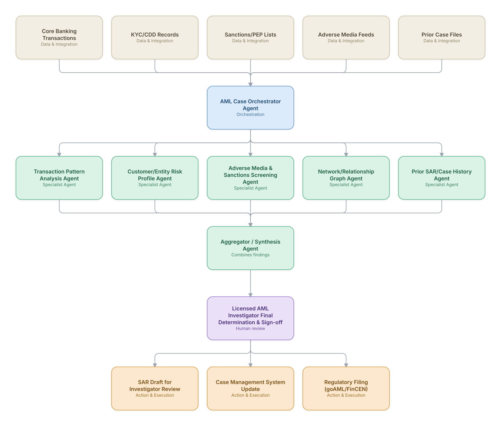

# 01. AML Transaction Monitoring & SAR Filing

**Domain:** Financial Services &nbsp;|&nbsp; **Architecture pattern:** [Orchestrator-Worker (Supervisor fan-out/fan-in)]({{ '/patterns/orchestrator-worker/' | relative_url }})

> 🧠 **Deep dive available:** this use case also has a full [8-Layer Regenerative Architecture breakdown]({{ '/deep8/finance/01-aml-transaction-monitoring-sar/' | relative_url }}) — the same problem mapped through L1–L8, with an agent-level tools/technologies stack and a suggested build order by layer.

## 1. Problem Statement & Use Case

Banks generate thousands of AML alerts daily from rules-based monitoring, of which 90-95% are false positives, yet each still requires investigator review to avoid regulatory penalty for missed suspicious activity. Investigators spend hours per alert gathering evidence across systems before deciding whether to file a Suspicious Activity Report (SAR). An agent team can pre-investigate every alert, assembling evidence and a draft narrative, so human investigators focus on judgment rather than data-gathering.

## 2. End-to-End Multi-Agent Architecture

The solution is implemented as a **Orchestrator-Worker (Supervisor fan-out/fan-in)** architecture. 
**Human-in-the-loop checkpoint:** Licensed AML Investigator Final Determination & Sign-off

### 2.1 Agents & Sub-Agents

| Agent | Responsibility |
|---|---|
| AML Case Orchestrator | Fans out an alert to evidence-gathering agents, aggregates findings into a case file with a preliminary risk rating |
| Transaction Pattern Analysis Agent | Detects structuring, layering, and velocity patterns in the alerted account's transaction history |
| Customer/Entity Risk Profile Agent | Assesses whether behavior deviates from the customer's declared occupation/expected activity |
| Adverse Media & Sanctions Screening Agent | Screens involved parties against sanctions, PEP, and adverse media |
| Network/Relationship Graph Agent | Maps connections to other flagged accounts/entities to detect mule networks |
| SAR Narrative Drafting Agent | Synthesizes all evidence into a structured, regulator-ready draft narrative |

### 2.2 Architecture Diagram

> This diagram is organized as a **layered architecture**: Data &amp; Integration → Orchestration → Agent →
> Action &amp; Execution, plus a cross-cutting Observability &amp; Governance layer (tracing, audit log,
> guardrails, and any human review checkpoint — shown in lavender). See the
> [E2E Platform Architecture]({{ '/architecture/e2e-platform-architecture/' | relative_url }}) for how this
> layering looks across all 60 use cases at once. A [Mermaid text source](architecture.mmd) of the same
> diagram is also available in this folder.

## 3. Technologies Used (per step)

| Step / Layer | Technology |
|---|---|
| Transaction monitoring | Existing AML rules engine (Actimize/SAS AML) as the alert source |
| Agent orchestration | LangGraph supervisor with strict tool-use audit logging (regulatory requirement) |
| Graph analytics | Neo4j for entity-relationship/mule-network detection |
| Screening | Sanctions/PEP/adverse-media API (Refinitiv World-Check, Dow Jones) |
| Narrative generation | Claude grounded strictly in retrieved evidence with citation of source records |
| Case management | Actimize/NICE Case Manager integration |
| Regulatory filing | FinCEN BSA E-Filing / goAML XML schema generation |
| Model governance | Full explainability + human-override logging for regulatory exam readiness |

## 4. Suggested Build Order

**Phase 1 — one worker, no fan-out.** Wire a single path end to end: Transaction Pattern Analysis Agent reading real data and producing a result, with AML Case Orchestrator Agent just passing data through untouched. Prove the data pipeline and one agent's reasoning before adding parallelism.

**Phase 2 — add the fan-out.** Bring the remaining 4 worker agents online in parallel and build AML Case Orchestrator Agent's aggregation/synthesis logic. This is where the orchestrator-worker pattern is actually learned — watch for race conditions and partial-failure handling here, not before.

**Phase 3 — add the governance gate.** Wire in the human checkpoint: Licensed AML Investigator Final Determination & Sign-off.

**Phase 4 — observability and feedback.** Trace every worker call, monitor the aggregator's decision quality against real outcomes, and add a feedback loop that catches drift before it becomes a production incident.

## 5. If We Rebuilt This: What Would Improve

- Every generated narrative sentence is required to cite its source transaction/record — this was added after an early draft included a plausible-sounding but unverifiable claim.
- Would build the network/relationship graph agent earlier; it caught mule-network patterns that individual per-account agents missed entirely in the first version.
- Investigators wanted a 'confidence + missing evidence' summary, not just a narrative, so they know what to double-check — added after investigator feedback.
- Regulatory audit requirements meant every agent tool call needed immutable logging from day one; retrofitting this after a pilot was costly.

> ⚙️ **Built with the AI-Regenesis engine.** Every diagram and build order on this page was generated from a
> compact spec by the same engine packaged as the free
> [`quick-reference-engine` skill]({{ '/skills/#quick-reference-engine' | relative_url }}) — drop your
> own use case in and get the same output.

---
[← Back to Financial Services index]({{ '/finance/' | relative_url }}) &nbsp;|&nbsp; [← Back to home]({{ '/' | relative_url }})
