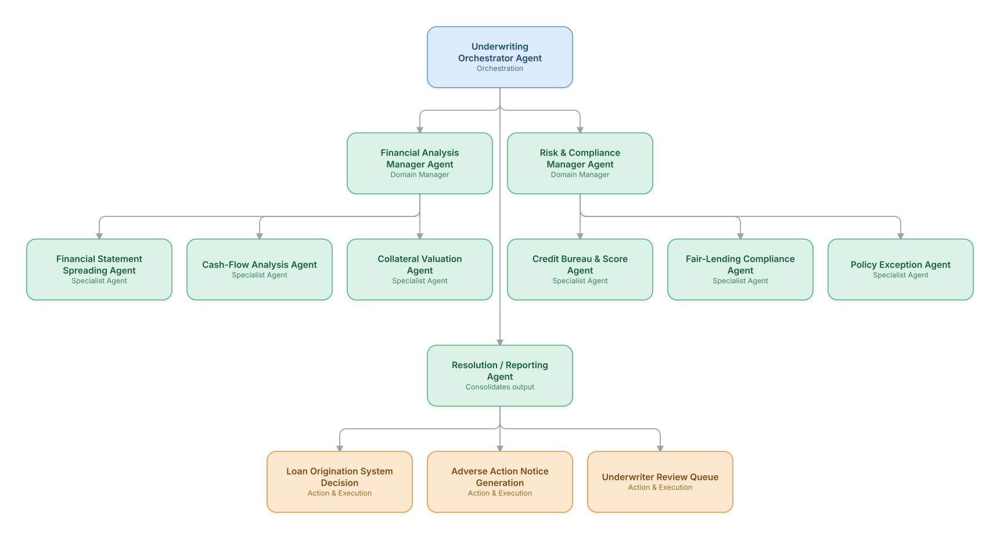

# 02. Credit Underwriting & Loan Origination

**Domain:** Financial Services &nbsp;|&nbsp; **Architecture pattern:** [Hierarchical Multi-Agent (Manager-of-Managers)]({{ '/patterns/hierarchical/' | relative_url }})

> 🧠 **Deep dive available:** this use case also has a full [8-Layer Regenerative Architecture breakdown]({{ '/deep8/finance/02-credit-underwriting-loan-origination/' | relative_url }}) — the same problem mapped through L1–L8, with an agent-level tools/technologies stack and a suggested build order by layer.

## 1. Problem Statement & Use Case

Small-business and consumer loan underwriting requires synthesizing financial statements, credit bureau data, bank transaction cash-flow analysis, collateral valuation, and policy compliance — traditionally a multi-day, multi-department process. A hierarchical agent system can compress this into hours while preserving auditable, explainable decisions required under fair-lending regulation.

## 2. End-to-End Multi-Agent Architecture

The solution is implemented as a **Hierarchical Multi-Agent (Manager-of-Managers)** architecture. 
### 2.1 Agents & Sub-Agents

| Agent | Responsibility |
|---|---|
| Underwriting Orchestrator | Coordinates financial and risk/compliance managers, produces the final decision package |
| Financial Analysis Manager | Oversees financial-statement, cash-flow, and collateral sub-agents |
| Risk & Compliance Manager | Oversees credit-score and fair-lending compliance sub-agents |
| Financial Statement Spreading Agent | Extracts and normalizes figures from uploaded financial statements/tax returns |
| Cash-Flow Analysis Agent | Analyzes bank transaction data (via open banking) for real cash-flow-based ability to repay |
| Fair-Lending Compliance Agent | Checks the decision for disparate-impact risk against protected classes before finalization |

### 2.2 Architecture Diagram

> This diagram is organized as a **layered architecture**: Data &amp; Integration → Orchestration → Agent →
> Action &amp; Execution, plus a cross-cutting Observability &amp; Governance layer (tracing, audit log,
> guardrails, and any human review checkpoint — shown in lavender). See the
> [E2E Platform Architecture]({{ '/architecture/e2e-platform-architecture/' | relative_url }}) for how this
> layering looks across all 60 use cases at once. A [Mermaid text source](architecture.mmd) of the same
> diagram is also available in this folder.

## 3. Technologies Used (per step)

| Step / Layer | Technology |
|---|---|
| Document extraction | OCR + LLM extraction of financial statements/tax docs (docx/pdf skill patterns) |
| Cash-flow analysis | Open banking API (Plaid) + transaction categorization ML model |
| Credit bureau integration | Experian/Equifax/TransUnion API |
| Agent orchestration | Hierarchical LangGraph with domain-manager sub-graphs |
| Fair-lending testing | Statistical disparate-impact testing (adverse impact ratio) as an automated gate |
| Decisioning | Explainable scorecard model (regulatory-preferred over black-box) combined with agent-gathered evidence |
| LOS integration | Encompass/nCino loan origination system API |
| Compliance documentation | Auto-generated adverse action notices citing specific reasons (Reg B compliant) |

## 4. Suggested Build Order

**Phase 1 — one branch only.** Build Underwriting Orchestrator Agent talking to just Financial Analysis Manager Agent and that manager's own leaf agents, ignoring the other 1 branch entirely. Prove one full manager-to-leaf chain before replicating it.

**Phase 2 — add the remaining branches.** Bring Risk & Compliance Manager Agent online, each with their own leaf agents. Build Underwriting Orchestrator Agent's cross-branch consolidation logic — this is the actual hard part of the hierarchical pattern, not any single branch.

**Phase 3 — resolve cross-branch conflicts.** Real inputs will disagree across managers (different branches recommending incompatible actions); add explicit conflict-resolution logic at Underwriting Orchestrator Agent rather than letting the last branch to report silently win.

**Phase 4 — observability and feedback.** Trace decisions at every level of the hierarchy separately (top orchestrator, each manager, each leaf) so a bad outcome can be traced to the specific branch and level that caused it.

## 5. If We Rebuilt This: What Would Improve

- Fair-lending compliance agent was added as a late gate in v1; would make it a co-equal manager reviewing every decision path from the start, not a final checkbox.
- Cash-flow analysis dramatically improved thin-file applicant approval accuracy — would prioritize open banking integration earlier over bureau-only scoring.
- Explainability requirements meant we had to avoid pure LLM-based final scoring; kept the decision boundary in a traditional interpretable model with agents feeding it features.
- Would add a policy-exception agent with clear escalation rather than allowing any single sub-agent to silently apply an exception.

> ⚙️ **Built with the AI-Regenesis engine.** Every diagram and build order on this page was generated from a
> compact spec by the same engine packaged as the free
> [`quick-reference-engine` skill]({{ '/skills/#quick-reference-engine' | relative_url }}) — drop your
> own use case in and get the same output.

---
[← Back to Financial Services index]({{ '/finance/' | relative_url }}) &nbsp;|&nbsp; [← Back to home]({{ '/' | relative_url }})
