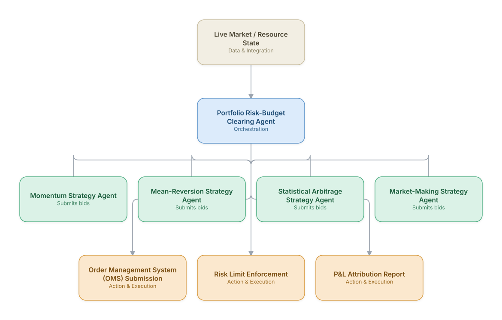

# 03. Algorithmic Trading Strategy Orchestration

**Domain:** Financial Services &nbsp;|&nbsp; **Architecture pattern:** [Market-Based / Auction Agents]({{ '/patterns/market-based/' | relative_url }})

> 🧠 **Deep dive available:** this use case also has a full [8-Layer Regenerative Architecture breakdown]({{ '/deep8/finance/03-algo-trading-strategy-orchestration/' | relative_url }}) — the same problem mapped through L1–L8, with an agent-level tools/technologies stack and a suggested build order by layer.

## 1. Problem Statement & Use Case

A multi-strategy trading desk runs several independent alpha strategies (momentum, mean-reversion, stat-arb) that compete for the same risk budget and execution capacity. Coordinating capital allocation and execution priority manually under changing market conditions is slow. A market-based internal architecture lets each strategy 'bid' for capital and execution priority against a risk-aware clearing mechanism.

## 2. End-to-End Multi-Agent Architecture

The solution is implemented as a **Market-Based / Auction Agents** architecture. 
### 2.1 Agents & Sub-Agents

| Agent | Responsibility |
|---|---|
| Portfolio Risk-Budget Clearing Agent | Allocates the firm's risk budget (VaR limits) across strategies based on their bids and recent performance |
| Momentum Strategy Agent | Bids for capital proportional to signal strength and current market regime fit |
| Mean-Reversion Strategy Agent | Bids for capital based on detected dislocations and expected reversion timeline |
| Statistical Arbitrage Strategy Agent | Bids based on pair/basket cointegration signal confidence |
| Execution Agent | Executes allocated orders via smart order routing, minimizing market impact across strategies |
| Risk Guardrail Agent | Enforces hard VaR/position limits independent of strategy bidding, can veto any allocation |

### 2.2 Architecture Diagram

> This diagram is organized as a **layered architecture**: Data &amp; Integration → Orchestration → Agent →
> Action &amp; Execution, plus a cross-cutting Observability &amp; Governance layer (tracing, audit log,
> guardrails, and any human review checkpoint — shown in lavender). See the
> [E2E Platform Architecture]({{ '/architecture/e2e-platform-architecture/' | relative_url }}) for how this
> layering looks across all 60 use cases at once. A [Mermaid text source](architecture.mmd) of the same
> diagram is also available in this folder.

## 3. Technologies Used (per step)

| Step / Layer | Technology |
|---|---|
| Strategy signal generation | Existing quant research pipeline (Python/pandas, proprietary factor models) |
| Market-based allocation | Internal auction mechanism with risk-adjusted bid weighting |
| Execution | Smart order router (SOR) with FIX protocol connectivity |
| Risk management | Real-time VaR engine (e.g., Axioma/MSCI RiskMetrics) as an independent veto layer |
| Orchestration | Low-latency event-driven agent framework (not LLM-in-the-loop for execution-critical paths) |
| LLM usage | Claude used offline for strategy performance narrative/attribution reports, not live order decisions |
| Backtesting | Vectorized backtest engine validating allocation policy changes before production |
| Compliance | Pre-trade compliance checks (restricted list, position limits) as a hard gate before OMS submission |

## 4. Suggested Build Order

**Phase 1 — two bidders, manual clearing.** Get Momentum Strategy Agent and Mean-Reversion Strategy Agent submitting bids with Portfolio Risk-Budget Clearing Agent clearing them on a fixed schedule — no real-time re-clearing yet.

**Phase 2 — add the remaining bidders and automate clearing.** Bring the rest of the bidder population online and move Portfolio Risk-Budget Clearing Agent to event-triggered (not just scheduled) clearing.

**Phase 3 — add hard guardrails independent of the market mechanism.** A pure auction can clear at a technically-valid but operationally-bad price; add a guardrail service that can veto a clearing result regardless of what the market mechanism decided.

**Phase 4 — observability and feedback.** Track clearing-price trends and bidder participation over time — a market that's stopped clearing efficiently is a slow-motion failure that won't show up in any single transaction.

## 5. If We Rebuilt This: What Would Improve

- Kept LLM reasoning entirely out of the latency-critical bid/execution loop after early testing showed unacceptable tail latency; LLMs are used only for post-trade analysis and reporting.
- Would give the Risk Guardrail Agent absolute veto power from day one rather than advisory-only, after a v1 near-miss where aggregate strategy exposure briefly exceeded firm limits.
- Add regime-detection as an explicit shared signal so strategy agents don't all bid aggressively into the same unfavorable regime simultaneously.
- Auction re-clearing frequency needed careful tuning — too frequent caused excessive turnover/costs, too infrequent caused stale allocations in fast markets.

> ⚙️ **Built with the AI-Regenesis engine.** Every diagram and build order on this page was generated from a
> compact spec by the same engine packaged as the free
> [`quick-reference-engine` skill]({{ '/skills/#quick-reference-engine' | relative_url }}) — drop your
> own use case in and get the same output.

---
[← Back to Financial Services index]({{ '/finance/' | relative_url }}) &nbsp;|&nbsp; [← Back to home]({{ '/' | relative_url }})
