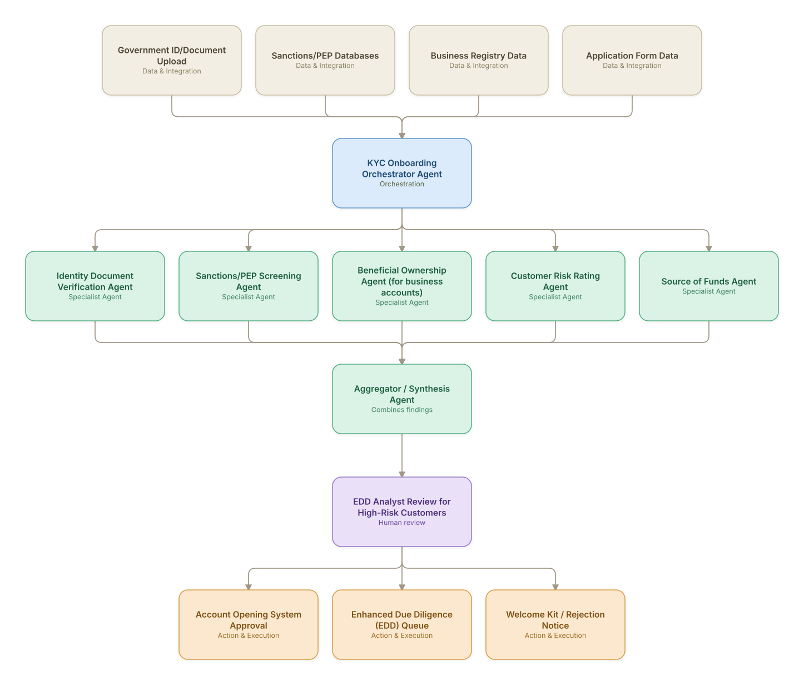

# 05. Customer Onboarding & KYC (Retail & Business Banking)

**Domain:** Financial Services &nbsp;|&nbsp; **Architecture pattern:** [Orchestrator-Worker (Supervisor fan-out/fan-in)]({{ '/patterns/orchestrator-worker/' | relative_url }})

> 🧠 **Deep dive available:** this use case also has a full [8-Layer Regenerative Architecture breakdown]({{ '/deep8/finance/05-customer-onboarding-kyc-finance/' | relative_url }}) — the same problem mapped through L1–L8, with an agent-level tools/technologies stack and a suggested build order by layer.

## 1. Problem Statement & Use Case

Digital account opening abandons at high rates when identity verification, sanctions screening, and risk rating steps are sequential and slow. Banks need a parallelized, auditable KYC agent team that completes onboarding checks in near real time while meeting CDD/EDD regulatory requirements.

## 2. End-to-End Multi-Agent Architecture

The solution is implemented as a **Orchestrator-Worker (Supervisor fan-out/fan-in)** architecture. 
**Human-in-the-loop checkpoint:** EDD Analyst Review for High-Risk Customers

### 2.1 Agents & Sub-Agents

| Agent | Responsibility |
|---|---|
| KYC Onboarding Orchestrator | Runs verification agents in parallel and produces a risk-rated onboarding decision |
| Identity Document Verification Agent | Validates ID authenticity and performs liveness/facial-match check |
| Sanctions/PEP Screening Agent | Screens applicant (and beneficial owners for business accounts) against sanctions/PEP lists |
| Beneficial Ownership Agent | For business accounts, resolves the ultimate beneficial ownership structure from registry filings |
| Customer Risk Rating Agent | Computes a CDD risk rating from geography, product, and screening results |
| Source of Funds Agent | For higher-risk applicants, gathers and validates declared source-of-funds documentation |

### 2.2 Architecture Diagram

> This diagram is organized as a **layered architecture**: Data &amp; Integration → Orchestration → Agent →
> Action &amp; Execution, plus a cross-cutting Observability &amp; Governance layer (tracing, audit log,
> guardrails, and any human review checkpoint — shown in lavender). See the
> [E2E Platform Architecture]({{ '/architecture/e2e-platform-architecture/' | relative_url }}) for how this
> layering looks across all 60 use cases at once. A [Mermaid text source](architecture.mmd) of the same
> diagram is also available in this folder.

## 3. Technologies Used (per step)

| Step / Layer | Technology |
|---|---|
| Identity verification | Onfido/Jumio document + biometric verification API |
| Sanctions screening | Refinitiv World-Check / Dow Jones Risk & Compliance API |
| Beneficial ownership | Business registry APIs (OpenCorporates, national registries) + LLM entity-resolution |
| Orchestration | LangGraph supervisor with parallel tool calls and per-agent timeout/fallback |
| Risk rating | Rules-based CDD risk matrix combined with agent-gathered evidence |
| Case management | Integration with AML case management system for EDD queue |
| Core banking integration | Account opening API (Temenos/Mambu) |
| Audit/compliance | Full evidence trail retained per regulatory record-keeping requirements (5-7 years) |

## 4. Suggested Build Order

**Phase 1 — one worker, no fan-out.** Wire a single path end to end: Identity Document Verification Agent reading real data and producing a result, with KYC Onboarding Orchestrator Agent just passing data through untouched. Prove the data pipeline and one agent's reasoning before adding parallelism.

**Phase 2 — add the fan-out.** Bring the remaining 4 worker agents online in parallel and build KYC Onboarding Orchestrator Agent's aggregation/synthesis logic. This is where the orchestrator-worker pattern is actually learned — watch for race conditions and partial-failure handling here, not before.

**Phase 3 — add the governance gate.** Wire in the human checkpoint: EDD Analyst Review for High-Risk Customers.

**Phase 4 — observability and feedback.** Trace every worker call, monitor the aggregator's decision quality against real outcomes, and add a feedback loop that catches drift before it becomes a production incident.

## 5. If We Rebuilt This: What Would Improve

- Beneficial ownership resolution across international registries was far harder than expected; would budget significantly more time for this sub-agent and expect more human fallback initially.
- Would define hard timeout/fallback behavior for each verification agent from day one — a slow sanctions-screening API stalled the entire flow in early testing.
- Add a plain-language 'what's missing / what's next' customer-facing status message generated per abandonment point to reduce drop-off.
- Risk-rating thresholds needed periodic recalibration against actual EDD outcomes; built this feedback loop only after the first regulatory exam recommendation.

> ⚙️ **Built with the AI-Regenesis engine.** Every diagram and build order on this page was generated from a
> compact spec by the same engine packaged as the free
> [`quick-reference-engine` skill]({{ '/skills/#quick-reference-engine' | relative_url }}) — drop your
> own use case in and get the same output.

---
[← Back to Financial Services index]({{ '/finance/' | relative_url }}) &nbsp;|&nbsp; [← Back to home]({{ '/' | relative_url }})
