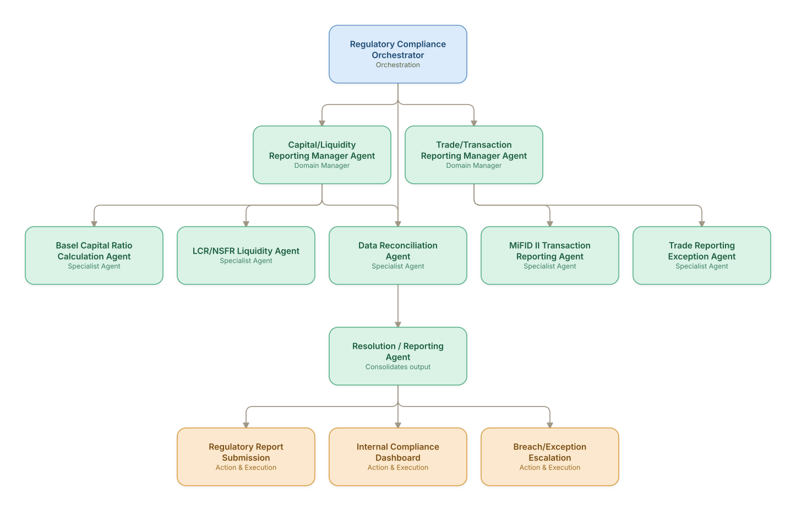

# 07. Regulatory Compliance Monitoring & Reg Reporting

**Domain:** Financial Services &nbsp;|&nbsp; **Architecture pattern:** [Hierarchical Multi-Agent (Manager-of-Managers)]({{ '/patterns/hierarchical/' | relative_url }})

> 🧠 **Deep dive available:** this use case also has a full [8-Layer Regenerative Architecture breakdown]({{ '/deep8/finance/07-regulatory-compliance-monitoring-reporting/' | relative_url }}) — the same problem mapped through L1–L8, with an agent-level tools/technologies stack and a suggested build order by layer.

## 1. Problem Statement & Use Case

Banks must continuously monitor for compliance with a growing patchwork of regulations (Basel III/IV, Dodd-Frank, MiFID II, local reporting) and file numerous recurring regulatory reports. Manual tracking of which rules apply to which business lines, and reconciling data across systems for each report, is a major operational burden and source of regulatory findings.

## 2. End-to-End Multi-Agent Architecture

The solution is implemented as a **Hierarchical Multi-Agent (Manager-of-Managers)** architecture. 
### 2.1 Agents & Sub-Agents

| Agent | Responsibility |
|---|---|
| Regulatory Compliance Orchestrator | Tracks the full regulatory calendar and coordinates domain managers to meet filing deadlines |
| Capital/Liquidity Reporting Manager | Oversees capital ratio and liquidity coverage sub-agents |
| Trade/Transaction Reporting Manager | Oversees transaction-reporting sub-agents across jurisdictions |
| Basel Capital Ratio Calculation Agent | Computes CET1/Tier 1/Total capital ratios from risk-weighted asset data |
| Data Reconciliation Agent | Reconciles source-system data against the general ledger before report generation |
| MiFID II Transaction Reporting Agent | Generates and validates transaction reports against ESMA schema requirements |

### 2.2 Architecture Diagram

> This diagram is organized as a **layered architecture**: Data &amp; Integration → Orchestration → Agent →
> Action &amp; Execution, plus a cross-cutting Observability &amp; Governance layer (tracing, audit log,
> guardrails, and any human review checkpoint — shown in lavender). See the
> [E2E Platform Architecture]({{ '/architecture/e2e-platform-architecture/' | relative_url }}) for how this
> layering looks across all 60 use cases at once. A [Mermaid text source](architecture.mmd) of the same
> diagram is also available in this folder.

## 3. Technologies Used (per step)

| Step / Layer | Technology |
|---|---|
| Regulatory calendar | Rules-driven calendar engine tracking jurisdiction-specific filing deadlines |
| Data reconciliation | Automated GL-to-source reconciliation with exception flagging |
| Calculation engines | Purpose-built regulatory capital calculation engines (Moody's/Wolters Kluwer OneSumX) |
| Report generation | XBRL/XML schema generation per regulator (EBA, FCA, ESMA formats) |
| Orchestration | Hierarchical LangGraph tracking report state machines per filing |
| LLM usage | Claude for regulatory-text change monitoring/impact-summary, not final calculations |
| Validation | Automated schema + business-rule validation before submission |
| Audit | Full lineage from source transaction to final regulatory report field |

## 4. Suggested Build Order

**Phase 1 — one branch only.** Build Regulatory Compliance Orchestrator talking to just Capital/Liquidity Reporting Manager Agent and that manager's own leaf agents, ignoring the other 1 branch entirely. Prove one full manager-to-leaf chain before replicating it.

**Phase 2 — add the remaining branches.** Bring Trade/Transaction Reporting Manager Agent online, each with their own leaf agents. Build Regulatory Compliance Orchestrator's cross-branch consolidation logic — this is the actual hard part of the hierarchical pattern, not any single branch.

**Phase 3 — resolve cross-branch conflicts.** Real inputs will disagree across managers (different branches recommending incompatible actions); add explicit conflict-resolution logic at Regulatory Compliance Orchestrator rather than letting the last branch to report silently win.

**Phase 4 — observability and feedback.** Trace decisions at every level of the hierarchy separately (top orchestrator, each manager, each leaf) so a bad outcome can be traced to the specific branch and level that caused it.

## 5. If We Rebuilt This: What Would Improve

- Kept all financial calculations in deterministic, auditable engines — LLM agents are used only for regulatory-text interpretation and change-impact summaries, never final numbers.
- Would build the regulatory-change monitoring agent first; new rule versions silently broke report templates in v1 before this was added.
- Data reconciliation exceptions were the dominant cause of filing delays; would invest more heavily here relative to report-generation automation.
- Cross-jurisdiction rule conflicts (same transaction reportable differently in two regimes) needed a dedicated conflict-resolution sub-agent, added after a near-miss on a filing.

> ⚙️ **Built with the AI-Regenesis engine.** Every diagram and build order on this page was generated from a
> compact spec by the same engine packaged as the free
> [`quick-reference-engine` skill]({{ '/skills/#quick-reference-engine' | relative_url }}) — drop your
> own use case in and get the same output.

---
[← Back to Financial Services index]({{ '/finance/' | relative_url }}) &nbsp;|&nbsp; [← Back to home]({{ '/' | relative_url }})
