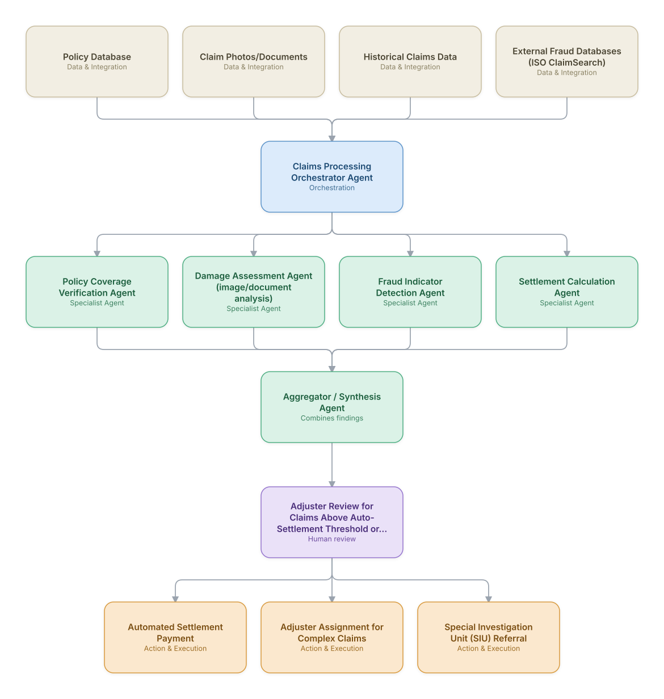

# 08. Insurance Claims Processing & Fraud Detection

**Domain:** Financial Services &nbsp;|&nbsp; **Architecture pattern:** [Orchestrator-Worker (Supervisor fan-out/fan-in)]({{ '/patterns/orchestrator-worker/' | relative_url }})

> 🧠 **Deep dive available:** this use case also has a full [8-Layer Regenerative Architecture breakdown]({{ '/deep8/finance/08-insurance-claims-processing-fraud/' | relative_url }}) — the same problem mapped through L1–L8, with an agent-level tools/technologies stack and a suggested build order by layer.

## 1. Problem Statement & Use Case

Insurance claims (auto, property, health) require damage assessment, policy coverage verification, fraud screening, and settlement calculation — currently siloed steps causing multi-week claim cycles and inconsistent fraud detection. An agent team can triage and settle straightforward claims automatically while flagging complex or suspicious claims for adjusters.

## 2. End-to-End Multi-Agent Architecture

The solution is implemented as a **Orchestrator-Worker (Supervisor fan-out/fan-in)** architecture. 
**Human-in-the-loop checkpoint:** Adjuster Review for Claims Above Auto-Settlement Threshold or Fraud Flag

### 2.1 Agents & Sub-Agents

| Agent | Responsibility |
|---|---|
| Claims Processing Orchestrator | Routes the claim through verification/assessment/fraud agents and decides auto-settle vs. adjuster review |
| Policy Coverage Verification Agent | Confirms the claim falls within active policy coverage, limits, and exclusions |
| Damage Assessment Agent | Analyzes submitted photos/videos and repair estimates to assess damage severity and cost |
| Fraud Indicator Detection Agent | Screens for staged-accident patterns, claim-timing anomalies, and cross-references SIU watchlists |
| Settlement Calculation Agent | Computes the settlement amount per policy terms, deductibles, and depreciation schedules |

### 2.2 Architecture Diagram

> This diagram is organized as a **layered architecture**: Data &amp; Integration → Orchestration → Agent →
> Action &amp; Execution, plus a cross-cutting Observability &amp; Governance layer (tracing, audit log,
> guardrails, and any human review checkpoint — shown in lavender). See the
> [E2E Platform Architecture]({{ '/architecture/e2e-platform-architecture/' | relative_url }}) for how this
> layering looks across all 60 use cases at once. A [Mermaid text source](architecture.mmd) of the same
> diagram is also available in this folder.

## 3. Technologies Used (per step)

| Step / Layer | Technology |
|---|---|
| Image analysis | Computer vision model for vehicle/property damage severity estimation |
| Document extraction | OCR + LLM extraction from repair estimates and medical bills |
| Fraud detection | Graph analytics (Neo4j) linking claimants, repair shops, and prior claims for staged-fraud rings |
| Policy engine | Rules engine checking coverage/exclusions against policy documents |
| Orchestration | LangGraph supervisor with auto-settle threshold logic |
| External data | ISO ClaimSearch / LexisNexis fraud database integration |
| Payment | Direct settlement payment via claims payment processor |
| Case management | Guidewire ClaimCenter integration |

## 4. Suggested Build Order

**Phase 1 — one worker, no fan-out.** Wire a single path end to end: Policy Coverage Verification Agent reading real data and producing a result, with Claims Processing Orchestrator Agent just passing data through untouched. Prove the data pipeline and one agent's reasoning before adding parallelism.

**Phase 2 — add the fan-out.** Bring the remaining 3 worker agents online in parallel and build Claims Processing Orchestrator Agent's aggregation/synthesis logic. This is where the orchestrator-worker pattern is actually learned — watch for race conditions and partial-failure handling here, not before.

**Phase 3 — add the governance gate.** Wire in the human checkpoint: Adjuster Review for Claims Above Auto-Settlement Threshold or Fraud Flag.

**Phase 4 — observability and feedback.** Trace every worker call, monitor the aggregator's decision quality against real outcomes, and add a feedback loop that catches drift before it becomes a production incident.

## 5. If We Rebuilt This: What Would Improve

- Image-based damage assessment needed human adjuster spot-checks for the first several months to build trust and catch systematic estimation biases before full automation.
- Would add explicit auto-settlement dollar caps that scale down for newer/riskier claim types rather than one global threshold — an early miscalibration overpaid a class of low-frequency high-severity claims.
- Fraud graph analytics caught ring-based fraud that per-claim fraud scoring missed entirely — would prioritize building this earlier.
- Claimants found black-box settlement calculations frustrating; added a plain-language settlement-breakdown explanation, which reduced disputes noticeably.

> ⚙️ **Built with the AI-Regenesis engine.** Every diagram and build order on this page was generated from a
> compact spec by the same engine packaged as the free
> [`quick-reference-engine` skill]({{ '/skills/#quick-reference-engine' | relative_url }}) — drop your
> own use case in and get the same output.

---
[← Back to Financial Services index]({{ '/finance/' | relative_url }}) &nbsp;|&nbsp; [← Back to home]({{ '/' | relative_url }})
