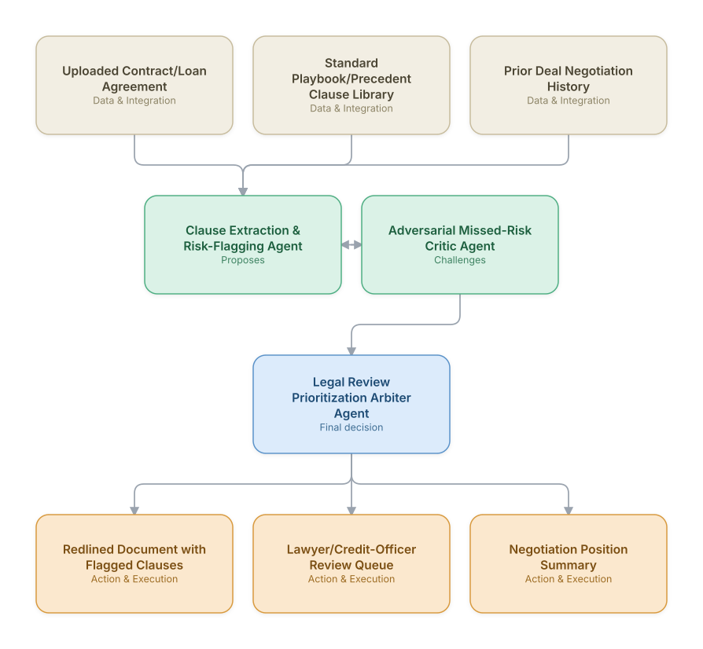

# 09. Contract & Loan Document Review (Legal/Credit Agent)

**Domain:** Financial Services &nbsp;|&nbsp; **Architecture pattern:** [Debate-Critique-Arbiter (Reflective Loop)]({{ '/patterns/debate-critique/' | relative_url }})

> 🧠 **Deep dive available:** this use case also has a full [8-Layer Regenerative Architecture breakdown]({{ '/deep8/finance/09-contract-loan-document-review/' | relative_url }}) — the same problem mapped through L1–L8, with an agent-level tools/technologies stack and a suggested build order by layer.

## 1. Problem Statement & Use Case

Reviewing loan agreements, ISDA/credit agreements, and commercial contracts for risky clauses, missing covenants, or deviations from standard playbooks is slow, expensive legal/credit-risk work. A proposer/critic agent pair — one extracting and flagging issues, one adversarially checking for missed risks or over-flagged non-issues — improves both coverage and precision before a human lawyer's final review.

## 2. End-to-End Multi-Agent Architecture

The solution is implemented as a **Debate-Critique-Arbiter (Reflective Loop)** architecture. 
### 2.1 Agents & Sub-Agents

| Agent | Responsibility |
|---|---|
| Clause Extraction & Risk-Flagging Agent | Extracts key clauses (covenants, MAC clauses, indemnities) and flags deviations from the standard playbook |
| Adversarial Missed-Risk Critic Agent | Independently re-reads the document looking specifically for risks the proposer may have missed |
| Legal Review Prioritization Arbiter Agent | Combines both agents' findings into a prioritized issues list for the human reviewer |
| Precedent Comparison Agent | Compares clause language against a library of the firm's prior negotiated precedents |
| Redline Generation Agent | Produces a suggested redline with rationale for each proposed change |

### 2.2 Architecture Diagram

> This diagram is organized as a **layered architecture**: Data &amp; Integration → Orchestration → Agent →
> Action &amp; Execution, plus a cross-cutting Observability &amp; Governance layer (tracing, audit log,
> guardrails, and any human review checkpoint — shown in lavender). See the
> [E2E Platform Architecture]({{ '/architecture/e2e-platform-architecture/' | relative_url }}) for how this
> layering looks across all 60 use cases at once. A [Mermaid text source](architecture.mmd) of the same
> diagram is also available in this folder.

## 3. Technologies Used (per step)

| Step / Layer | Technology |
|---|---|
| Document parsing | docx/pdf skill-based extraction preserving clause structure and cross-references |
| Clause extraction | Claude with legal-domain prompting + structured clause taxonomy output |
| Adversarial critique | Second independent Claude pass with an explicit 'find what was missed' objective and no visibility into the first pass's flags |
| Precedent matching | Vector search (pgvector) over the firm's precedent clause library |
| Arbitration | Rule-based prioritization (materiality x deviation-from-standard) combining both agents' outputs |
| Redlining | Document generation preserving Word track-changes format (docx skill) |
| Workflow | Integration with contract lifecycle management (CLM) platform (Ironclad/Icertis) |
| Human review | Lawyer/credit-officer sign-off required before any clause position is finalized |

## 4. Suggested Build Order

**Phase 1 — the proposer alone.** Get Clause Extraction & Risk-Flagging Agent producing a hypothesis from real data, with no critic yet — this is just a single-pass classifier/recommender at this stage, and that's fine.

**Phase 2 — add the critic, fully independent.** Build Adversarial Missed-Risk Critic Agent with no visibility into the proposer's reasoning — separate context, separate prompt. This independence is the entire point of the pattern; skipping it turns the critic into a rubber stamp.

**Phase 3 — add Legal Review Prioritization Arbiter Agent and calibrate.** Build the arbitration logic, then run it against a set of cases with known-correct outcomes to calibrate how much weight the critic's pushback should carry before trusting it on live decisions.

**Phase 4 — observability and feedback.** Track how often the arbiter overrides the proposer and whether those overrides were actually correct — this tells you whether the critic is earning its place in the pipeline or just adding latency.

## 5. If We Rebuilt This: What Would Improve

- The critic's independence (no visibility into the proposer's flags) was essential — an early version where the critic saw the proposer's output just rubber-stamped it, missing real gaps.
- Would build the precedent library integration first; generic 'market standard' flagging without firm-specific precedent context produced too many irrelevant flags initially.
- Legal reviewers strongly preferred seeing *why* something was flagged with a specific clause citation, not just a risk label — made citation-grounding mandatory.
- Contract structure variance (different templates per deal type) broke naive clause extraction; would invest in more robust document-structure parsing earlier.

> ⚙️ **Built with the AI-Regenesis engine.** Every diagram and build order on this page was generated from a
> compact spec by the same engine packaged as the free
> [`quick-reference-engine` skill]({{ '/skills/#quick-reference-engine' | relative_url }}) — drop your
> own use case in and get the same output.

---
[← Back to Financial Services index]({{ '/finance/' | relative_url }}) &nbsp;|&nbsp; [← Back to home]({{ '/' | relative_url }})
