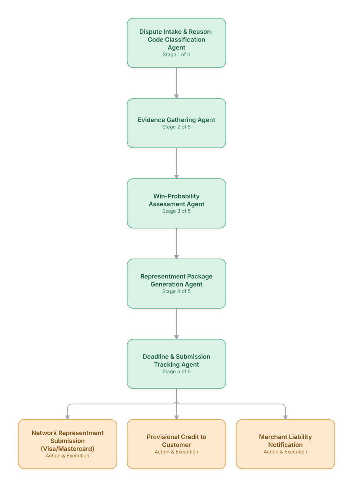

# 11. Customer Dispute & Chargeback Resolution

**Domain:** Financial Services &nbsp;|&nbsp; **Architecture pattern:** [Sequential Pipeline]({{ '/patterns/pipeline/' | relative_url }})

> 🧠 **Deep dive available:** this use case also has a full [8-Layer Regenerative Architecture breakdown]({{ '/deep8/finance/11-chargeback-dispute-resolution/' | relative_url }}) — the same problem mapped through L1–L8, with an agent-level tools/technologies stack and a suggested build order by layer.

## 1. Problem Statement & Use Case

Card chargeback disputes require gathering transaction evidence, matching against network reason codes, and assembling representment packages within tight network deadlines (often 7-20 days). Manual handling scales poorly with dispute volume and banks often miss deadlines or under-invest in winnable disputes.

## 2. End-to-End Multi-Agent Architecture

The solution is implemented as a **Sequential Pipeline** architecture. 
### 2.1 Agents & Sub-Agents

| Agent | Responsibility |
|---|---|
| Dispute Intake & Classification Agent | Classifies the dispute reason code and applicable network rules |
| Evidence Gathering Agent | Assembles transaction logs, AVS/CVV match results, delivery confirmation, and prior correspondence |
| Win-Probability Assessment Agent | Estimates likelihood of winning representment based on evidence strength and historical outcomes |
| Representment Package Generation Agent | Assembles a network-compliant evidence package for cases worth contesting |
| Deadline & Submission Tracking Agent | Tracks network-specific deadlines and ensures timely submission |

### 2.2 Architecture Diagram

> This diagram is organized as a **layered architecture**: Data &amp; Integration → Orchestration → Agent →
> Action &amp; Execution, plus a cross-cutting Observability &amp; Governance layer (tracing, audit log,
> guardrails, and any human review checkpoint — shown in lavender). See the
> [E2E Platform Architecture]({{ '/architecture/e2e-platform-architecture/' | relative_url }}) for how this
> layering looks across all 60 use cases at once. A [Mermaid text source](architecture.mmd) of the same
> diagram is also available in this folder.

## 3. Technologies Used (per step)

| Step / Layer | Technology |
|---|---|
| Reason-code classification | Rules engine mapping to Visa/Mastercard reason-code taxonomies |
| Evidence gathering | Tool-calling agent across transaction, fraud-screening, and merchant-communication systems |
| Win-probability model | Classifier trained on historical representment outcomes by reason code and evidence type |
| Package generation | Automated compilation into network-required format (Visa VROL/Mastercom) |
| Orchestration | Temporal workflow with deadline-based SLA tracking and alerts |
| LLM usage | Claude drafting the cover narrative summarizing evidence, grounded in gathered documents |
| Case management | Chargeback management platform integration (Verifi/Ethoca) |
| Analytics | Win-rate and dollar-recovery dashboard by reason code and merchant |

## 4. Suggested Build Order

**Phase 1 — the first two stages only.** Get Dispute Intake & Reason-Code Classification Agent feeding Evidence Gathering Agent correctly, with the rest of the pipeline stubbed out. Durability matters more than completeness here — make sure a crash mid-pipeline doesn't lose or duplicate work.

**Phase 2 — the full chain.** Add the remaining 3 stages in order, testing each newly-added stage against real output from the stage before it, not synthetic test data.

**Phase 3 — add retry and partial-failure handling.** Decide, stage by stage, what happens when that specific stage fails: retry, skip, or halt the whole pipeline. This decision is different per stage and shouldn't be a single global policy.

**Phase 4 — observability and feedback.** Add per-stage tracing so a slow or wrong pipeline run can be attributed to one specific stage, and track output quality over time to catch silent degradation in an early stage before it compounds downstream.

## 5. If We Rebuilt This: What Would Improve

- Would add the win-probability agent before building full package-generation automation — many early low-probability disputes weren't worth the operational cost to contest.
- Deadline tracking needed to be the most bulletproof part of the system; a missed deadline is an automatic loss regardless of evidence quality, so this got dedicated redundant alerting.
- Evidence quality varied a lot by merchant integration; would invest earlier in standardizing merchant-side evidence submission (delivery confirmation, etc.).
- Cover narrative drafts occasionally over-claimed certainty; added strict grounding requirements so claims map 1:1 to attached evidence documents.

> ⚙️ **Built with the AI-Regenesis engine.** Every diagram and build order on this page was generated from a
> compact spec by the same engine packaged as the free
> [`quick-reference-engine` skill]({{ '/skills/#quick-reference-engine' | relative_url }}) — drop your
> own use case in and get the same output.

---
[← Back to Financial Services index]({{ '/finance/' | relative_url }}) &nbsp;|&nbsp; [← Back to home]({{ '/' | relative_url }})
