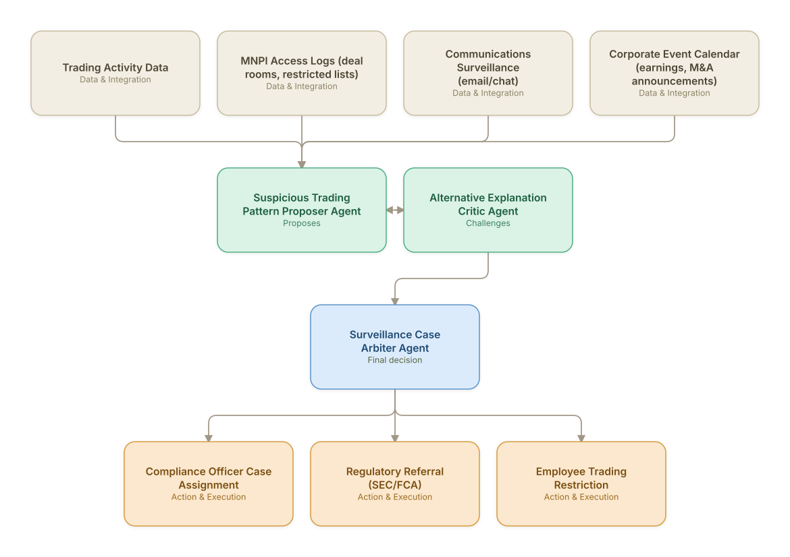

# 17. Insider Trading & Market Abuse Surveillance

**Domain:** Financial Services &nbsp;|&nbsp; **Architecture pattern:** [Debate-Critique-Arbiter (Reflective Loop)]({{ '/patterns/debate-critique/' | relative_url }})

> 🧠 **Deep dive available:** this use case also has a full [8-Layer Regenerative Architecture breakdown]({{ '/deep8/finance/17-insider-trading-surveillance/' | relative_url }}) — the same problem mapped through L1–L8, with an agent-level tools/technologies stack and a suggested build order by layer.

## 1. Problem Statement & Use Case

Detecting insider trading and market manipulation requires correlating trading activity with material non-public information (MNPI) access, communications, and timing — a task prone to both false positives (coincidental profitable trades) and false negatives (sophisticated evasion). A proposer/critic pair improves the precision of surveillance alerts before they reach compliance officers, who face significant regulatory scrutiny on both over- and under-reporting.

## 2. End-to-End Multi-Agent Architecture

The solution is implemented as a **Debate-Critique-Arbiter (Reflective Loop)** architecture. 
### 2.1 Agents & Sub-Agents

| Agent | Responsibility |
|---|---|
| Suspicious Trading Pattern Proposer Agent | Flags trades with unusual timing/size relative to subsequent material announcements and the trader's MNPI access |
| Alternative Explanation Critic Agent | Searches for legitimate explanations (scheduled trading plan, sector-wide movement, pre-existing position) |
| Surveillance Case Arbiter Agent | Weighs both agents' findings into a final case priority and evidence summary for compliance |
| Communications Correlation Agent | Searches surveilled communications for contemporaneous discussion of the relevant MNPI |
| Restricted List Cross-Reference Agent | Checks whether the trader/entity was on a restricted or watch list at the time of trading |

### 2.2 Architecture Diagram

> This diagram is organized as a **layered architecture**: Data &amp; Integration → Orchestration → Agent →
> Action &amp; Execution, plus a cross-cutting Observability &amp; Governance layer (tracing, audit log,
> guardrails, and any human review checkpoint — shown in lavender). See the
> [E2E Platform Architecture]({{ '/architecture/e2e-platform-architecture/' | relative_url }}) for how this
> layering looks across all 60 use cases at once. A [Mermaid text source](architecture.mmd) of the same
> diagram is also available in this folder.

## 3. Technologies Used (per step)

| Step / Layer | Technology |
|---|---|
| Trade surveillance | Existing trade surveillance platform (Nasdaq SMARTS/ACA) as the alert and data source |
| MNPI access logs | Deal-room and restricted-list access logging integrated into the analysis |
| Communications surveillance | Email/chat surveillance platform (Behavox/Theta Lake) with NLP-based topic detection |
| Proposer/critic reasoning | Two independent Claude passes with opposing objectives, similar in design to Use Case 7 (telecom fraud) |
| Arbitration | Structured evidence-weighting model, human-calibrated against historical confirmed cases |
| Case management | Compliance case management system integration |
| Regulatory filing | Automated SAR/STOR (Suspicious Transaction and Order Report) drafting for confirmed cases |
| Audit | Full evidentiary chain retained given the severity of insider-trading allegations |

## 4. Suggested Build Order

**Phase 1 — the proposer alone.** Get Suspicious Trading Pattern Proposer Agent producing a hypothesis from real data, with no critic yet — this is just a single-pass classifier/recommender at this stage, and that's fine.

**Phase 2 — add the critic, fully independent.** Build Alternative Explanation Critic Agent with no visibility into the proposer's reasoning — separate context, separate prompt. This independence is the entire point of the pattern; skipping it turns the critic into a rubber stamp.

**Phase 3 — add Surveillance Case Arbiter Agent and calibrate.** Build the arbitration logic, then run it against a set of cases with known-correct outcomes to calibrate how much weight the critic's pushback should carry before trusting it on live decisions.

**Phase 4 — observability and feedback.** Track how often the arbiter overrides the proposer and whether those overrides were actually correct — this tells you whether the critic is earning its place in the pipeline or just adding latency.

## 5. If We Rebuilt This: What Would Improve

- Kept the critic agent fully independent of the proposer's reasoning (separate context, no shared framing) — this design choice, carried over from the telecom fraud use case, was equally critical here to avoid confirmation bias.
- Communications NLP had high false-positive rates on ordinary business language about the same companies; would invest more in contextual disambiguation before broad rollout.
- Compliance officers wanted the arbiter to explicitly state what evidence was *not* found (e.g., no communications correlation) alongside what was, to support both escalation and clearance decisions.
- Given the severity of false accusations, added a mandatory dual-compliance-officer review before any regulatory referral, beyond just the agent arbitration.

> ⚙️ **Built with the AI-Regenesis engine.** Every diagram and build order on this page was generated from a
> compact spec by the same engine packaged as the free
> [`quick-reference-engine` skill]({{ '/skills/#quick-reference-engine' | relative_url }}) — drop your
> own use case in and get the same output.

---
[← Back to Financial Services index]({{ '/finance/' | relative_url }}) &nbsp;|&nbsp; [← Back to home]({{ '/' | relative_url }})
