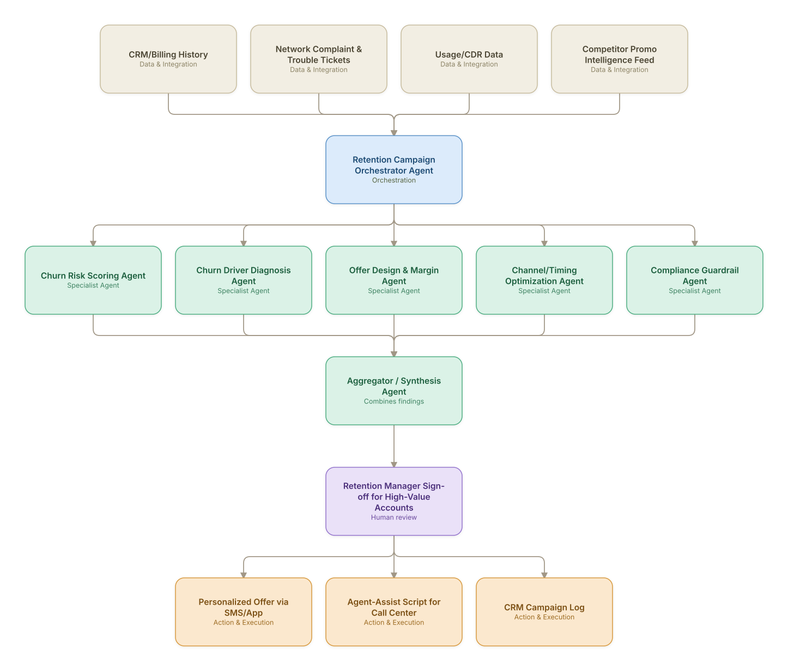

# 05. Customer Churn Prediction & Win-Back Orchestration

**Domain:** Telecommunications &nbsp;|&nbsp; **Architecture pattern:** [Orchestrator-Worker (Supervisor fan-out/fan-in)]({{ '/patterns/orchestrator-worker/' | relative_url }})

> 🧠 **Deep dive available:** this use case also has a full [8-Layer Regenerative Architecture breakdown]({{ '/deep8/telecom/05-churn-prediction-winback/' | relative_url }}) — the same problem mapped through L1–L8, with an agent-level tools/technologies stack and a suggested build order by layer.

## 1. Problem Statement & Use Case

Postpaid churn is expensive to reverse once a customer has ported out. Existing churn models score risk but stop short of orchestrating a coordinated, cross-channel retention response (offer design, timing, channel, agent-assisted call) tailored to the actual churn driver (price, coverage complaints, competitor promo). The business needs an agentic system that diagnoses *why* a customer is at risk and orchestrates the best next action within compliance and margin constraints.

## 2. End-to-End Multi-Agent Architecture

The solution is implemented as a **Orchestrator-Worker (Supervisor fan-out/fan-in)** architecture. 
**Human-in-the-loop checkpoint:** Retention Manager Sign-off for High-Value Accounts

### 2.1 Agents & Sub-Agents

| Agent | Responsibility |
|---|---|
| Retention Campaign Orchestrator | Coordinates diagnosis and offer agents, sequences the outreach plan per customer |
| Churn Risk Scoring Agent | Real-time propensity score from usage decline, complaint frequency, contract end-date |
| Churn Driver Diagnosis Agent | LLM-based reasoning over tickets/CDR to classify driver: price, coverage, service, competitor |
| Offer Design & Margin Agent | Generates offer within approved margin/discount guardrails per driver type |
| Channel/Timing Optimization Agent | Bandit-based selection of channel and send-time for highest response probability |
| Compliance Guardrail Agent | Validates offer/messaging against TCPA/regulatory and internal policy before send |

### 2.2 Architecture Diagram

> This diagram is organized as a **layered architecture**: Data &amp; Integration → Orchestration → Agent →
> Action &amp; Execution, plus a cross-cutting Observability &amp; Governance layer (tracing, audit log,
> guardrails, and any human review checkpoint — shown in lavender). See the
> [E2E Platform Architecture]({{ '/architecture/e2e-platform-architecture/' | relative_url }}) for how this
> layering looks across all 60 use cases at once. A [Mermaid text source](architecture.mmd) of the same
> diagram is also available in this folder.

## 3. Technologies Used (per step)

| Step / Layer | Technology |
|---|---|
| Risk scoring model | XGBoost / LightGBM churn propensity model on Databricks |
| Driver diagnosis | Claude with RAG over ticket text + structured CDR features |
| Offer optimization | Constrained optimization (margin bounds) + contextual bandit (Thompson sampling) |
| Orchestration | LangGraph supervisor with tool-calling into CRM/offer engine |
| Compliance check | Rules engine + LLM policy-classifier as a gate before dispatch |
| Channel delivery | Twilio (SMS) / Braze (push) / Genesys (agent-assist) |
| Feedback loop | Redeemed-offer + post-offer churn outcome fed back to retrain scoring model |
| Data platform | Snowflake + Feature Store (Feast) for real-time feature serving |

## 4. Suggested Build Order

**Phase 1 — one worker, no fan-out.** Wire a single path end to end: Churn Risk Scoring Agent reading real data and producing a result, with Retention Campaign Orchestrator Agent just passing data through untouched. Prove the data pipeline and one agent's reasoning before adding parallelism.

**Phase 2 — add the fan-out.** Bring the remaining 4 worker agents online in parallel and build Retention Campaign Orchestrator Agent's aggregation/synthesis logic. This is where the orchestrator-worker pattern is actually learned — watch for race conditions and partial-failure handling here, not before.

**Phase 3 — add the governance gate.** Wire in the human checkpoint: Retention Manager Sign-off for High-Value Accounts.

**Phase 4 — observability and feedback.** Trace every worker call, monitor the aggregator's decision quality against real outcomes, and add a feedback loop that catches drift before it becomes a production incident.

## 5. If We Rebuilt This: What Would Improve

- Add explicit offer-fatigue tracking per customer; early version re-targeted the same segment too often, eroding margin without lifting retention.
- Introduce an A/B holdout group by default so campaign lift is measurable, not assumed — this was bolted on after the fact.
- Separate the diagnosis agent's confidence into the offer decision explicitly; low-confidence diagnoses should trigger a cheaper generic offer, not a high-margin one.
- Give the compliance guardrail agent veto power earlier in the pipeline (pre-offer-design) rather than post-hoc, to avoid wasted optimization cycles on non-compliant offers.

> ⚙️ **Built with the AI-Regenesis engine.** Every diagram and build order on this page was generated from a
> compact spec by the same engine packaged as the free
> [`quick-reference-engine` skill]({{ '/skills/#quick-reference-engine' | relative_url }}) — drop your
> own use case in and get the same output.

---
[← Back to Telecommunications index]({{ '/telecom/' | relative_url }}) &nbsp;|&nbsp; [← Back to home]({{ '/' | relative_url }})
