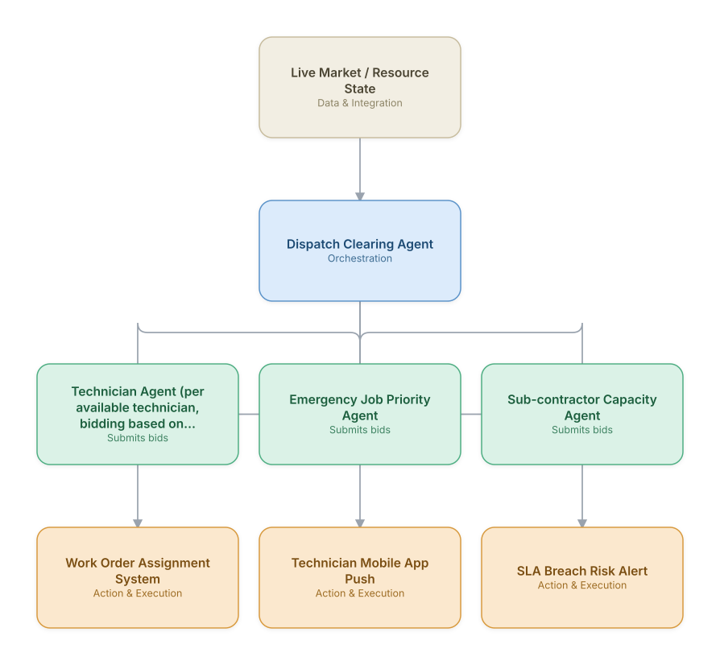

# 09. Field Workforce Dispatch & Dynamic Scheduling

**Domain:** Telecommunications &nbsp;|&nbsp; **Architecture pattern:** [Market-Based / Auction Agents]({{ '/patterns/market-based/' | relative_url }})

> 🧠 **Deep dive available:** this use case also has a full [8-Layer Regenerative Architecture breakdown]({{ '/deep8/telecom/09-field-workforce-dispatch-scheduling/' | relative_url }}) — the same problem mapped through L1–L8, with an agent-level tools/technologies stack and a suggested build order by layer.

## 1. Problem Statement & Use Case

Dispatching field technicians for installs, repairs, and tower maintenance across a large geography with varying skill requirements, SLA windows, and travel time is a hard combinatorial problem that worsens with same-day emergency truck-rolls. A market-based multi-agent design, where each open job 'auctions' itself to available technician agents, adapts faster to real-time changes than a centralized static scheduler.

## 2. End-to-End Multi-Agent Architecture

The solution is implemented as a **Market-Based / Auction Agents** architecture. 
### 2.1 Agents & Sub-Agents

| Agent | Responsibility |
|---|---|
| Dispatch Clearing Agent | Runs a continuous combinatorial auction matching open jobs to technician bids optimizing SLA and travel cost |
| Technician Agent | Represents each technician's real-time location, skills, and remaining capacity; bids on suitable jobs |
| Emergency Job Priority Agent | Injects priority weighting for SLA-critical/emergency jobs into the auction |
| Sub-contractor Capacity Agent | Bids in overflow jobs beyond internal technician capacity, factoring in cost |
| Route Optimization Agent | Post-auction, sequences each technician's daily route to minimize drive time |

### 2.2 Architecture Diagram

> This diagram is organized as a **layered architecture**: Data &amp; Integration → Orchestration → Agent →
> Action &amp; Execution, plus a cross-cutting Observability &amp; Governance layer (tracing, audit log,
> guardrails, and any human review checkpoint — shown in lavender). See the
> [E2E Platform Architecture]({{ '/architecture/e2e-platform-architecture/' | relative_url }}) for how this
> layering looks across all 60 use cases at once. A [Mermaid text source](architecture.mmd) of the same
> diagram is also available in this folder.

## 3. Technologies Used (per step)

| Step / Layer | Technology |
|---|---|
| Auction mechanism | Combinatorial auction solver (Vickrey-Clarke-Groves inspired) via OR-Tools |
| Technician agents | Lightweight per-technician agent processes reading live GPS + skill profile |
| Routing | Google OR-Tools VRP solver / Mapbox Optimization API |
| Real-time state | Redis for live technician availability/location state |
| Orchestration | Event-driven microservices coordinating the auction loop every N minutes |
| Mobile integration | Push notifications via Firebase to technician app |
| SLA monitoring | Streaming SLA-risk scoring feeding priority weights back into the auction |
| Reporting | Ops dashboard showing fill-rate, SLA compliance, and drive-time metrics |

## 4. Suggested Build Order

**Phase 1 — two bidders, manual clearing.** Get Technician Agent (per available technician, bidding based on skill/location/SLA fit) and Emergency Job Priority Agent submitting bids with Dispatch Clearing Agent clearing them on a fixed schedule — no real-time re-clearing yet.

**Phase 2 — add the remaining bidders and automate clearing.** Bring the rest of the bidder population online and move Dispatch Clearing Agent to event-triggered (not just scheduled) clearing.

**Phase 3 — add hard guardrails independent of the market mechanism.** A pure auction can clear at a technically-valid but operationally-bad price; add a guardrail service that can veto a clearing result regardless of what the market mechanism decided.

**Phase 4 — observability and feedback.** Track clearing-price trends and bidder participation over time — a market that's stopped clearing efficiently is a slow-motion failure that won't show up in any single transaction.

## 5. If We Rebuilt This: What Would Improve

- Pure price/cost-based bidding under-weighted technician fatigue/overtime; added a soft constraint penalizing over-scheduling into the bid function.
- Auction re-runs every fixed interval caused unnecessary technician re-assignment churn; switched to event-triggered re-auctioning only on material changes.
- Would add an explainability layer so dispatchers can see *why* a job was assigned to a given technician — early version was a black-box optimizer output.
- Sub-contractor bidding needed real cost-visibility guardrails; initial version could over-select costly overflow capacity when internal techs were briefly unavailable.

> ⚙️ **Built with the AI-Regenesis engine.** Every diagram and build order on this page was generated from a
> compact spec by the same engine packaged as the free
> [`quick-reference-engine` skill]({{ '/skills/#quick-reference-engine' | relative_url }}) — drop your
> own use case in and get the same output.

---
[← Back to Telecommunications index]({{ '/telecom/' | relative_url }}) &nbsp;|&nbsp; [← Back to home]({{ '/' | relative_url }})
