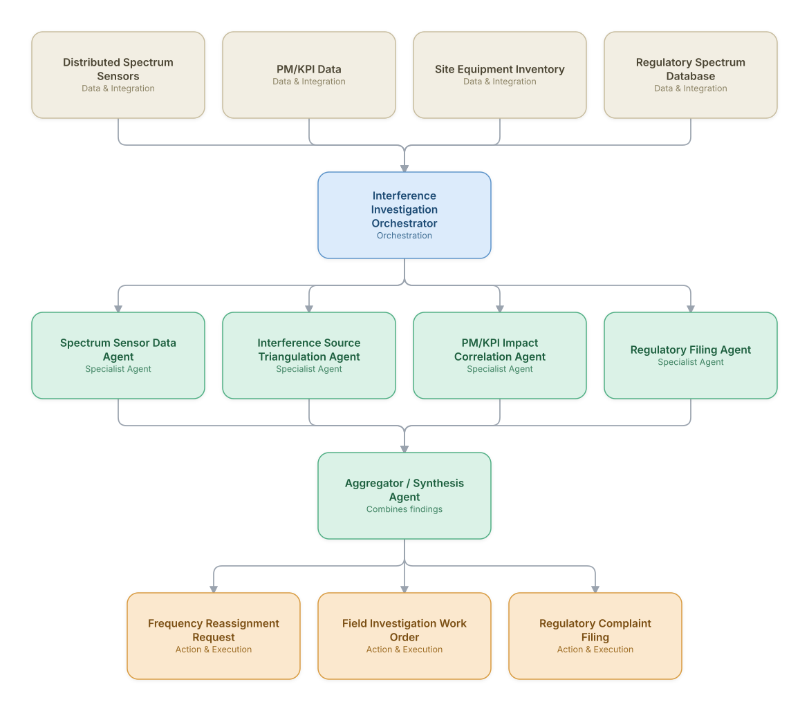

# 16. Spectrum Interference Detection & Mitigation

**Domain:** Telecommunications &nbsp;|&nbsp; **Architecture pattern:** [Orchestrator-Worker (Supervisor fan-out/fan-in)]({{ '/patterns/orchestrator-worker/' | relative_url }})

> 🧠 **Deep dive available:** this use case also has a full [8-Layer Regenerative Architecture breakdown]({{ '/deep8/telecom/16-spectrum-interference-detection/' | relative_url }}) — the same problem mapped through L1–L8, with an agent-level tools/technologies stack and a suggested build order by layer.

## 1. Problem Statement & Use Case

Unlicensed spectrum use, faulty equipment, or adjacent-band interference degrades network performance in hard-to-diagnose ways. RF engineers need to triangulate interference sources from distributed sensor/PM data and coordinate mitigation (filtering, frequency reassignment, or regulatory enforcement action) quickly.

## 2. End-to-End Multi-Agent Architecture

The solution is implemented as a **Orchestrator-Worker (Supervisor fan-out/fan-in)** architecture. 
### 2.1 Agents & Sub-Agents

| Agent | Responsibility |
|---|---|
| Interference Investigation Orchestrator | Coordinates detection, triangulation, and mitigation-path decision |
| Spectrum Sensor Data Agent | Aggregates readings from distributed RF sensors and detects anomalous energy in-band |
| Interference Source Triangulation Agent | Uses time-difference-of-arrival across sensors to estimate source location |
| PM/KPI Impact Correlation Agent | Confirms whether the interference correlates with degraded cell KPIs |
| Regulatory Filing Agent | Prepares a regulator-ready complaint package if the source is unlicensed/external |

### 2.2 Architecture Diagram

> This diagram is organized as a **layered architecture**: Data &amp; Integration → Orchestration → Agent →
> Action &amp; Execution, plus a cross-cutting Observability &amp; Governance layer (tracing, audit log,
> guardrails, and any human review checkpoint — shown in lavender). See the
> [E2E Platform Architecture]({{ '/architecture/e2e-platform-architecture/' | relative_url }}) for how this
> layering looks across all 60 use cases at once. A [Mermaid text source](architecture.mmd) of the same
> diagram is also available in this folder.

## 3. Technologies Used (per step)

| Step / Layer | Technology |
|---|---|
| Spectrum sensing | Distributed SDR-based sensor network reporting to a central platform |
| Triangulation | TDOA/AOA geolocation algorithms |
| Correlation analysis | Time-series correlation between interference events and KPI degradation |
| Orchestration | LangGraph supervisor invoking sensing/triangulation/correlation agents |
| Regulatory data | Integration with national spectrum regulator's licensed-user database |
| Mitigation execution | SON-driven frequency reassignment via EMS API |
| Case documentation | Auto-generated regulatory filing with evidence attachments |
| Field coordination | Work order system integration for on-site equipment inspection |

## 4. Suggested Build Order

**Phase 1 — one worker, no fan-out.** Wire a single path end to end: Spectrum Sensor Data Agent reading real data and producing a result, with Interference Investigation Orchestrator just passing data through untouched. Prove the data pipeline and one agent's reasoning before adding parallelism.

**Phase 2 — add the fan-out.** Bring the remaining 3 worker agents online in parallel and build Interference Investigation Orchestrator's aggregation/synthesis logic. This is where the orchestrator-worker pattern is actually learned — watch for race conditions and partial-failure handling here, not before.

**Phase 3 — add the governance gate.** Add policy/guardrail checks the aggregator's output must clear before it reaches the action layer.

**Phase 4 — observability and feedback.** Trace every worker call, monitor the aggregator's decision quality against real outcomes, and add a feedback loop that catches drift before it becomes a production incident.

## 5. If We Rebuilt This: What Would Improve

- Triangulation accuracy was highly sensitive to sensor density; would prioritize sensor placement optimization as an explicit sub-project before scaling the agent system.
- Add a historical interference-pattern library so recurring known sources (e.g., a specific radar system) are identified instantly rather than re-investigated.
- Regulatory filing agent needed strict factual grounding — added a mandatory evidence-citation requirement after an early draft included an unverified claim.
- Would integrate equipment inventory data earlier; many early 'interference' cases were actually the operator's own faulty equipment, which the triangulation-only flow initially missed.

> ⚙️ **Built with the AI-Regenesis engine.** Every diagram and build order on this page was generated from a
> compact spec by the same engine packaged as the free
> [`quick-reference-engine` skill]({{ '/skills/#quick-reference-engine' | relative_url }}) — drop your
> own use case in and get the same output.

---
[← Back to Telecommunications index]({{ '/telecom/' | relative_url }}) &nbsp;|&nbsp; [← Back to home]({{ '/' | relative_url }})
