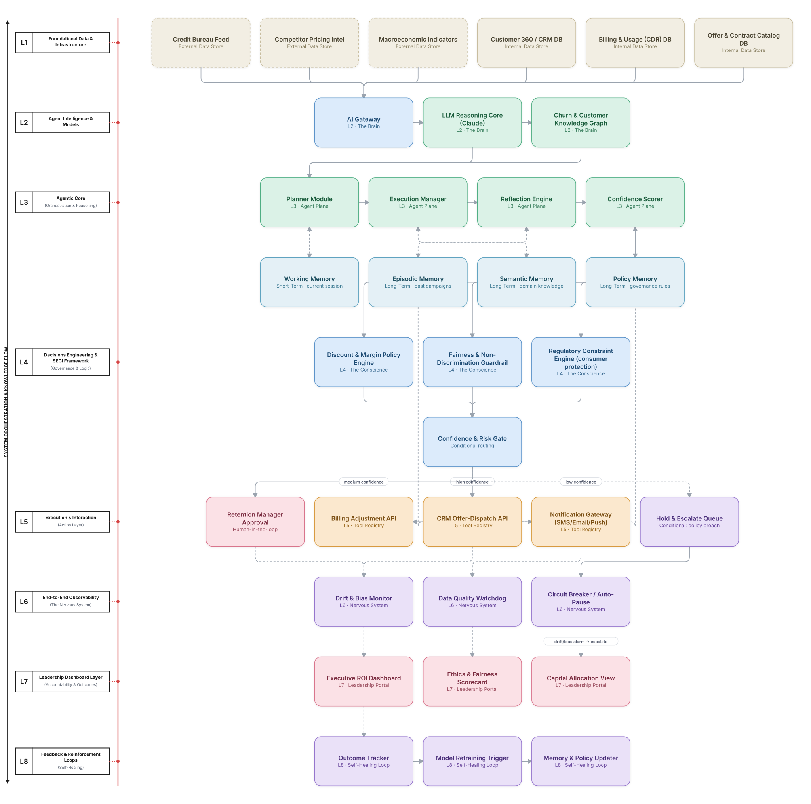

# Flagship Reference Example: The Integrated Decision Engineering Meta-Architecture

This document is a different kind of artifact from the 60 catalog use cases in `docs/telecom/`, `docs/bssoss/`,
and `docs/finance/`. Those each demonstrate one of 8 *execution* patterns (orchestrator-worker, hierarchical,
pipeline, and so on). This one demonstrates a full *enterprise reference stack* — the **8-layer Integrated
Decision Engineering Meta-Architecture** — applied end-to-end to a single high-stakes business decision, in the
same spirit as the source material's own guidance: pick one consequential decision (it specifically names
customer retention or fraud detection as good starting points) and map it through every layer before scaling out.

The 8 layers, from the foundation up, are:

| Layer | Role | One-line job |
|---|---|---|
| L1 | **The Base** | Secure infrastructure and raw data — internal systems of record and external feeds |
| L2 | **The Brain** | Core AI horsepower — the LLM reasoning engine and domain knowledge graphs |
| L3 | **Thinking Center** | Where agents reason, remember, and talk to each other |
| L4 | **The Conscience** | Business rules, ethics, and regulatory guardrails the system must never cross |
| L5 | **Action Layer** | Where a decision becomes a real-world effect — an API call, a message, a human ask |
| L6 | **Nervous System** | Real-time watchdog for data health, bias, and drift |
| L7 | **Leadership Portal** | The executive scorecard — dollars, ROI, and ethics in one view |
| L8 | **Self-Healing Loop** | The learner — tracks outcomes and retrains the system to be smarter tomorrow |

The companion internals — an **AI Gateway**, an **Agent Plane** (Planner, Execution Manager, Reflection Engine,
Confidence Scorer), a **Tool Registry & APIs**, and a **four-part Memory Layer** (working, episodic, semantic,
policy) — are the detailed machinery that live inside L1–L3 of that stack. This example makes that mapping
explicit rather than leaving it implicit.

## 1. Problem Statement & Use Case

**Enterprise Customer Retention Investment Decisioning.**

A telecom/BSS-OSS operator loses hundreds of millions of dollars a year to preventable churn. The organization
already has tactical retention bots (see [Telecom Use Case 05](../telecom/05-churn-prediction-winback/README.md)
for the simpler orchestrator-worker version of this problem) that score risk and dispatch offers — but those
systems treat retention as an isolated task-level workflow. They don't connect individual retention decisions to
portfolio-level capital allocation, they have no traceable governance layer to prevent retention offers from
systematically favoring some customer segments over others, leadership has no real-time view of what retention
spend is actually buying in ROI terms, and there's no closed feedback loop that learns which offers actually
worked and recalibrates automatically. The system is a black box that occasionally embarrasses the business and
never gets smarter on its own.

What's needed isn't a better bot — it's the full Decision Engineering stack: an accountable, auditable,
continuously-improving capital allocation system where every layer, from raw CRM data up through the executive
dashboard, is connected, governed, and self-correcting.

## 2. The 8-Layer Blueprint

The table below follows the same two-column spirit as the manuscript's own reference blueprint: the left side
is the generic 8-layer model (layer badge, title, and its one-line job); the right side is what this specific
use case built for that layer — the architecture/solution, and the tools and technologies behind it.

## 3. Architecture Diagram (Flow View)

**Reading the diagram:**
- **Dashed-border cards** (top row) are *external* data stores — third-party feeds the organization doesn't
  control. Solid-border cream cards are *internal* systems of record.
- **Blue cards** (memory row) are explicitly labeled **Short-Term** (Working Memory — the current session/plan)
  or **Long-Term** (Episodic, Semantic, and Policy Memory), connected bidirectionally to the Agent Plane that
  reads and writes them.
- **The "Confidence & Risk Gate"** is where the diagram's conditional edges live: three labeled branches —
  *high confidence* (auto-execute), *medium confidence* (route to a human), and *low confidence* (hold &
  escalate) — send the same decision down structurally different paths.
- **Dashed lines below L5** are telemetry/audit connections into the Nervous System — every action, automated or
  human-approved, is observed.
- **The bottom band (L6 → L7 → L8)** is the regenerative loop: monitoring feeds the leadership scorecard, outcomes
  feed the learner, and the learner writes back into L3's Policy and Episodic Memory — the system's rules and
  history both update from what actually happened, closing the loop the source material calls "regenerative."

## 4. Conditional Decision Logic — the Confidence & Risk Gate

This is the architecture's explicit branching point, corresponding to the Confidence Scorer's role in the Agent
Plane:

| Condition | Route | What happens |
|---|---|---|
| High confidence + within policy | **Auto-execute** | Confidence Scorer clears the decision against L4's guardrails; the Execution Manager calls the CRM Offer-Dispatch API directly — no human in the loop |
| Medium confidence, or a high-value account | **Human review** | Routed to the Retention Manager Approval queue; a person makes the final call before anything reaches the customer |
| Low confidence, or a policy/fairness breach | **Hold & escalate** | The decision is held, the Circuit Breaker is notified, and the case is logged for the Nervous System to investigate — nothing executes until a human or the next retrain resolves it |

This is the same three-way confidence-gated branching used in [Human-in-the-Loop Escalation pattern](../../patterns/human-escalation.md)
elsewhere in this catalog — the meta-architecture doesn't invent a new primitive here, it embeds that pattern as
the L4→L5 transition of a much larger stack.

## 5. Memory Architecture — Short-Term vs. Long-Term

| Memory type | Duration | Holds | Written by / read by |
|---|---|---|---|
| **Working Memory** | Short-term | The current customer session, in-flight plan, and most recent tool results | Planner Module |
| **Episodic Memory** | Long-term | Past retention campaigns, their outcomes, and mistakes to avoid repeating | Reflection Engine (write), Self-Healing Loop (write on retrain) |
| **Semantic Memory** | Long-term | Structured domain knowledge — customer segments, product facts, market context | Execution Manager |
| **Policy Memory** | Long-term | Discount limits, fairness rules, regulatory constraints the system must never violate | Confidence Scorer (read on every decision), Self-Healing Loop (write on retrain) |

Separating these matters for a concrete reason: Working Memory can be wrong for a minute and it costs nothing —
it just means the current plan gets revised. Policy Memory being wrong for a minute means a non-compliant offer
could go out. They need different write-access, different retention periods, and different audit requirements,
which is why the architecture treats them as four distinct stores rather than one generic "memory."

## 6. Agents & Interfaces

| Component | Responsibility |
|---|---|
| AI Gateway | Decouples the Agent Plane from the underlying model provider; handles routing, prompt control, token/cost tracking |
| Planner Module | Decomposes a goal like "reduce churn in segment X" into an ordered set of sub-steps |
| Execution Manager | Calls tools, validates results, retries on failure |
| Reflection Engine | Reviews the Planner/Execution output against expectations before it reaches the Confidence Scorer |
| Confidence Scorer | Estimates certainty and risk; the single node with authority to route into the three-way conditional gate |
| Discount & Margin Policy Engine | Encodes the business's tacit expert "know-how" as executable discount/margin rules |
| Fairness & Non-Discrimination Guardrail | Blocks any offer pattern that would systematically disadvantage a protected group |
| Regulatory Constraint Engine | Enforces consumer-protection and consent rules on any customer-facing action |
| Retention Manager Approval | The human checkpoint for medium-confidence or high-value decisions |
| Drift & Bias Monitor | Watches live offer-acceptance and fairness metrics for statistically significant drift |
| Circuit Breaker / Auto-Pause | Can halt the whole campaign automatically if the Nervous System's thresholds are breached |
| Outcome Tracker → Model Retraining Trigger → Memory & Policy Updater | The L8 chain that turns real outcomes into updated rules and a smarter model, without waiting for a quarterly review |

## 7. Technologies Used (per layer)

| Layer / Step | Technology |
|---|---|
| L1 internal data stores | CRM (Salesforce/Amdocs), billing/CDR warehouse, product/offer catalog DB |
| L1 external data stores | Credit bureau API, competitor pricing intelligence feed, macroeconomic data provider |
| L2 AI Gateway | Model-routing gateway (e.g., a managed LLM gateway) decoupling agent logic from model choice |
| L2 reasoning core | Claude, via the AI Gateway |
| L2 knowledge graph | Graph database (Neo4j) modeling customer/churn relationships |
| L3 Agent Plane | LangGraph-style planner/execution/reflection loop with an explicit confidence-scoring step |
| L3 Memory Layer | Working memory in-process/session store; episodic + semantic memory in a vector DB (pgvector/Weaviate); policy memory in a versioned rules store |
| L4 Conscience | Rules engine for margin/discount policy; a fairness-testing library for the non-discrimination guardrail; a regulatory rules engine for consumer-protection constraints |
| L5 Tool Registry | CRM offer-dispatch, billing-adjustment, and notification-gateway APIs registered behind a common tool-calling interface |
| L6 Nervous System | Real-time drift/bias detection (statistical monitoring), data-quality checks, an automated circuit-breaker service |
| L7 Leadership Portal | BI dashboard (e.g., Looker/Tableau) wired directly to the outcome and financial data, not a static report |
| L8 Self-Healing Loop | Automated retraining pipeline triggered on performance-degradation thresholds, writing back to Policy and Episodic Memory |

## 8. If We Rebuilt This: What Would Improve

- Would build the Nervous System's drift/bias monitor **before** the Action Layer went live, not after — the
  fairness guardrail at L4 checks each decision individually, but only the Nervous System catches *aggregate*
  drift across thousands of decisions, and that's the failure mode regulators actually care about.
- Would give the Confidence Scorer a calibration period (shadow mode, scoring but not routing) before letting it
  drive real conditional routing — an uncalibrated confidence score routing into a three-way gate is worse than
  no gate at all, because it creates false confidence in the auto-execute path specifically.
- Would separate Policy Memory's write-access from every other memory type from day one, with its own approval
  workflow — it's the one memory store where a bad write doesn't just degrade quality, it can make the system
  non-compliant.
- Would connect the Leadership Portal to leading indicators (early offer-acceptance signals), not just lagging
  ROI, since by the time L7's dashboard shows a problem in trailing revenue, the Self-Healing Loop has already had
  weeks of bad data to learn from.

---
[← Back to home](../../README.md) &nbsp;|&nbsp; [See the E2E Platform Architecture](e2e-platform-architecture.md)
