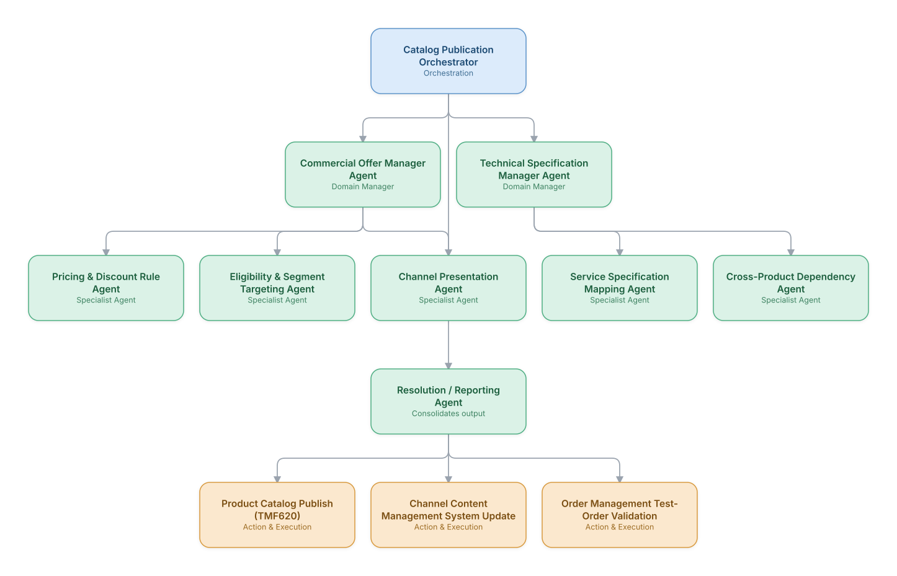

# 02. Product Catalog & Offer Management Automation

**Domain:** BSS/OSS &nbsp;|&nbsp; **Architecture pattern:** [Hierarchical Multi-Agent (Manager-of-Managers)]({{ '/patterns/hierarchical/' | relative_url }})

> 🧠 **Deep dive available:** this use case also has a full [8-Layer Regenerative Architecture breakdown]({{ '/deep8/bssoss/02-product-catalog-offer-management/' | relative_url }}) — the same problem mapped through L1–L8, with an agent-level tools/technologies stack and a suggested build order by layer.

## 1. Problem Statement & Use Case

Launching a new bundled offer requires coordinating pricing, eligibility rules, technical service specifications, and channel-specific presentation across a sprawling product catalog — a process that commercial teams describe as the single biggest bottleneck to speed-to-market. A hierarchical agent team spanning commercial and technical catalog domains can validate and publish new offers in hours instead of weeks.

## 2. End-to-End Multi-Agent Architecture

The solution is implemented as a **Hierarchical Multi-Agent (Manager-of-Managers)** architecture. 
### 2.1 Agents & Sub-Agents

| Agent | Responsibility |
|---|---|
| Catalog Publication Orchestrator | Coordinates commercial and technical managers and gates final publication on cross-checks passing |
| Commercial Offer Manager | Oversees pricing, eligibility, and channel-presentation sub-agents |
| Technical Specification Manager | Oversees service-spec mapping and cross-product dependency sub-agents |
| Pricing & Discount Rule Agent | Validates the new offer's pricing against margin floors and existing discount stacking rules |
| Eligibility & Segment Targeting Agent | Encodes which customer segments/geographies can purchase the offer |
| Cross-Product Dependency Agent | Checks for conflicts with existing bundles (e.g., a device financing plan incompatible with a new SIM-only offer) |

### 2.2 Architecture Diagram

> This diagram is organized as a **layered architecture**: Data &amp; Integration → Orchestration → Agent →
> Action &amp; Execution, plus a cross-cutting Observability &amp; Governance layer (tracing, audit log,
> guardrails, and any human review checkpoint — shown in lavender). See the
> [E2E Platform Architecture]({{ '/architecture/e2e-platform-architecture/' | relative_url }}) for how this
> layering looks across all 60 use cases at once. A [Mermaid text source](architecture.mmd) of the same
> diagram is also available in this folder.

## 3. Technologies Used (per step)

| Step / Layer | Technology |
|---|---|
| Catalog platform | TM Forum TMF620 Product Catalog Management API |
| Orchestration | Hierarchical LangGraph with commercial/technical sub-graphs |
| Pricing validation | Rules engine encoding margin-floor and discount-stacking policy |
| Dependency checking | Graph-based product-relationship model (Neo4j) to detect bundle conflicts |
| Test-order validation | Automated synthetic order run through the OMS pipeline before go-live |
| Channel publishing | CMS/e-commerce integration for storefront and call-center script updates |
| LLM usage | Claude drafting customer-facing offer copy and internal launch-readiness summaries |
| Governance | Full approval-chain audit log (commercial + technical + legal sign-off) |

## 4. Suggested Build Order

**Phase 1 — one branch only.** Build Catalog Publication Orchestrator talking to just Commercial Offer Manager Agent and that manager's own leaf agents, ignoring the other 1 branch entirely. Prove one full manager-to-leaf chain before replicating it.

**Phase 2 — add the remaining branches.** Bring Technical Specification Manager Agent online, each with their own leaf agents. Build Catalog Publication Orchestrator's cross-branch consolidation logic — this is the actual hard part of the hierarchical pattern, not any single branch.

**Phase 3 — resolve cross-branch conflicts.** Real inputs will disagree across managers (different branches recommending incompatible actions); add explicit conflict-resolution logic at Catalog Publication Orchestrator rather than letting the last branch to report silently win.

**Phase 4 — observability and feedback.** Trace decisions at every level of the hierarchy separately (top orchestrator, each manager, each leaf) so a bad outcome can be traced to the specific branch and level that caused it.

## 5. If We Rebuilt This: What Would Improve

- Would run the synthetic test-order validation earlier in the flow, not just before go-live — several offers passed catalog validation but failed silently in the OMS pipeline, discovered too late in v1.
- Cross-product dependency checking had the highest ROI of any sub-agent; would prioritize building this before pricing/eligibility automation if starting over.
- Channel presentation agent initially generated inconsistent copy across web/app/call-center for the same offer — added a single shared offer-narrative source of truth all channels pull from.
- Add a post-launch monitoring agent that watches early order volume/fallout rate for a new offer and can auto-pause publication if fallout spikes.

---
[← Back to BSS/OSS index]({{ '/bssoss/' | relative_url }}) &nbsp;|&nbsp; [← Back to home]({{ '/' | relative_url }})
