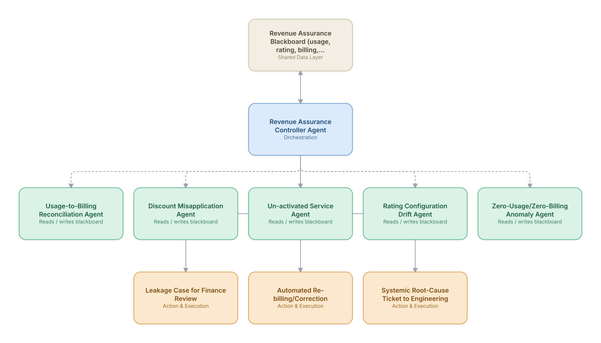

# 03. Revenue Assurance & Leakage Detection

**Domain:** BSS/OSS &nbsp;|&nbsp; **Architecture pattern:** [Blackboard / Shared-Memory]({{ '/patterns/blackboard/' | relative_url }})

> 🧠 **Deep dive available:** this use case also has a full [8-Layer Regenerative Architecture breakdown]({{ '/deep8/bssoss/03-revenue-assurance-leakage-detection/' | relative_url }}) — the same problem mapped through L1–L8, with an agent-level tools/technologies stack and a suggested build order by layer.

## 1. Problem Statement & Use Case

Revenue leakage — unbilled usage, mis-rated services, un-activated but delivered services, discount misapplication — typically runs 1-3% of telecom revenue and is notoriously hard to find because evidence is scattered across mediation, rating, billing, and provisioning systems. A blackboard of specialized leakage detectors, synthesized by a controller, surfaces high-confidence, high-value leakage cases for recovery.

## 2. End-to-End Multi-Agent Architecture

The solution is implemented as a **Blackboard / Shared-Memory** architecture. 
### 2.1 Agents & Sub-Agents

| Agent | Responsibility |
|---|---|
| Revenue Assurance Controller Agent | Synthesizes blackboard findings into prioritized leakage cases ranked by recovery value |
| Usage-to-Billing Reconciliation Agent | Compares network usage records (mediation output) against what was actually billed |
| Discount Misapplication Agent | Detects discounts applied outside eligibility rules or beyond promotional end-dates |
| Un-activated Service Agent | Finds services provisioned and delivered in the network but never activated in billing |
| Rating Configuration Drift Agent | Detects rating engine configuration changes that silently under-charge a usage category |
| Zero-Usage/Zero-Billing Anomaly Agent | Flags active subscriptions generating usage but zero corresponding billing records |

### 2.2 Architecture Diagram

> This diagram is organized as a **layered architecture**: Data &amp; Integration → Orchestration → Agent →
> Action &amp; Execution, plus a cross-cutting Observability &amp; Governance layer (tracing, audit log,
> guardrails, and any human review checkpoint — shown in lavender). See the
> [E2E Platform Architecture]({{ '/architecture/e2e-platform-architecture/' | relative_url }}) for how this
> layering looks across all 60 use cases at once. A [Mermaid text source](architecture.mmd) of the same
> diagram is also available in this folder.

## 3. Technologies Used (per step)

| Step / Layer | Technology |
|---|---|
| Data sources | Mediation platform, rating engine, billing system, and provisioning/OSS inventory feeds |
| Blackboard store | Columnar data warehouse (Snowflake/BigQuery) as the shared cross-reference store |
| Reconciliation logic | Large-scale SQL/Spark reconciliation jobs feeding structured findings to the blackboard |
| Controller reasoning | Claude synthesizing multi-agent findings into a prioritized, dollar-quantified leakage report |
| Configuration drift detection | Diff-based monitoring of rating engine configuration changes over time |
| Case management | Revenue assurance case tracking (in-house or RA platform like cVidya/Subex) |
| Correction execution | Automated re-billing trigger for high-confidence, policy-approved correction types |
| Reporting | Finance-facing dashboard quantifying recovered vs. at-risk revenue |

## 4. Suggested Build Order

**Phase 1 — one agent writing to the blackboard.** Get Usage-to-Billing Reconciliation Agent reading and writing the shared store with Revenue Assurance Controller Agent just reading it back out, no synthesis logic yet. Prove the shared-state read/write mechanics before adding more writers.

**Phase 2 — add the remaining agents.** Bring Discount Misapplication Agent, Un-activated Service Agent, Rating Configuration Drift Agent, Zero-Usage/Zero-Billing Anomaly Agent online, each writing independently to the blackboard. Build Revenue Assurance Controller Agent's synthesis logic — deciding which agent to trigger next and how to combine partial, sometimes-conflicting findings.

**Phase 3 — add a minimum-evidence threshold.** An early blackboard system will over-synthesize from sparse data; require a minimum number of corroborating agent findings before the controller surfaces a conclusion.

**Phase 4 — observability and feedback.** Snapshot the blackboard's state history so any synthesized conclusion can be traced back to exactly which agent findings produced it.

## 5. If We Rebuilt This: What Would Improve

- Would keep automated re-billing scoped to only the highest-confidence, previously-human-validated leakage patterns — an early broader auto-correction attempt risked customer-facing billing errors in the other direction.
- Rating configuration drift detection caught issues no other agent could see (a silent config push, not a data mismatch) — would build this sub-agent earlier given its outsized impact.
- Blackboard cross-referencing across four large systems was the main performance bottleneck; would design a pre-aggregated daily snapshot layer from the start instead of live cross-system joins.
- Finance wanted leakage cases grouped by root cause (not just by account) to prioritize systemic fixes over one-off corrections — restructured the controller's output format after this feedback.

---
[← Back to BSS/OSS index]({{ '/bssoss/' | relative_url }}) &nbsp;|&nbsp; [← Back to home]({{ '/' | relative_url }})
