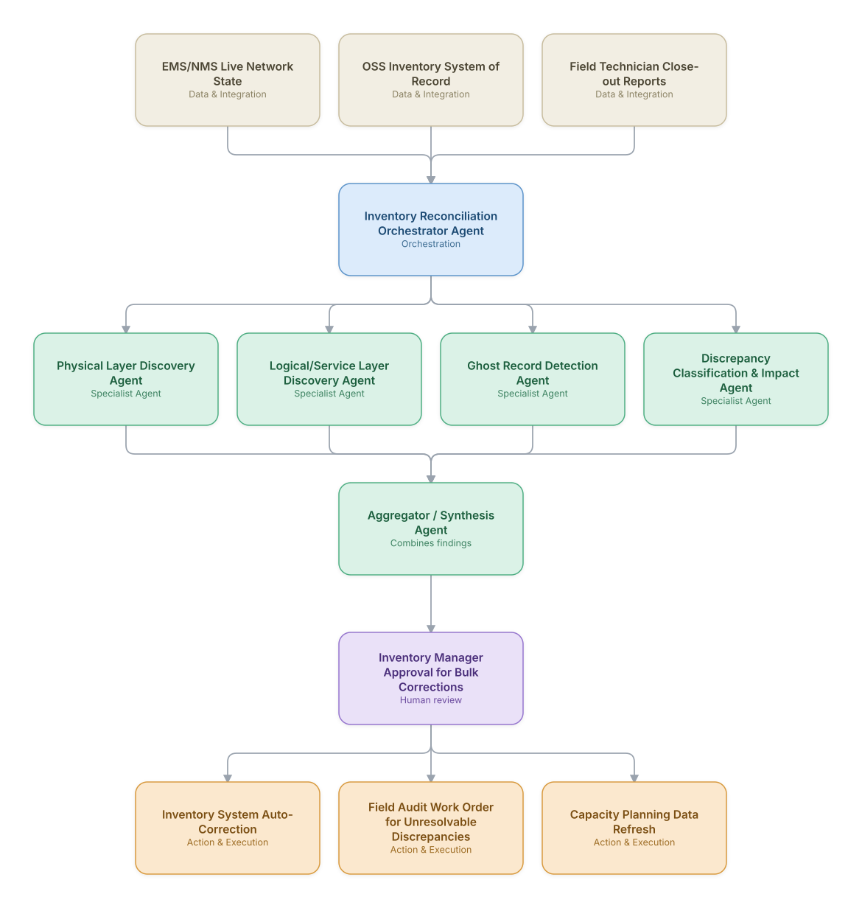

# 05. Network Inventory Discovery & Reconciliation

**Domain:** BSS/OSS &nbsp;|&nbsp; **Architecture pattern:** [Orchestrator-Worker (Supervisor fan-out/fan-in)]({{ '/patterns/orchestrator-worker/' | relative_url }})

> 🧠 **Deep dive available:** this use case also has a full [8-Layer Regenerative Architecture breakdown]({{ '/deep8/bssoss/05-network-inventory-discovery-reconciliation/' | relative_url }}) — the same problem mapped through L1–L8, with an agent-level tools/technologies stack and a suggested build order by layer.

## 1. Problem Statement & Use Case

OSS inventory systems drift out of sync with the physical/logical network over time (undocumented field changes, decommissioned equipment never removed, ghost records), which cascades into failed provisioning, inaccurate capacity planning, and wasted truck-rolls. A coordinated agent team can continuously discover actual network state and reconcile it against the system-of-record inventory.

## 2. End-to-End Multi-Agent Architecture

The solution is implemented as a **Orchestrator-Worker (Supervisor fan-out/fan-in)** architecture. 
**Human-in-the-loop checkpoint:** Inventory Manager Approval for Bulk Corrections

### 2.1 Agents & Sub-Agents

| Agent | Responsibility |
|---|---|
| Inventory Reconciliation Orchestrator | Coordinates discovery agents and produces a prioritized reconciliation plan |
| Physical Layer Discovery Agent | Queries EMS/NMS for actual installed equipment and compares to inventory records |
| Logical/Service Layer Discovery Agent | Discovers actual active services/circuits and compares to the logical inventory |
| Ghost Record Detection Agent | Identifies inventory records with no corresponding live network element (decommissioned, never removed) |
| Discrepancy Classification & Impact Agent | Classifies each discrepancy's likely cause and business impact (blocks provisioning vs. cosmetic) |

### 2.2 Architecture Diagram

> This diagram is organized as a **layered architecture**: Data &amp; Integration → Orchestration → Agent →
> Action &amp; Execution, plus a cross-cutting Observability &amp; Governance layer (tracing, audit log,
> guardrails, and any human review checkpoint — shown in lavender). See the
> [E2E Platform Architecture]({{ '/architecture/e2e-platform-architecture/' | relative_url }}) for how this
> layering looks across all 60 use cases at once. A [Mermaid text source](architecture.mmd) of the same
> diagram is also available in this folder.

## 3. Technologies Used (per step)

| Step / Layer | Technology |
|---|---|
| Network discovery | SNMP/NETCONF/gNMI polling plus vendor EMS APIs for live state |
| Inventory system | OSS inventory platform (Netcracker/Amdocs/Blue Planet) as system of record |
| Orchestration | LangGraph supervisor running discovery agents on a scheduled sweep cadence |
| Discrepancy matching | Entity-resolution matching (fuzzy key matching on serial numbers/circuit IDs) |
| Impact classification | Claude reasoning over discrepancy type and downstream provisioning dependency graph |
| Correction execution | Automated low-risk correction (e.g., updating a firmware version field) vs. human-gated bulk changes |
| Field integration | Technician close-out report parsing to catch undocumented field changes |
| Reporting | Inventory accuracy score trend dashboard by network domain |

## 4. Suggested Build Order

**Phase 1 — one worker, no fan-out.** Wire a single path end to end: Physical Layer Discovery Agent reading real data and producing a result, with Inventory Reconciliation Orchestrator Agent just passing data through untouched. Prove the data pipeline and one agent's reasoning before adding parallelism.

**Phase 2 — add the fan-out.** Bring the remaining 3 worker agents online in parallel and build Inventory Reconciliation Orchestrator Agent's aggregation/synthesis logic. This is where the orchestrator-worker pattern is actually learned — watch for race conditions and partial-failure handling here, not before.

**Phase 3 — add the governance gate.** Wire in the human checkpoint: Inventory Manager Approval for Bulk Corrections.

**Phase 4 — observability and feedback.** Trace every worker call, monitor the aggregator's decision quality against real outcomes, and add a feedback loop that catches drift before it becomes a production incident.

## 5. If We Rebuilt This: What Would Improve

- Would gate all bulk/high-volume corrections behind human approval from the start — an early auto-correction run on ghost records deleted a handful of legitimately-planned-but-not-yet-installed equipment records.
- Field technician close-out report parsing caught undocumented changes no network polling could see; would prioritize this data source earlier.
- Discrepancy impact classification (does this block provisioning or is it cosmetic) was essential for prioritization — v1 treated all discrepancies equally and buried the important ones.
- Reconciliation sweep frequency needed to vary by network domain — access-layer equipment changes far more often than core, and a uniform sweep schedule wasted compute on stable domains.

---
[← Back to BSS/OSS index]({{ '/bssoss/' | relative_url }}) &nbsp;|&nbsp; [← Back to home]({{ '/' | relative_url }})
