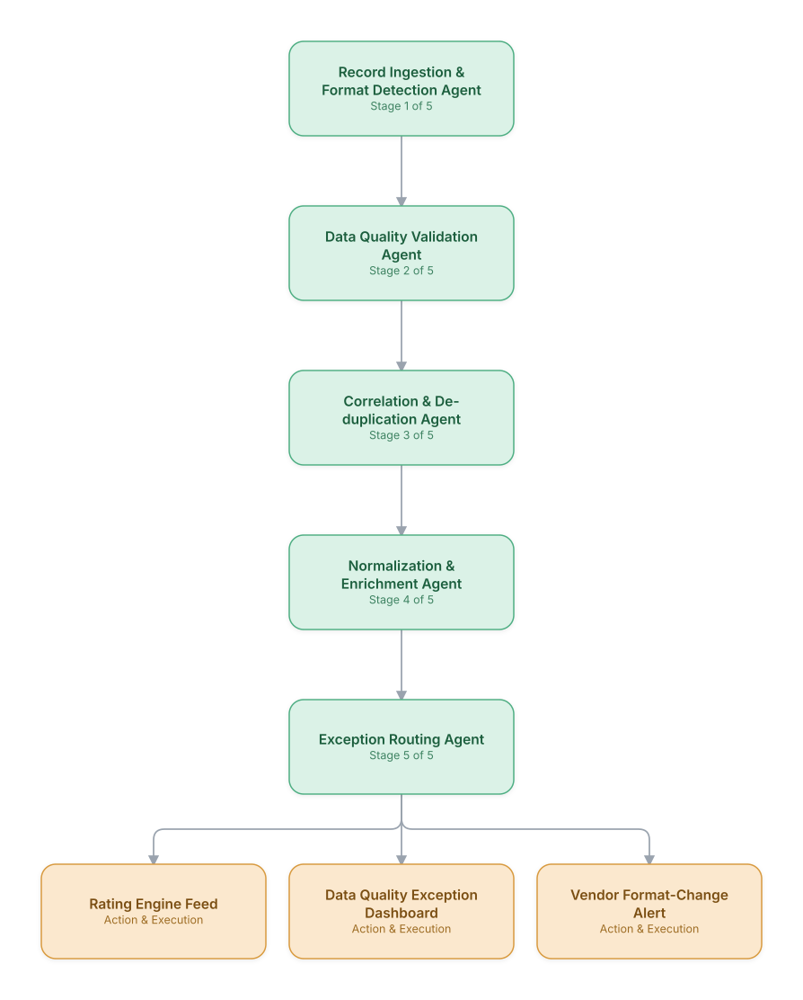

# 06. Mediation & CDR/xDR Processing Pipeline

**Domain:** BSS/OSS &nbsp;|&nbsp; **Architecture pattern:** [Sequential Pipeline](../../patterns/pipeline.md)

> 🧠 **Deep dive available:** this use case also has a full [8-Layer Regenerative Architecture breakdown](../../deep8/bssoss/06-mediation-cdr-xdr-processing/README.md) — the same problem mapped through L1–L8, with an agent-level tools/technologies stack and a suggested build order by layer.

## 1. Problem Statement & Use Case

Mediation systems must ingest, validate, correlate, and transform billions of daily call/data/event detail records (CDRs/xDRs) from heterogeneous network elements into a normalized format for rating and billing. Format drift from vendor firmware updates and silent data-quality issues cause downstream rating errors that are expensive to trace back. An agent pipeline adds intelligent validation and self-describing error handling on top of the raw mediation engine.

## 2. End-to-End Multi-Agent Architecture

The solution is implemented as a **Sequential Pipeline** architecture. 
### 2.1 Agents & Sub-Agents

| Agent | Responsibility |
|---|---|
| Record Ingestion & Format Detection Agent | Identifies the source format/vendor variant of incoming records and routes to the right parser |
| Data Quality Validation Agent | Validates record completeness and field-level sanity (e.g., call duration within plausible bounds) |
| Correlation & De-duplication Agent | Correlates partial records (e.g., call-leg records) and removes network-generated duplicates |
| Normalization & Enrichment Agent | Converts to the canonical xDR schema and enriches with subscriber/service context |
| Exception Routing Agent | Routes malformed or unresolvable records to the appropriate exception queue with a diagnosis |

### 2.2 Architecture Diagram

> This diagram is organized as a **layered architecture**: Data &amp; Integration → Orchestration → Agent →
> Action &amp; Execution, plus a cross-cutting Observability &amp; Governance layer (tracing, audit log,
> guardrails, and any human review checkpoint — shown in lavender). See the
> [E2E Platform Architecture](../../architecture/e2e-platform-architecture.md) for how this layering looks
> across all 60 use cases at once. A [Mermaid text source](architecture.mmd) of the same diagram is also
> available in this folder.

## 3. Technologies Used (per step)

| Step / Layer | Technology |
|---|---|
| Mediation engine | Existing mediation platform (Openwave/Digital Route MediationZone) as the base processing engine |
| Format detection | Schema-inference classifier trained on known vendor CDR/xDR variants |
| Data quality rules | Great Expectations-style validation rules layered with an LLM fallback for ambiguous cases |
| Correlation logic | Stream-processing correlation (Apache Flink) for multi-leg record stitching |
| Orchestration | Pipeline implemented as a Flink/Kafka Streams topology with agent-based exception-handling steps |
| Enrichment | Real-time subscriber/service lookup against the customer 360 store (see BSS/OSS Use Case 8) |
| Exception diagnosis | Claude generating a plain-language diagnosis for engineering when a new vendor format variant appears |
| Monitoring | Record-loss and data-quality-exception-rate dashboards per network element type |

## 4. Suggested Build Order

**Phase 1 — the first two stages only.** Get Record Ingestion & Format Detection Agent feeding Data Quality Validation Agent correctly, with the rest of the pipeline stubbed out. Durability matters more than completeness here — make sure a crash mid-pipeline doesn't lose or duplicate work.

**Phase 2 — the full chain.** Add the remaining 3 stages in order, testing each newly-added stage against real output from the stage before it, not synthetic test data.

**Phase 3 — add retry and partial-failure handling.** Decide, stage by stage, what happens when that specific stage fails: retry, skip, or halt the whole pipeline. This decision is different per stage and shouldn't be a single global policy.

**Phase 4 — observability and feedback.** Add per-stage tracing so a slow or wrong pipeline run can be attributed to one specific stage, and track output quality over time to catch silent degradation in an early stage before it compounds downstream.

## 5. If We Rebuilt This: What Would Improve

- Would add automatic vendor format-change alerting from day one — a firmware update on one vendor's equipment silently changed a field format and went undetected for two billing cycles in v1.
- Correlation/de-duplication was the highest-defect-risk stage; would invest in more exhaustive test coverage here specifically given how directly it affects billing accuracy.
- Exception routing needed clearer severity tiering — early version treated a single malformed record the same as a systemic feed-level failure, burying critical alerts in noise.
- Enrichment lookups against the customer 360 store added meaningful latency at billion-record scale; would pre-compute and cache enrichment context rather than looking it up per record.

---
[← Back to BSS/OSS index](../README.md) &nbsp;|&nbsp; [← Back to home](../../../README.md)
