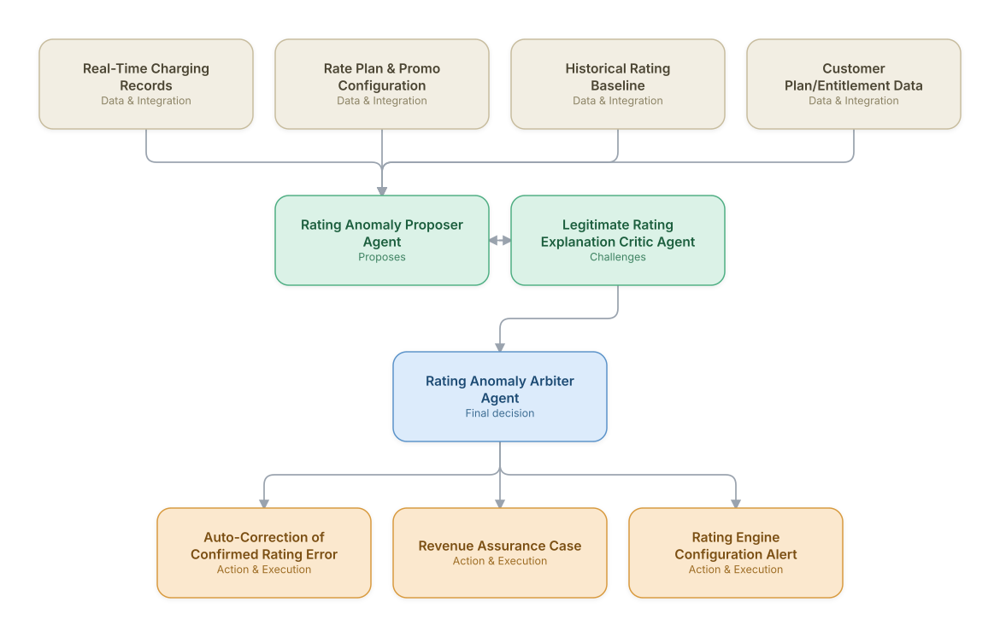

# 07. Charging & Rating Engine Anomaly Detection

**Domain:** BSS/OSS &nbsp;|&nbsp; **Architecture pattern:** [Debate-Critique-Arbiter (Reflective Loop)]({{ '/patterns/debate-critique/' | relative_url }})

> 🧠 **Deep dive available:** this use case also has a full [8-Layer Regenerative Architecture breakdown]({{ '/deep8/bssoss/07-charging-rating-anomaly-detection/' | relative_url }}) — the same problem mapped through L1–L8, with an agent-level tools/technologies stack and a suggested build order by layer.

## 1. Problem Statement & Use Case

Real-time charging and rating engines occasionally under- or over-charge due to configuration errors, promo-interaction bugs, or edge-case usage patterns — costly in direct revenue impact and in customer trust when overcharges occur. A proposer/critic pair, similar in spirit to fraud detection, distinguishes genuine rating anomalies from legitimate edge cases (e.g., a valid but unusual promo stacking) before alerting revenue assurance or auto-correcting.

## 2. End-to-End Multi-Agent Architecture

The solution is implemented as a **Debate-Critique-Arbiter (Reflective Loop)** architecture. 
### 2.1 Agents & Sub-Agents

| Agent | Responsibility |
|---|---|
| Rating Anomaly Proposer Agent | Flags charging events that deviate from expected rate-plan pricing given usage and plan terms |
| Legitimate Rating Explanation Critic Agent | Searches for a legitimate explanation — an active promo, a plan change mid-cycle, an approved manual adjustment |
| Rating Anomaly Arbiter Agent | Weighs both agents' evidence into a confirmed-error vs. legitimate-variance determination |
| Configuration Drift Cross-Check Agent | Checks whether a recent rating engine configuration deployment correlates with the anomaly's onset |
| Correction Execution Agent | Applies approved auto-correction for confirmed, low-risk rating errors within policy limits |

### 2.2 Architecture Diagram

> This diagram is organized as a **layered architecture**: Data &amp; Integration → Orchestration → Agent →
> Action &amp; Execution, plus a cross-cutting Observability &amp; Governance layer (tracing, audit log,
> guardrails, and any human review checkpoint — shown in lavender). See the
> [E2E Platform Architecture]({{ '/architecture/e2e-platform-architecture/' | relative_url }}) for how this
> layering looks across all 60 use cases at once. A [Mermaid text source](architecture.mmd) of the same
> diagram is also available in this folder.

## 3. Technologies Used (per step)

| Step / Layer | Technology |
|---|---|
| Charging platform | Existing real-time charging system (Ericsson/Amdocs/Netcracker Convergent Charging) as the event source |
| Baseline modeling | Statistical baseline of expected charge amount per rate plan and usage profile |
| Proposer/critic reasoning | Two independently-prompted Claude passes, mirroring the design used in the AML and insider-trading use cases |
| Configuration tracking | Version-controlled rating configuration with deployment-time correlation analysis |
| Arbitration | Weighted evidence scoring calibrated against historically-confirmed rating errors |
| Correction execution | Automated micro-correction for small, high-confidence, policy-bounded cases only |
| Case management | Revenue assurance case system integration for anything above the auto-correction threshold |
| Monitoring | Rating-accuracy dashboard tracking both false-positive noise and confirmed-error recovery value |

## 4. Suggested Build Order

**Phase 1 — the proposer alone.** Get Rating Anomaly Proposer Agent producing a hypothesis from real data, with no critic yet — this is just a single-pass classifier/recommender at this stage, and that's fine.

**Phase 2 — add the critic, fully independent.** Build Legitimate Rating Explanation Critic Agent with no visibility into the proposer's reasoning — separate context, separate prompt. This independence is the entire point of the pattern; skipping it turns the critic into a rubber stamp.

**Phase 3 — add Rating Anomaly Arbiter Agent and calibrate.** Build the arbitration logic, then run it against a set of cases with known-correct outcomes to calibrate how much weight the critic's pushback should carry before trusting it on live decisions.

**Phase 4 — observability and feedback.** Track how often the arbiter overrides the proposer and whether those overrides were actually correct — this tells you whether the critic is earning its place in the pipeline or just adding latency.

## 5. If We Rebuilt This: What Would Improve

- Kept the critic agent's evidence search fully independent from the proposer, consistent with the design lesson from the AML and insider-trading use cases — shared context caused the same confirmation-bias problem here in early testing.
- Configuration-deployment correlation turned out to be the single strongest signal for confirmed errors; would surface deployment timestamps to the proposer as a first-class signal, not an afterthought sub-agent.
- Auto-correction threshold was initially too permissive on dollar amount — tightened significantly after realizing 'small per-event' errors summed to material revenue impact at scale.
- Would add customer-facing transparency for any correction that resulted in a customer credit, since customers noticed unexplained credit-memo line items and contacted support confused.

---
[← Back to BSS/OSS index]({{ '/bssoss/' | relative_url }}) &nbsp;|&nbsp; [← Back to home]({{ '/' | relative_url }})
