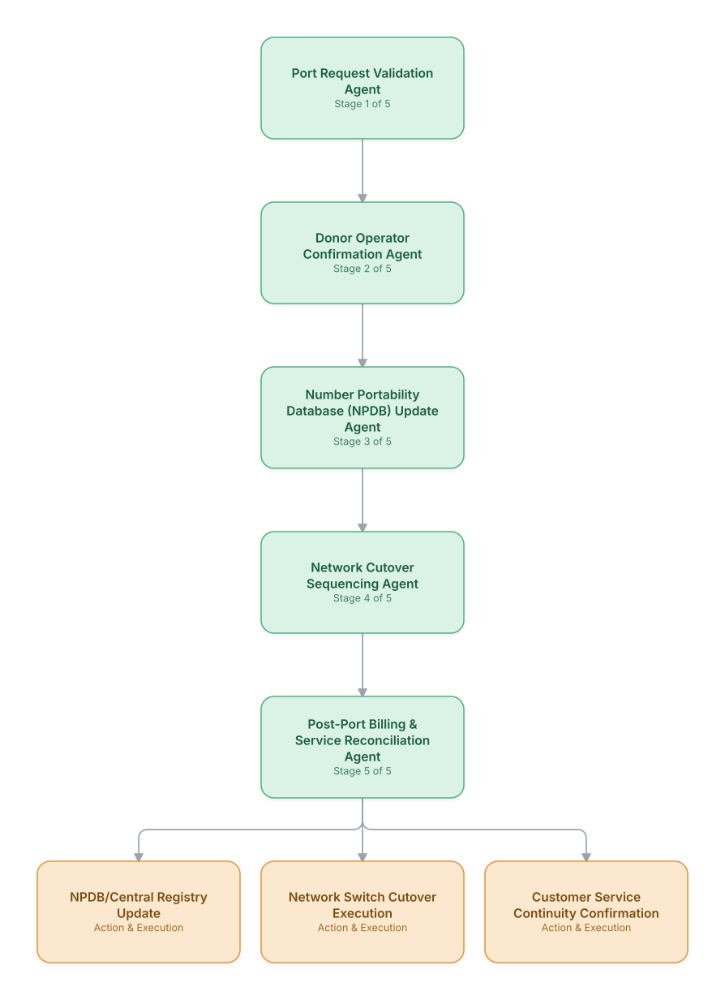

# 10. Number Portability Orchestration

**Domain:** BSS/OSS &nbsp;|&nbsp; **Architecture pattern:** [Sequential Pipeline]({{ '/patterns/pipeline/' | relative_url }})

> 🧠 **Deep dive available:** this use case also has a full [8-Layer Regenerative Architecture breakdown]({{ '/deep8/bssoss/10-number-portability-orchestration/' | relative_url }}) — the same problem mapped through L1–L8, with an agent-level tools/technologies stack and a suggested build order by layer.

## 1. Problem Statement & Use Case

Porting a phone number between operators (or between prepaid/postpaid within the same operator) involves a strict, regulator-defined sequence of validation, donor-operator confirmation, network cutover, and billing adjustment steps with tight SLA windows. Missing a step or executing out of order causes service disruption and regulatory reporting obligations — this is a domain where a disciplined, auditable pipeline matters more than adaptive flexibility.

## 2. End-to-End Multi-Agent Architecture

The solution is implemented as a **Sequential Pipeline** architecture. 
### 2.1 Agents & Sub-Agents

| Agent | Responsibility |
|---|---|
| Port Request Validation Agent | Validates the port request against regulator rules (correct account holder, no contract-lock conflicts) |
| Donor Operator Confirmation Agent | Manages the confirm/reject handshake with the losing operator within the regulatory SLA window |
| Number Portability Database Update Agent | Updates the central number portability registry once confirmed |
| Network Cutover Sequencing Agent | Sequences the precise cutover timing to minimize service interruption for the customer |
| Post-Port Billing & Service Reconciliation Agent | Confirms billing and service entitlements are correctly reflected on the gaining operator's systems post-cutover |

### 2.2 Architecture Diagram

> This diagram is organized as a **layered architecture**: Data &amp; Integration → Orchestration → Agent →
> Action &amp; Execution, plus a cross-cutting Observability &amp; Governance layer (tracing, audit log,
> guardrails, and any human review checkpoint — shown in lavender). See the
> [E2E Platform Architecture]({{ '/architecture/e2e-platform-architecture/' | relative_url }}) for how this
> layering looks across all 60 use cases at once. A [Mermaid text source](architecture.mmd) of the same
> diagram is also available in this folder.

## 3. Technologies Used (per step)

| Step / Layer | Technology |
|---|---|
| Regulatory integration | Central number portability clearinghouse API (e.g., NPAC in the US, equivalent national registries elsewhere) |
| Validation rules | Rules engine encoding jurisdiction-specific porting eligibility requirements |
| Orchestration | Temporal workflow enforcing strict step ordering and regulator SLA deadlines |
| Cutover coordination | Real-time coordination with switch/HLR-HSS systems for the network cutover moment |
| LLM usage | Claude for customer-facing status explanations and internal exception-narrative generation only, not for core sequencing logic |
| Monitoring | SLA-compliance dashboard tracking every port request against regulatory deadlines |
| Audit | Full immutable audit trail per port required for regulatory dispute resolution |
| Rollback handling | Defined rollback procedure agent for failed cutovers to restore service on the donor network |

## 4. Suggested Build Order

**Phase 1 — the first two stages only.** Get Port Request Validation Agent feeding Donor Operator Confirmation Agent correctly, with the rest of the pipeline stubbed out. Durability matters more than completeness here — make sure a crash mid-pipeline doesn't lose or duplicate work.

**Phase 2 — the full chain.** Add the remaining 3 stages in order, testing each newly-added stage against real output from the stage before it, not synthetic test data.

**Phase 3 — add retry and partial-failure handling.** Decide, stage by stage, what happens when that specific stage fails: retry, skip, or halt the whole pipeline. This decision is different per stage and shouldn't be a single global policy.

**Phase 4 — observability and feedback.** Add per-stage tracing so a slow or wrong pipeline run can be attributed to one specific stage, and track output quality over time to catch silent degradation in an early stage before it compounds downstream.

## 5. If We Rebuilt This: What Would Improve

- Deliberately kept this pipeline rigid and rules-driven rather than adaptive — the regulatory and customer-service-continuity stakes of a mis-sequenced port are far higher than the efficiency gain from flexibility.
- Would build the rollback-handling agent with equal rigor to the forward path from the start; early versions treated rollback as an afterthought, and a handful of failed cutovers left customers without service longer than necessary.
- Donor operator confirmation timeouts (silence interpreted as rejection under some regulatory regimes) needed very precise SLA-clock handling — a timezone/clock-sync bug caused incorrect timeout determinations in early testing.
- Customers found generic 'porting in progress' messages frustrating during multi-day ports; added stage-specific status messaging generated by the LLM layer, grounded strictly in actual pipeline state.

---
[← Back to BSS/OSS index]({{ '/bssoss/' | relative_url }}) &nbsp;|&nbsp; [← Back to home]({{ '/' | relative_url }})
