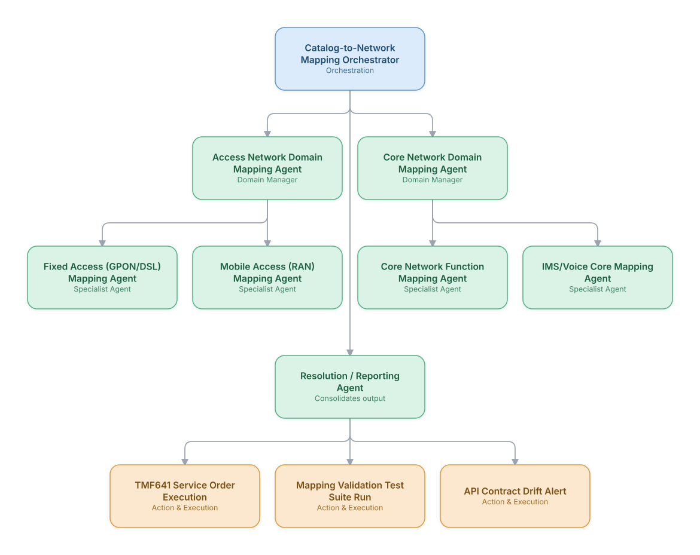

# 12. Service Catalog-to-Network Activation Mapping (TMF Open APIs)

**Domain:** BSS/OSS &nbsp;|&nbsp; **Architecture pattern:** [Hierarchical Multi-Agent (Manager-of-Managers)]({{ '/patterns/hierarchical/' | relative_url }})

> 🧠 **Deep dive available:** this use case also has a full [8-Layer Regenerative Architecture breakdown]({{ '/deep8/bssoss/12-service-catalog-network-activation-mapping/' | relative_url }}) — the same problem mapped through L1–L8, with an agent-level tools/technologies stack and a suggested build order by layer.

## 1. Problem Statement & Use Case

Translating a commercial service catalog entry into the correct sequence of TM Forum Open API calls across heterogeneous OSS/network domains requires deep, often tribal-knowledge mapping logic that breaks whenever either the catalog or an underlying OSS API changes. A hierarchical agent team maintains this mapping layer as a living, self-validating system rather than static integration code.

## 2. End-to-End Multi-Agent Architecture

The solution is implemented as a **Hierarchical Multi-Agent (Manager-of-Managers)** architecture. 
### 2.1 Agents & Sub-Agents

| Agent | Responsibility |
|---|---|
| Catalog-to-Network Mapping Orchestrator | Routes each service catalog entry to the correct domain mapping managers and validates end-to-end coverage |
| Access Network Domain Mapping Agent | Oversees fixed and mobile access mapping sub-agents |
| Core Network Domain Mapping Agent | Oversees core network function and IMS/voice mapping sub-agents |
| Fixed Access (GPON/DSL) Mapping Agent | Maps broadband catalog entries to the correct OLT/DSLAM provisioning API sequence |
| Mobile Access (RAN) Mapping Agent | Maps mobile service entries to RAN configuration and QoS profile API calls |
| Core Network Function Mapping Agent | Maps service entries to 5GC/EPC network function provisioning calls |

### 2.2 Architecture Diagram

> This diagram is organized as a **layered architecture**: Data &amp; Integration → Orchestration → Agent →
> Action &amp; Execution, plus a cross-cutting Observability &amp; Governance layer (tracing, audit log,
> guardrails, and any human review checkpoint — shown in lavender). See the
> [E2E Platform Architecture]({{ '/architecture/e2e-platform-architecture/' | relative_url }}) for how this
> layering looks across all 60 use cases at once. A [Mermaid text source](architecture.mmd) of the same
> diagram is also available in this folder.

## 3. Technologies Used (per step)

| Step / Layer | Technology |
|---|---|
| Catalog source | TM Forum TMF620 Product Catalog as the mapping input |
| API layer | TM Forum TMF641 (Service Ordering), TMF638 (Service Inventory) Open APIs |
| Orchestration | Hierarchical LangGraph mirroring the operator's actual network domain org structure |
| Mapping validation | Automated regression test suite re-validating every mapping whenever a catalog or API contract changes |
| Drift detection | API contract diffing (OpenAPI spec comparison) to catch breaking changes from OSS vendors |
| LLM usage | Claude proposing updated mapping logic when drift is detected, with mandatory engineer review before deployment |
| Version control | Git-based versioning of mapping logic with full change history |
| Monitoring | Mapping success-rate dashboard per catalog entry and network domain |

## 4. Suggested Build Order

**Phase 1 — one branch only.** Build Catalog-to-Network Mapping Orchestrator talking to just Access Network Domain Mapping Agent and that manager's own leaf agents, ignoring the other 1 branch entirely. Prove one full manager-to-leaf chain before replicating it.

**Phase 2 — add the remaining branches.** Bring Core Network Domain Mapping Agent online, each with their own leaf agents. Build Catalog-to-Network Mapping Orchestrator's cross-branch consolidation logic — this is the actual hard part of the hierarchical pattern, not any single branch.

**Phase 3 — resolve cross-branch conflicts.** Real inputs will disagree across managers (different branches recommending incompatible actions); add explicit conflict-resolution logic at Catalog-to-Network Mapping Orchestrator rather than letting the last branch to report silently win.

**Phase 4 — observability and feedback.** Trace decisions at every level of the hierarchy separately (top orchestrator, each manager, each leaf) so a bad outcome can be traced to the specific branch and level that caused it.

## 5. If We Rebuilt This: What Would Improve

- API contract drift detection was the single highest-value addition — would build it before any of the mapping agents themselves, since undetected vendor API changes were the dominant cause of production mapping failures.
- Would require mandatory engineer review of any LLM-proposed mapping change before deployment as a hard rule from the start, not something added after an early unreviewed change caused a provisioning outage.
- Domain mapping managers initially couldn't see cross-domain dependencies (e.g., a service needing both RAN and core changes) — added explicit cross-domain coordination logic at the top orchestrator level.
- Regression testing needed to run on every catalog change, not just every API change — an early gap here let a catalog update silently break a previously-working mapping.

---
[← Back to BSS/OSS index]({{ '/bssoss/' | relative_url }}) &nbsp;|&nbsp; [← Back to home]({{ '/' | relative_url }})
