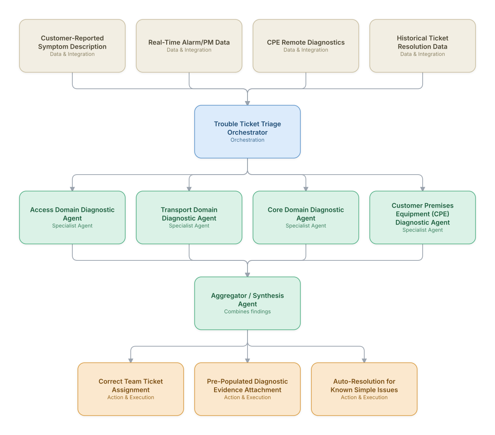

# 13. Trouble Ticket Management & Cross-Domain Assurance (OSS)

**Domain:** BSS/OSS &nbsp;|&nbsp; **Architecture pattern:** [Orchestrator-Worker (Supervisor fan-out/fan-in)](../../patterns/orchestrator-worker.md)

> 🧠 **Deep dive available:** this use case also has a full [8-Layer Regenerative Architecture breakdown](../../deep8/bssoss/13-trouble-ticket-cross-domain-assurance/README.md) — the same problem mapped through L1–L8, with an agent-level tools/technologies stack and a suggested build order by layer.

## 1. Problem Statement & Use Case

OSS trouble tickets for service-affecting issues often require cross-domain investigation (is it access, transport, or core?) before the right team can even start fixing it, and tickets frequently bounce between teams before landing correctly. An agent team can run a first-pass cross-domain diagnostic in parallel, assigning the ticket correctly the first time and pre-populating diagnostic evidence.

## 2. End-to-End Multi-Agent Architecture

The solution is implemented as a **Orchestrator-Worker (Supervisor fan-out/fan-in)** architecture. 
### 2.1 Agents & Sub-Agents

| Agent | Responsibility |
|---|---|
| Trouble Ticket Triage Orchestrator | Runs cross-domain diagnostics in parallel and assigns the ticket to the correct team with evidence attached |
| Access Domain Diagnostic Agent | Checks access-layer health (line quality, port status, recent access-network alarms) relevant to the symptom |
| Transport Domain Diagnostic Agent | Checks for transport-layer issues (link errors, path degradation) that could explain the symptom |
| Core Domain Diagnostic Agent | Checks core network element health relevant to the reported symptom |
| CPE Diagnostic Agent | Runs remote diagnostics against the customer's premises equipment to rule out local causes |

### 2.2 Architecture Diagram

> This diagram is organized as a **layered architecture**: Data &amp; Integration → Orchestration → Agent →
> Action &amp; Execution, plus a cross-cutting Observability &amp; Governance layer (tracing, audit log,
> guardrails, and any human review checkpoint — shown in lavender). See the
> [E2E Platform Architecture](../../architecture/e2e-platform-architecture.md) for how this layering looks
> across all 60 use cases at once. A [Mermaid text source](architecture.mmd) of the same diagram is also
> available in this folder.

## 3. Technologies Used (per step)

| Step / Layer | Technology |
|---|---|
| Ticket intake | Customer service system (Salesforce Service Cloud) generating the initial ticket |
| Diagnostic APIs | EMS/NMS query APIs per network domain plus CPE remote-management (TR-069/USP) protocols |
| Orchestration | LangGraph supervisor running domain diagnostics in parallel with a shared time budget |
| Symptom classification | LLM classifier mapping free-text customer symptom descriptions to likely diagnostic domains |
| Auto-resolution | Rules engine for well-understood simple fixes (e.g., remote CPE reboot) executed automatically with customer consent |
| Ticket routing | OSS trouble ticket system (Remedy/ServiceNow) integration for correct-team assignment |
| Historical grounding | RAG over historical resolved tickets to suggest likely root cause |
| Analytics | First-time-right assignment rate and mean-time-to-resolution dashboard |

## 4. Suggested Build Order

**Phase 1 — one worker, no fan-out.** Wire a single path end to end: Access Domain Diagnostic Agent reading real data and producing a result, with Trouble Ticket Triage Orchestrator just passing data through untouched. Prove the data pipeline and one agent's reasoning before adding parallelism.

**Phase 2 — add the fan-out.** Bring the remaining 3 worker agents online in parallel and build Trouble Ticket Triage Orchestrator's aggregation/synthesis logic. This is where the orchestrator-worker pattern is actually learned — watch for race conditions and partial-failure handling here, not before.

**Phase 3 — add the governance gate.** Add policy/guardrail checks the aggregator's output must clear before it reaches the action layer.

**Phase 4 — observability and feedback.** Trace every worker call, monitor the aggregator's decision quality against real outcomes, and add a feedback loop that catches drift before it becomes a production incident.

## 5. If We Rebuilt This: What Would Improve

- Auto-resolution (e.g., remote CPE reboot) required explicit customer consent before executing, added after an early version reset a customer's equipment mid-video-call without warning.
- Would build the historical-ticket RAG grounding earlier — it dramatically improved diagnostic accuracy for the long tail of unusual symptom descriptions once added.
- First-time-right assignment was the metric that mattered most to operations leadership, more than average diagnostic accuracy per domain — would have led with this KPI from the start.
- CPE diagnostics needed graceful degradation for older equipment lacking remote-management support — early version had no fallback and silently skipped diagnosis for a meaningful fraction of the install base.

---
[← Back to BSS/OSS index](../README.md) &nbsp;|&nbsp; [← Back to home](../../../README.md)
