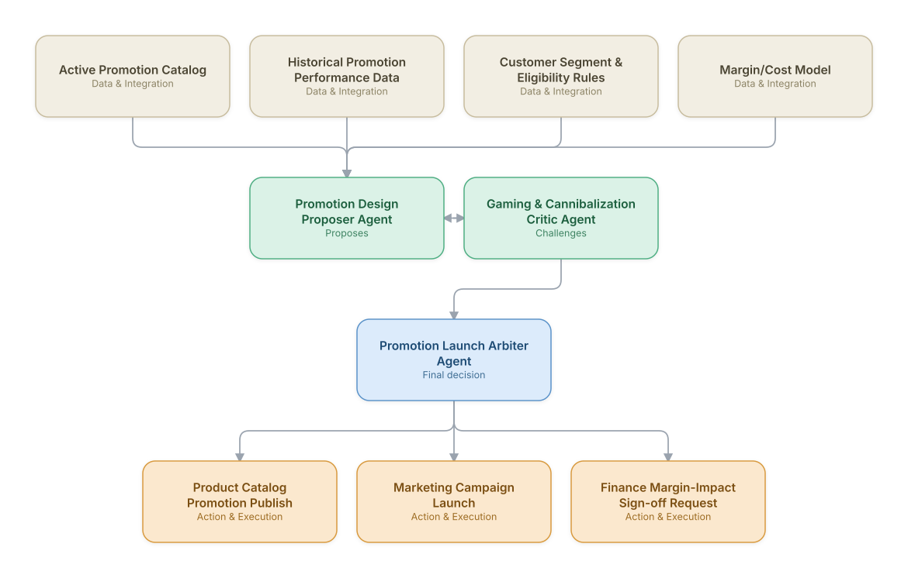

# 15. Promotions & Campaign Configuration Engine

**Domain:** BSS/OSS &nbsp;|&nbsp; **Architecture pattern:** [Debate-Critique-Arbiter (Reflective Loop)]({{ '/patterns/debate-critique/' | relative_url }})

> 🧠 **Deep dive available:** this use case also has a full [8-Layer Regenerative Architecture breakdown]({{ '/deep8/bssoss/15-promotions-campaign-configuration-engine/' | relative_url }}) — the same problem mapped through L1–L8, with an agent-level tools/technologies stack and a suggested build order by layer.

## 1. Problem Statement & Use Case

Marketing teams want to launch promotions quickly (a holiday data bonus, a referral discount), but poorly modeled promotions can be gamed, cannibalize existing revenue, or interact unexpectedly with other active promotions in ways that erode margin. A proposer/critic pair — one designing the promotion for marketing impact, one adversarially checking for gaming and cannibalization risk — catches problems before launch rather than after the damage is done.

## 2. End-to-End Multi-Agent Architecture

The solution is implemented as a **Debate-Critique-Arbiter (Reflective Loop)** architecture. 
### 2.1 Agents & Sub-Agents

| Agent | Responsibility |
|---|---|
| Promotion Design Proposer Agent | Designs the promotion mechanics (discount structure, eligibility, duration) to maximize the stated marketing objective |
| Gaming & Cannibalization Critic Agent | Actively searches for ways the promotion could be gamed (e.g., repeated sign-up/cancel cycles) or would cannibalize existing full-price customers |
| Promotion Launch Arbiter Agent | Weighs marketing impact against gaming/cannibalization risk into a launch decision or required modification |
| Promotion Interaction Agent | Checks how the new promotion interacts with all currently active promotions for compounding-discount risk |
| Margin Impact Modeling Agent | Quantifies the expected margin impact under both intended-use and worst-case-gaming scenarios |

### 2.2 Architecture Diagram

> This diagram is organized as a **layered architecture**: Data &amp; Integration → Orchestration → Agent →
> Action &amp; Execution, plus a cross-cutting Observability &amp; Governance layer (tracing, audit log,
> guardrails, and any human review checkpoint — shown in lavender). See the
> [E2E Platform Architecture]({{ '/architecture/e2e-platform-architecture/' | relative_url }}) for how this
> layering looks across all 60 use cases at once. A [Mermaid text source](architecture.mmd) of the same
> diagram is also available in this folder.

## 3. Technologies Used (per step)

| Step / Layer | Technology |
|---|---|
| Promotion configuration | Extension of the product catalog platform's promotion/discount module |
| Proposer/critic reasoning | Two independently-prompted Claude passes with opposing objectives, consistent with this catalog's other debate-critique designs |
| Gaming simulation | Monte Carlo simulation of adversarial customer behavior against the proposed promotion rules |
| Interaction checking | Rules engine cross-referencing all active promotions for stacking/compounding conflicts |
| Margin modeling | Financial model integrating historical redemption rates and worst-case gaming scenarios |
| Arbitration | Weighted decision combining marketing-impact and risk scores, with a required finance sign-off above a materiality threshold |
| Launch execution | Automated publish to catalog and marketing campaign systems once approved |
| Post-launch monitoring | Real-time redemption-pattern monitoring to catch actual gaming behavior the pre-launch simulation missed |

## 4. Suggested Build Order

**Phase 1 — the proposer alone.** Get Promotion Design Proposer Agent producing a hypothesis from real data, with no critic yet — this is just a single-pass classifier/recommender at this stage, and that's fine.

**Phase 2 — add the critic, fully independent.** Build Gaming & Cannibalization Critic Agent with no visibility into the proposer's reasoning — separate context, separate prompt. This independence is the entire point of the pattern; skipping it turns the critic into a rubber stamp.

**Phase 3 — add Promotion Launch Arbiter Agent and calibrate.** Build the arbitration logic, then run it against a set of cases with known-correct outcomes to calibrate how much weight the critic's pushback should carry before trusting it on live decisions.

**Phase 4 — observability and feedback.** Track how often the arbiter overrides the proposer and whether those overrides were actually correct — this tells you whether the critic is earning its place in the pipeline or just adding latency.

## 5. If We Rebuilt This: What Would Improve

- Gaming simulation via Monte Carlo against adversarial behavior caught a sign-up/cancel loophole that the critic's qualitative review alone missed — would combine simulation and qualitative critique from the start rather than adding simulation later.
- Promotion interaction checking prevented a stacking scenario that would have resulted in negative-margin transactions — this sub-agent had outsized value relative to its build cost and should be prioritized in any similar system.
- Would add post-launch monitoring as a mandatory companion to every launch, not an optional extra — pre-launch simulation is necessarily incomplete, and real gaming patterns emerged that hadn't been anticipated.
- Marketing teams initially found the critic's pushback frustrating when they were confident in a promotion; reframing the critic's output as 'risk-adjusted launch options' rather than a blocking veto improved adoption.

---
[← Back to BSS/OSS index]({{ '/bssoss/' | relative_url }}) &nbsp;|&nbsp; [← Back to home]({{ '/' | relative_url }})
