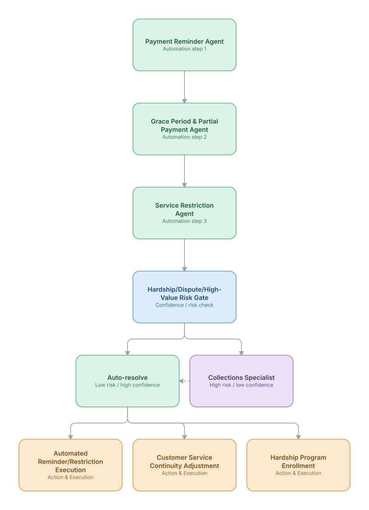

# 16. Dunning & Prepaid/Postpaid Collections Automation

**Domain:** BSS/OSS &nbsp;|&nbsp; **Architecture pattern:** [Human-in-the-Loop Escalation Chain]({{ '/patterns/human-escalation/' | relative_url }})

> 🧠 **Deep dive available:** this use case also has a full [8-Layer Regenerative Architecture breakdown]({{ '/deep8/bssoss/16-dunning-collections-automation/' | relative_url }}) — the same problem mapped through L1–L8, with an agent-level tools/technologies stack and a suggested build order by layer.

## 1. Problem Statement & Use Case

Postpaid telecom collections and prepaid low-balance dunning need to run at massive scale (millions of customers) with automated reminders, service restrictions, and suspension actions — but must escalate to human agents for hardship situations, disputes, or high-value customers where a purely automated action risks real harm or churn of a valuable relationship. A confidence/risk-gated escalation chain balances scale with care.

## 2. End-to-End Multi-Agent Architecture

The solution is implemented as a **Human-in-the-Loop Escalation Chain** architecture. 
### 2.1 Agents & Sub-Agents

| Agent | Responsibility |
|---|---|
| Payment Reminder Agent | Sends escalating, compliant reminders as a payment due-date approaches and passes |
| Grace Period & Partial Payment Agent | Manages grace-period extensions and partial-payment plan offers within policy limits |
| Service Restriction Agent | Applies data/voice restrictions and eventual suspension per the escalation ladder if payment remains outstanding |
| Hardship/Dispute/High-Value Risk Gate | Screens every case before restriction/suspension for hardship indicators, an open billing dispute, or high customer lifetime value |
| Collections Specialist | Reviews gated cases and decides on hardship enrollment, dispute hold, or manual account handling |

### 2.2 Architecture Diagram

> This diagram is organized as a **layered architecture**: Data &amp; Integration → Orchestration → Agent →
> Action &amp; Execution, plus a cross-cutting Observability &amp; Governance layer (tracing, audit log,
> guardrails, and any human review checkpoint — shown in lavender). See the
> [E2E Platform Architecture]({{ '/architecture/e2e-platform-architecture/' | relative_url }}) for how this
> layering looks across all 60 use cases at once. A [Mermaid text source](architecture.mmd) of the same
> diagram is also available in this folder.

## 3. Technologies Used (per step)

| Step / Layer | Technology |
|---|---|
| Payment tracking | Billing system real-time payment status feed |
| Reminder automation | SMS/email/app-push sequencing engine with compliant frequency limits |
| Risk gate scoring | Model combining payment history, customer value (CLV), open dispute flags, and hardship-indicator signals |
| Orchestration | Sequential automation chain (LangGraph) with the risk gate as a mandatory checkpoint before any restriction |
| Human workflow | Collections specialist case queue integrated with the billing and CRM systems |
| Hardship programs | Integration with hardship/payment-assistance program enrollment systems |
| Compliance | Regulatory contact-frequency and disclosure rules enforced identically to the finance-domain collections use case |
| Monitoring | Restriction/suspension rate, complaint rate, and recovery-rate dashboard segmented by risk-gate outcome |

## 4. Suggested Build Order

**Phase 1 — the automation chain, no gate yet.** Get Payment Reminder Agent → Grace Period & Partial Payment Agent → Service Restriction Agent working end to end against real data, routing every single case to Collections Specialist for now — automation logic before automation trust.

**Phase 2 — add Hardship/Dispute/High-Value Risk Gate in shadow mode.** Let the gate score every case and log what it *would* route, but keep sending everything to Collections Specialist regardless. Compare the gate's decisions against what the human actually did.

**Phase 3 — turn on auto-resolve for the highest-confidence tier only.** Once shadow-mode data shows the gate agrees with Collections Specialist at very high confidence, let only that top tier bypass the human — keep everything else routed to review.

**Phase 4 — observability and feedback.** Track the auto-resolve tier's real-world accuracy continuously, not just at launch, and be willing to narrow the auto-resolve criteria back down if accuracy drifts.

## 5. If We Rebuilt This: What Would Improve

- The risk gate blocking automated suspension for flagged cases was a hard requirement from launch, not an afterthought — this is the same principle applied in the finance-domain collections use case, and it proved just as important here.
- Would incorporate open-dispute status into the risk gate from day one; an early version suspended service for a customer with an active, legitimate billing dispute, which became a notable complaint driver.
- High-value customer identification needed to consider full household/multi-line value, not just the single delinquent line — a customer with five other paid-up lines was nearly suspended over one small overdue line in early testing.
- Would add a lighter-touch first-contact channel (in-app nudge before SMS) for customers with strong payment history but a rare late payment, rather than treating every delinquency identically on the escalation ladder.

---
[← Back to BSS/OSS index]({{ '/bssoss/' | relative_url }}) &nbsp;|&nbsp; [← Back to home]({{ '/' | relative_url }})
