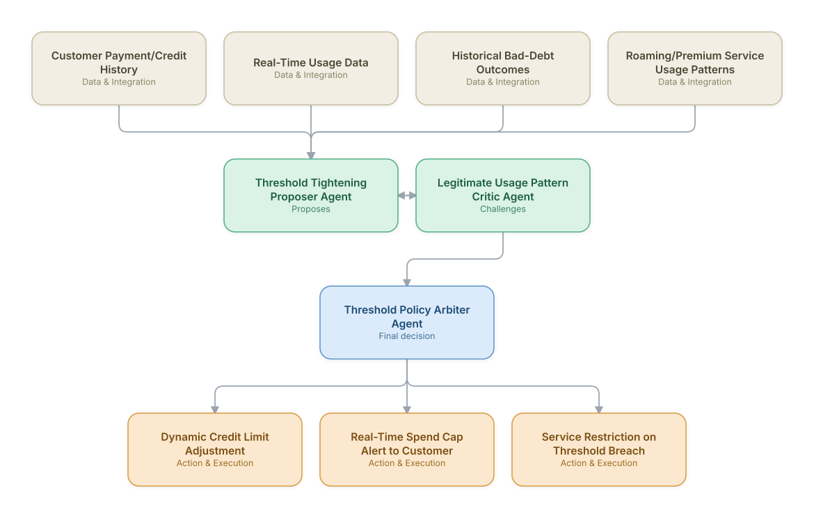

# 18. Credit Limit & Fraud Threshold Management (BSS)

**Domain:** BSS/OSS &nbsp;|&nbsp; **Architecture pattern:** [Debate-Critique-Arbiter (Reflective Loop)](../../patterns/debate-critique.md)

> 🧠 **Deep dive available:** this use case also has a full [8-Layer Regenerative Architecture breakdown](../../deep8/bssoss/18-credit-limit-fraud-threshold-management/README.md) — the same problem mapped through L1–L8, with an agent-level tools/technologies stack and a suggested build order by layer.

## 1. Problem Statement & Use Case

Postpaid credit limits and usage-based fraud thresholds (e.g., data roaming caps, premium SMS spend limits) must balance protecting the operator from bad debt/fraud exposure against not needlessly restricting legitimate high-usage customers. Static, one-size-fits-all thresholds either let too much bad debt through or generate excessive false-positive service interruptions for legitimate power users.

## 2. End-to-End Multi-Agent Architecture

The solution is implemented as a **Debate-Critique-Arbiter (Reflective Loop)** architecture. 
### 2.1 Agents & Sub-Agents

| Agent | Responsibility |
|---|---|
| Threshold Tightening Proposer Agent | Proposes tighter credit limits/usage caps for accounts showing early bad-debt or fraud risk signals |
| Legitimate Usage Pattern Critic Agent | Checks whether flagged high-usage behavior matches a known legitimate pattern (business travel, seasonal usage, family plan sharing) |
| Threshold Policy Arbiter Agent | Sets the final dynamic threshold per account, balancing risk protection against legitimate-customer friction |
| Bad-Debt Outcome Feedback Agent | Feeds actual bad-debt write-off outcomes back to calibrate the proposer's risk signals over time |
| Real-Time Spend Cap Notification Agent | Proactively alerts customers approaching their threshold, giving them a chance to act before restriction |

### 2.2 Architecture Diagram

> This diagram is organized as a **layered architecture**: Data &amp; Integration → Orchestration → Agent →
> Action &amp; Execution, plus a cross-cutting Observability &amp; Governance layer (tracing, audit log,
> guardrails, and any human review checkpoint — shown in lavender). See the
> [E2E Platform Architecture](../../architecture/e2e-platform-architecture.md) for how this layering looks
> across all 60 use cases at once. A [Mermaid text source](architecture.mmd) of the same diagram is also
> available in this folder.

## 3. Technologies Used (per step)

| Step / Layer | Technology |
|---|---|
| Credit/usage data | Billing and real-time charging system feeds for payment history and live usage |
| Risk scoring | Bad-debt propensity model trained on historical write-off outcomes |
| Proposer/critic reasoning | Two independently-prompted Claude passes, consistent with this catalog's fraud/anomaly debate-critique designs |
| Legitimate-pattern detection | Sequence-pattern model recognizing known legitimate high-usage archetypes (roaming business travelers, etc.) |
| Arbitration | Dynamic threshold-setting model calibrated against both bad-debt cost and customer-friction cost |
| Notification | Real-time proactive spend-cap alerts via SMS/app push before restriction triggers |
| Feedback loop | Automated ingestion of realized bad-debt outcomes to retrain the proposer's risk model monthly |
| Monitoring | Bad-debt-prevented vs. legitimate-customer-friction dashboard, tracked as co-equal KPIs |

## 4. Suggested Build Order

**Phase 1 — the proposer alone.** Get Threshold Tightening Proposer Agent producing a hypothesis from real data, with no critic yet — this is just a single-pass classifier/recommender at this stage, and that's fine.

**Phase 2 — add the critic, fully independent.** Build Legitimate Usage Pattern Critic Agent with no visibility into the proposer's reasoning — separate context, separate prompt. This independence is the entire point of the pattern; skipping it turns the critic into a rubber stamp.

**Phase 3 — add Threshold Policy Arbiter Agent and calibrate.** Build the arbitration logic, then run it against a set of cases with known-correct outcomes to calibrate how much weight the critic's pushback should carry before trusting it on live decisions.

**Phase 4 — observability and feedback.** Track how often the arbiter overrides the proposer and whether those overrides were actually correct — this tells you whether the critic is earning its place in the pipeline or just adding latency.

## 5. If We Rebuilt This: What Would Improve

- Would track legitimate-customer friction (unnecessary restrictions) as a first-class KPI alongside bad-debt prevention from the very start — v1 over-indexed on the risk-prevention side and generated avoidable complaints from legitimate roaming customers.
- Proactive spend-cap notifications before restriction meaningfully reduced complaints versus a hard cutoff with no warning — would make this notification step non-optional in any similar system.
- The bad-debt outcome feedback loop took months to accumulate enough labeled outcomes to meaningfully improve the proposer; would start this feedback collection from day one even before the model is mature enough to use it.
- Family plan usage sharing was initially misread as anomalous single-user behavior; would model multi-line household usage patterns explicitly rather than per-line in isolation.

---
[← Back to BSS/OSS index](../README.md) &nbsp;|&nbsp; [← Back to home](../../../README.md)
