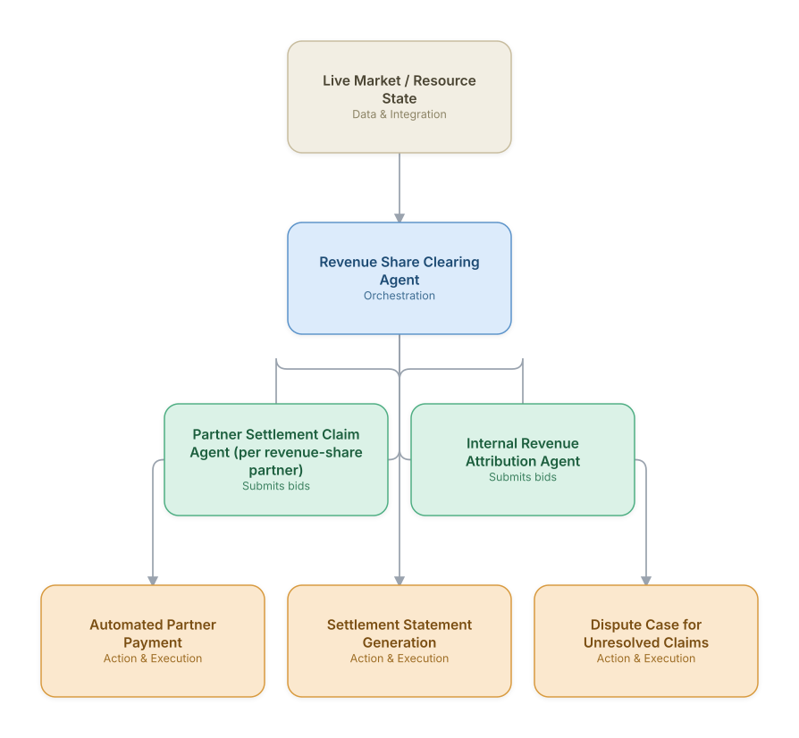

# 19. Partner Revenue Share & Settlement Automation

**Domain:** BSS/OSS &nbsp;|&nbsp; **Architecture pattern:** [Market-Based / Auction Agents](../../patterns/market-based.md)

> 🧠 **Deep dive available:** this use case also has a full [8-Layer Regenerative Architecture breakdown](../../deep8/bssoss/19-partner-revenue-share-settlement/README.md) — the same problem mapped through L1–L8, with an agent-level tools/technologies stack and a suggested build order by layer.

## 1. Problem Statement & Use Case

Content and platform partnerships (app-store billing, streaming bundles, IoT platform revenue share) involve complex, often-disputed revenue-share calculations across many partners with different commercial terms. Manual settlement reconciliation is slow and disputes over calculation methodology sour partner relationships. A market-based clearing approach, where each partner's settlement agent submits its claim against a neutral clearing agent that applies contract terms transparently, reduces disputes and settlement cycle time.

## 2. End-to-End Multi-Agent Architecture

The solution is implemented as a **Market-Based / Auction Agents** architecture. 
### 2.1 Agents & Sub-Agents

| Agent | Responsibility |
|---|---|
| Revenue Share Clearing Agent | Applies each partner's specific contract terms transparently to attributed revenue and clears the final settlement amount |
| Partner Settlement Claim Agent | Represents each partner's expected settlement calculation based on their view of usage/revenue attribution |
| Internal Revenue Attribution Agent | Provides the operator's authoritative view of usage and revenue attributable to each partner |
| Contract Terms Interpretation Agent | Extracts and applies the specific revenue-share formula, minimums, and tiering from each partner contract |
| Dispute Resolution Support Agent | When the clearing agent and a partner's claim disagree beyond a tolerance threshold, assembles the evidence package for human-mediated resolution |

### 2.2 Architecture Diagram

> This diagram is organized as a **layered architecture**: Data &amp; Integration → Orchestration → Agent →
> Action &amp; Execution, plus a cross-cutting Observability &amp; Governance layer (tracing, audit log,
> guardrails, and any human review checkpoint — shown in lavender). See the
> [E2E Platform Architecture](../../architecture/e2e-platform-architecture.md) for how this layering looks
> across all 60 use cases at once. A [Mermaid text source](architecture.mmd) of the same diagram is also
> available in this folder.

## 3. Technologies Used (per step)

| Step / Layer | Technology |
|---|---|
| Revenue attribution | Usage/revenue attribution pipeline feeding the internal agent's authoritative claim |
| Contract terms | Claude + RAG extraction of revenue-share terms from partner contracts, mirroring the finance-domain contract review use case |
| Clearing mechanism | Transparent, auditable calculation engine (not a negotiation — a deterministic application of agreed contract terms) with a neutral audit trail visible to both sides |
| Partner portal | Self-service portal where partners can view the calculation inputs and methodology, reducing dispute volume |
| Settlement execution | Automated payment processing for cleared, undisputed settlements |
| Dispute tooling | Automated evidence-package generation for the sub-tolerance-threshold percentage of claims requiring human mediation |
| Orchestration | Scheduled monthly/quarterly clearing runs per partner contract cycle |
| Audit | Full calculation lineage retained for financial audit and partner dispute resolution |

## 4. Suggested Build Order

**Phase 1 — two bidders, manual clearing.** Get Partner Settlement Claim Agent (per revenue-share partner) and Internal Revenue Attribution Agent submitting bids with Revenue Share Clearing Agent clearing them on a fixed schedule — no real-time re-clearing yet.

**Phase 2 — add the remaining bidders and automate clearing.** Bring the rest of the bidder population online and move Revenue Share Clearing Agent to event-triggered (not just scheduled) clearing.

**Phase 3 — add hard guardrails independent of the market mechanism.** A pure auction can clear at a technically-valid but operationally-bad price; add a guardrail service that can veto a clearing result regardless of what the market mechanism decided.

**Phase 4 — observability and feedback.** Track clearing-price trends and bidder participation over time — a market that's stopped clearing efficiently is a slow-motion failure that won't show up in any single transaction.

## 5. If We Rebuilt This: What Would Improve

- The partner-facing transparency portal (showing exact calculation inputs and methodology) reduced dispute volume more than any improvement to calculation accuracy itself — would prioritize transparency tooling from the start, not as a later addition.
- Would keep the clearing calculation strictly deterministic and auditable rather than any form of LLM-mediated negotiation — partners needed to trust the math was contractually mechanical, not a black box.
- Revenue attribution disagreements were usually a data-source timing issue (partner counting a different billing cycle boundary) rather than a genuine contract-interpretation dispute — would build cycle-boundary reconciliation logic earlier given how much dispute volume it accounted for.
- Would set a tighter, contract-specified dispute tolerance threshold per partner rather than one global tolerance — a single global threshold let small-but-persistent discrepancies with one large partner accumulate unnoticed.

---
[← Back to BSS/OSS index](../README.md) &nbsp;|&nbsp; [← Back to home](../../../README.md)
