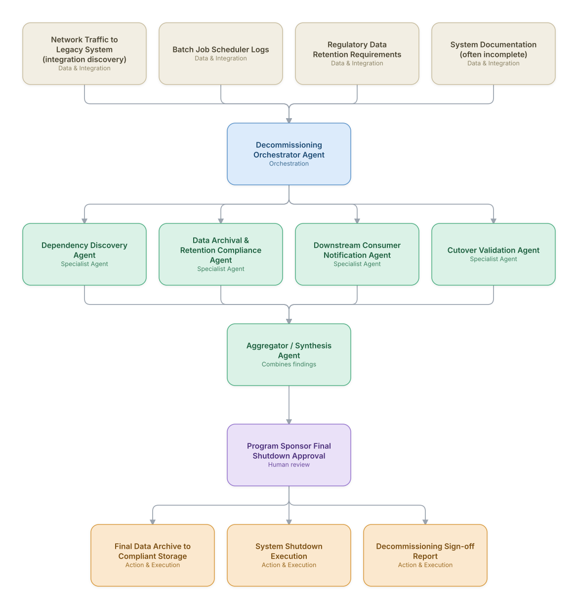

# 20. Legacy System Decommissioning & Data Archival

**Domain:** BSS/OSS &nbsp;|&nbsp; **Architecture pattern:** [Orchestrator-Worker (Supervisor fan-out/fan-in)](../../patterns/orchestrator-worker.md)

> 🧠 **Deep dive available:** this use case also has a full [8-Layer Regenerative Architecture breakdown](../../deep8/bssoss/20-legacy-system-decommissioning-archival/README.md) — the same problem mapped through L1–L8, with an agent-level tools/technologies stack and a suggested build order by layer.

## 1. Problem Statement & Use Case

Decommissioning a legacy BSS/OSS system after a migration (see Use Case 14) requires exhaustively mapping every remaining dependency (batch jobs, reports, undocumented integrations), archiving historical data for regulatory retention, and validating nothing breaks before the final shutdown — work that is high-risk, tedious, and prone to missed dependencies when done manually under program-timeline pressure.

## 2. End-to-End Multi-Agent Architecture

The solution is implemented as a **Orchestrator-Worker (Supervisor fan-out/fan-in)** architecture. 
**Human-in-the-loop checkpoint:** Program Sponsor Final Shutdown Approval

### 2.1 Agents & Sub-Agents

| Agent | Responsibility |
|---|---|
| Decommissioning Orchestrator Agent | Coordinates dependency discovery, archival, and validation, gating final shutdown on all checks passing |
| Dependency Discovery Agent | Analyzes live network traffic and batch job logs to find undocumented integrations still calling the legacy system |
| Data Archival & Retention Compliance Agent | Identifies data requiring regulatory retention and archives it to compliant long-term storage before shutdown |
| Downstream Consumer Notification Agent | Notifies every discovered downstream consumer team well ahead of the shutdown date |
| Cutover Validation Agent | Runs a final validation pass confirming zero live traffic to the legacy system before sign-off |

### 2.2 Architecture Diagram

> This diagram is organized as a **layered architecture**: Data &amp; Integration → Orchestration → Agent →
> Action &amp; Execution, plus a cross-cutting Observability &amp; Governance layer (tracing, audit log,
> guardrails, and any human review checkpoint — shown in lavender). See the
> [E2E Platform Architecture](../../architecture/e2e-platform-architecture.md) for how this layering looks
> across all 60 use cases at once. A [Mermaid text source](architecture.mmd) of the same diagram is also
> available in this folder.

## 3. Technologies Used (per step)

| Step / Layer | Technology |
|---|---|
| Traffic analysis | Network flow monitoring (NetFlow/packet capture) to discover live integrations empirically, not just from documentation |
| Batch job analysis | Scheduler log mining (Control-M/Autosys logs) to find scheduled jobs still touching the legacy system |
| Retention compliance | Regulatory retention rules engine (varies by data type and jurisdiction, e.g., 7-year call detail retention) |
| Archival storage | Compliant cold storage (e.g., S3 Glacier with legal hold/WORM configuration) |
| Orchestration | LangGraph supervisor with a hard gate requiring all worker agents to report zero blocking dependencies |
| Notification | Automated stakeholder notification workflow with escalating reminders as shutdown approaches |
| Validation | Final traffic-monitoring validation window (e.g., 30 days of zero traffic) before executing shutdown |
| Documentation | Auto-generated decommissioning report for audit and knowledge-retention purposes |

## 4. Suggested Build Order

**Phase 1 — one worker, no fan-out.** Wire a single path end to end: Dependency Discovery Agent reading real data and producing a result, with Decommissioning Orchestrator Agent just passing data through untouched. Prove the data pipeline and one agent's reasoning before adding parallelism.

**Phase 2 — add the fan-out.** Bring the remaining 3 worker agents online in parallel and build Decommissioning Orchestrator Agent's aggregation/synthesis logic. This is where the orchestrator-worker pattern is actually learned — watch for race conditions and partial-failure handling here, not before.

**Phase 3 — add the governance gate.** Wire in the human checkpoint: Program Sponsor Final Shutdown Approval.

**Phase 4 — observability and feedback.** Trace every worker call, monitor the aggregator's decision quality against real outcomes, and add a feedback loop that catches drift before it becomes a production incident.

## 5. If We Rebuilt This: What Would Improve

- Empirical traffic-based dependency discovery found integrations that no documentation or interview process surfaced — would always prioritize this over relying on documentation/tribal knowledge, which was consistently incomplete.
- Would build in a longer mandatory zero-traffic validation window from the start; an early decommissioning shut down a system that still received a rare monthly batch job, which the shorter initial validation window missed.
- Regulatory retention requirements varied more than expected by data type within the same legacy system — would engage compliance/legal earlier to build a more granular retention rules engine rather than one blanket retention period.
- Downstream consumer notification needed much longer lead times and more escalation than initially planned — several teams only acted on the final reminder, and would build in earlier, more insistent outreach next time.

---
[← Back to BSS/OSS index](../README.md) &nbsp;|&nbsp; [← Back to home](../../../README.md)
