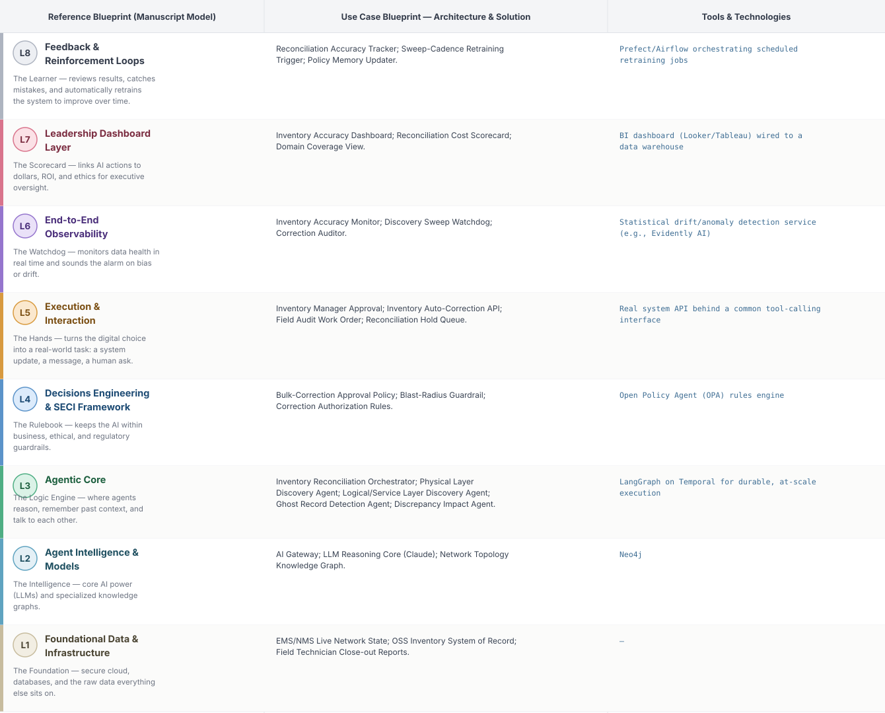
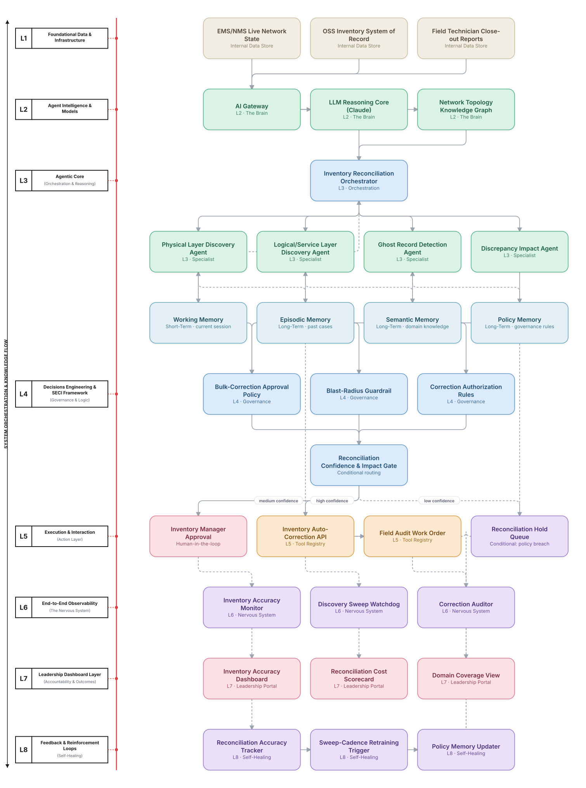

# Deep 8-Layer Regenerative Architecture: Network Inventory Reconciliation Decisioning

**Domain:** BSS/OSS &nbsp;|&nbsp; **Quick Reference counterpart:** [Network Inventory Discovery & Reconciliation](../../../bssoss/05-network-inventory-discovery-reconciliation/README.md) (Orchestrator-Worker (Supervisor fan-out/fan-in))

This deep-8 view wraps inventory discovery in explicit blast-radius governance — bulk corrections always require sign-off, individual low-risk corrections can auto-execute, and leadership gets a direct view of inventory accuracy trends, not just a one-time cleanup report.

## 1. Problem Statement & Use Case

OSS inventory drifts out of sync with the physical network over time, cascading into failed provisioning and wasted truck-rolls. Auto-correcting inventory discrepancies without a bulk-change approval gate risks deleting legitimately-planned-but-not-yet-installed equipment records, as happened in the Quick Reference version's own retrospective.

## 2. The 8-Layer Blueprint

## 3. Architecture Diagram (Flow View)

**Reading the diagram:** The Reconciliation Confidence & Impact Gate keeps bulk/high-volume corrections behind human approval by design — this mirrors the Quick view's own hard-learned lesson about auto-correction risk, now made an explicit, permanent architectural gate rather than a policy note.

## 4. Agent-Level Architecture Stack

| Layer | Agent Name | Agent Purpose | Inputs / Outputs | Learning Stack | Production Stack |
|---|---|---|---|---|---|
| L2 | AI Gateway | Provides AI Gateway's reasoning/knowledge capability to the Agentic Core. | Agent requests → Model responses, usage telemetry | Claude API called directly | LiteLLM / Portkey model-routing gateway with cost tracking |
| L2 | LLM Reasoning Core (Claude) | Provides LLM Reasoning Core (Claude)'s reasoning/knowledge capability to the Agentic Core. | Agent requests → Model responses, usage telemetry | Claude API called directly | LiteLLM / Portkey model-routing gateway with cost tracking |
| L2 | Network Topology Knowledge Graph | Provides Network Topology Knowledge Graph's reasoning/knowledge capability to the Agentic Core. | Agent requests → Model responses, usage telemetry | Claude API called directly | Neo4j |
| L3 | Inventory Reconciliation Orchestrator | Inventory Reconciliation Orchestrator — specialist agent in the Agentic Core's reasoning chain. | Task context, Working Memory → Reasoning output, next-step decision | LangGraph agent node + Claude API | LangGraph on Temporal for durable, at-scale execution |
| L3 | Physical Layer Discovery Agent | Physical Layer Discovery Agent — specialist agent in the Agentic Core's reasoning chain. | Task context, Working Memory → Reasoning output, next-step decision | LangGraph agent node + Claude API | LangGraph on Temporal for durable, at-scale execution |
| L3 | Logical/Service Layer Discovery Agent | Logical/Service Layer Discovery Agent — specialist agent in the Agentic Core's reasoning chain. | Task context, Working Memory → Reasoning output, next-step decision | LangGraph agent node + Claude API | LangGraph on Temporal for durable, at-scale execution |
| L3 | Ghost Record Detection Agent | Ghost Record Detection Agent — specialist agent in the Agentic Core's reasoning chain. | Task context, Working Memory → Reasoning output, next-step decision | LangGraph agent node + Claude API | LangGraph on Temporal for durable, at-scale execution |
| L3 | Discrepancy Impact Agent | Discrepancy Impact Agent — specialist agent in the Agentic Core's reasoning chain. | Task context, Working Memory → Reasoning output, next-step decision | LangGraph agent node + Claude API | LangGraph on Temporal for durable, at-scale execution |
| L4 | Bulk-Correction Approval Policy | Enforces Bulk-Correction Approval Policy as a governance gate before any action reaches the Action Layer. | Proposed action, policy rules → Pass/fail decision | Plain Python rule functions | Open Policy Agent (OPA) rules engine |
| L4 | Blast-Radius Guardrail | Enforces Blast-Radius Guardrail as a governance gate before any action reaches the Action Layer. | Proposed action, policy rules → Pass/fail decision | Plain Python rule functions | Open Policy Agent (OPA) rules engine |
| L4 | Correction Authorization Rules | Enforces Correction Authorization Rules as a governance gate before any action reaches the Action Layer. | Proposed action, policy rules → Pass/fail decision | Plain Python rule functions | Open Policy Agent (OPA) rules engine |
| L5 | Inventory Manager Approval | Executes Inventory Manager Approval as part of the Action & Execution layer once a decision is approved. | Approved decision → Executed action, system update | Mock REST endpoint (FastAPI) | Real system API behind a common tool-calling interface |
| L5 | Inventory Auto-Correction API | Executes Inventory Auto-Correction API as part of the Action & Execution layer once a decision is approved. | Approved decision → Executed action, system update | Mock REST endpoint (FastAPI) | Real system API behind a common tool-calling interface |
| L5 | Field Audit Work Order | Executes Field Audit Work Order as part of the Action & Execution layer once a decision is approved. | Approved decision → Executed action, system update | Mock REST endpoint (FastAPI) | Real system API behind a common tool-calling interface |
| L5 | Reconciliation Hold Queue | Executes Reconciliation Hold Queue as part of the Action & Execution layer once a decision is approved. | Approved decision → Executed action, system update | Mock REST endpoint (FastAPI) | Real system API behind a common tool-calling interface |
| L6 | Inventory Accuracy Monitor | Continuously monitors for the failure mode Inventory Accuracy Monitor is named to catch. | Live execution/outcome telemetry → Alert, health score | Scheduled Python script / simple threshold check | Statistical drift/anomaly detection service (e.g., Evidently AI) |
| L6 | Discovery Sweep Watchdog | Continuously monitors for the failure mode Discovery Sweep Watchdog is named to catch. | Live execution/outcome telemetry → Alert, health score | Scheduled Python script / simple threshold check | Statistical drift/anomaly detection service (e.g., Evidently AI) |
| L6 | Correction Auditor | Continuously monitors for the failure mode Correction Auditor is named to catch. | Live execution/outcome telemetry → Alert, health score | Scheduled Python script / simple threshold check | Statistical drift/anomaly detection service (e.g., Evidently AI) |
| L7 | Inventory Accuracy Dashboard | Gives leadership real-time visibility via Inventory Accuracy Dashboard. | Outcome + financial data → Executive-facing metric | Streamlit or Metabase dashboard | BI dashboard (Looker/Tableau) wired to a data warehouse |
| L7 | Reconciliation Cost Scorecard | Gives leadership real-time visibility via Reconciliation Cost Scorecard. | Outcome + financial data → Executive-facing metric | Streamlit or Metabase dashboard | BI dashboard (Looker/Tableau) wired to a data warehouse |
| L7 | Domain Coverage View | Gives leadership real-time visibility via Domain Coverage View. | Outcome + financial data → Executive-facing metric | Streamlit or Metabase dashboard | BI dashboard (Looker/Tableau) wired to a data warehouse |
| L8 | Reconciliation Accuracy Tracker | Closes the feedback loop via Reconciliation Accuracy Tracker, feeding outcomes back into memory. | Outcome-accuracy data, thresholds → Retraining trigger / updated memory | Cron job checking a threshold | Prefect/Airflow orchestrating scheduled retraining jobs |
| L8 | Sweep-Cadence Retraining Trigger | Closes the feedback loop via Sweep-Cadence Retraining Trigger, feeding outcomes back into memory. | Outcome-accuracy data, thresholds → Retraining trigger / updated memory | Cron job checking a threshold | Prefect/Airflow orchestrating scheduled retraining jobs |
| L8 | Policy Memory Updater | Closes the feedback loop via Policy Memory Updater, feeding outcomes back into memory. | Outcome-accuracy data, thresholds → Retraining trigger / updated memory | Cron job checking a threshold | Prefect/Airflow orchestrating scheduled retraining jobs |

## 5. Suggested Build Order (by Layer)

**Phase 1 — L1 + L2 + a stub L5, nothing else.** Fake network inventory data in Postgres, a single Claude API call, and Physical Layer Discovery Agent producing a result that just gets printed, with Inventory Reconciliation Orchestrator just passing data through untouched. No memory, no governance, no conditional routing yet.

**Phase 2 — build out L3, the Agentic Core.** Bring the remaining 3 agents online and build Inventory Reconciliation Orchestrator's aggregation logic, and add Working + Episodic memory (Chroma). This is where the pattern is actually learned, not before.

**Phase 3 — add L4 and the conditional gate.** Wire in the governance engines as hard gates, then build the three-way Reconciliation Confidence & Impact Gate routing into auto-execute / human review / hold.

**Phase 4 — complete L5.** Build the Inventory Manager Approval approval screen and the hold/escalate queue; this is the first point where a human is actually in the loop.

**Phase 5 — add L6 observability.** Drop in a drift/anomaly detection service and a data-quality check. This is usually the point where problems invisible in Phases 1–4 surface for the first time.

**Phase 6 — add L7 and L8.** Build the executive dashboard last, and the scheduled retraining/memory-update job. These teach the least new technical ground but close the loop the manuscript calls "regenerative."

---
[← Back to Deep 8-Layer index](../../README.md) &nbsp;|&nbsp; [← Back to home](../../../README.md)
