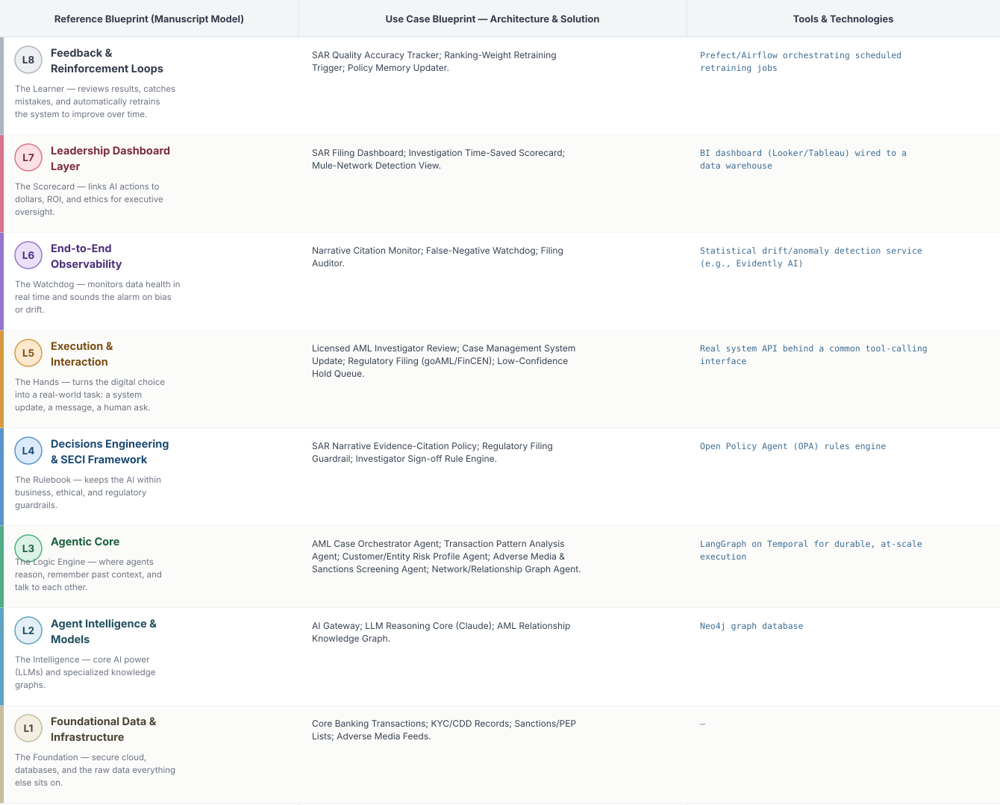
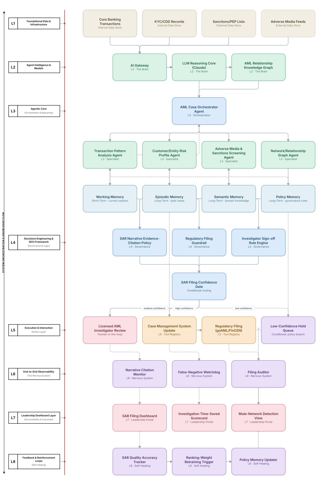

# Deep 8-Layer Regenerative Architecture: AML Case Investigation & SAR Filing Decisioning

**Domain:** Financial Services &nbsp;|&nbsp; **Quick Reference counterpart:** [AML Transaction Monitoring & SAR Filing]({{ '/finance/01-aml-transaction-monitoring-sar/' | relative_url }}) (Orchestrator-Worker (Supervisor fan-out/fan-in))

This deep-8 view keeps the Quick view's strict evidence-citation requirement — every SAR narrative sentence must cite its source record — as an explicit, non-bypassable L4 policy rather than a prompting convention, and adds executive visibility into how much investigator time the system is actually saving.

## 1. Problem Statement & Use Case

90-95% of AML alerts are false positives, yet each still requires investigator review to avoid regulatory penalty for a missed suspicious activity. The Quick view's own early prototype generated a plausible-sounding but unverifiable narrative claim — a hard lesson on where generative reasoning cannot be trusted without a citation guardrail.

## 2. The 8-Layer Blueprint

## 3. Architecture Diagram (Flow View)

**Reading the diagram:** The SAR Filing Confidence Gate never bypasses the licensed investigator for an actual filing decision — only evidence assembly and narrative drafting are automated. L4's citation-grounding guardrail blocks any narrative sentence that isn't traceable to a specific source record.

## 4. Agent-Level Architecture Stack

| Layer | Agent Name | Agent Purpose | Inputs / Outputs | Learning Stack | Production Stack |
|---|---|---|---|---|---|
| L2 | AI Gateway | Provides AI Gateway's reasoning/knowledge capability to the Agentic Core. | Agent requests → Model responses, usage telemetry | Claude API called directly | LiteLLM / Portkey model-routing gateway with cost tracking |
| L2 | LLM Reasoning Core (Claude) | Provides LLM Reasoning Core (Claude)'s reasoning/knowledge capability to the Agentic Core. | Agent requests → Model responses, usage telemetry | Claude API called directly | LiteLLM / Portkey model-routing gateway with cost tracking |
| L2 | AML Relationship Knowledge Graph | Provides AML Relationship Knowledge Graph's reasoning/knowledge capability to the Agentic Core. | Agent requests → Model responses, usage telemetry | Claude API called directly | Neo4j graph database |
| L3 | AML Case Orchestrator Agent | AML Case Orchestrator Agent — specialist agent in the Agentic Core's reasoning chain. | Task context, Working Memory → Reasoning output, next-step decision | LangGraph agent node + Claude API | LangGraph on Temporal for durable, at-scale execution |
| L3 | Transaction Pattern Analysis Agent | Transaction Pattern Analysis Agent — specialist agent in the Agentic Core's reasoning chain. | Task context, Working Memory → Reasoning output, next-step decision | LangGraph agent node + Claude API | LangGraph on Temporal for durable, at-scale execution |
| L3 | Customer/Entity Risk Profile Agent | Customer/Entity Risk Profile Agent — specialist agent in the Agentic Core's reasoning chain. | Task context, Working Memory → Reasoning output, next-step decision | LangGraph agent node + Claude API | LangGraph on Temporal for durable, at-scale execution |
| L3 | Adverse Media & Sanctions Screening Agent | Adverse Media & Sanctions Screening Agent — specialist agent in the Agentic Core's reasoning chain. | Task context, Working Memory → Reasoning output, next-step decision | LangGraph agent node + Claude API | LangGraph on Temporal for durable, at-scale execution |
| L3 | Network/Relationship Graph Agent | Network/Relationship Graph Agent — specialist agent in the Agentic Core's reasoning chain. | Task context, Working Memory → Reasoning output, next-step decision | LangGraph agent node + Claude API | LangGraph on Temporal for durable, at-scale execution |
| L4 | SAR Narrative Evidence-Citation Policy | Enforces SAR Narrative Evidence-Citation Policy as a governance gate before any action reaches the Action Layer. | Proposed action, policy rules → Pass/fail decision | Plain Python rule functions | Open Policy Agent (OPA) rules engine |
| L4 | Regulatory Filing Guardrail | Enforces Regulatory Filing Guardrail as a governance gate before any action reaches the Action Layer. | Proposed action, policy rules → Pass/fail decision | Plain Python rule functions | Open Policy Agent (OPA) rules engine |
| L4 | Investigator Sign-off Rule Engine | Enforces Investigator Sign-off Rule Engine as a governance gate before any action reaches the Action Layer. | Proposed action, policy rules → Pass/fail decision | Plain Python rule functions | Open Policy Agent (OPA) rules engine |
| L5 | Licensed AML Investigator Review | Executes Licensed AML Investigator Review as part of the Action & Execution layer once a decision is approved. | Approved decision → Executed action, system update | Mock REST endpoint (FastAPI) | Real system API behind a common tool-calling interface |
| L5 | Case Management System Update | Executes Case Management System Update as part of the Action & Execution layer once a decision is approved. | Approved decision → Executed action, system update | Mock REST endpoint (FastAPI) | Real system API behind a common tool-calling interface |
| L5 | Regulatory Filing (goAML/FinCEN) | Executes Regulatory Filing (goAML/FinCEN) as part of the Action & Execution layer once a decision is approved. | Approved decision → Executed action, system update | Mock REST endpoint (FastAPI) | Real system API behind a common tool-calling interface |
| L5 | Low-Confidence Hold Queue | Executes Low-Confidence Hold Queue as part of the Action & Execution layer once a decision is approved. | Approved decision → Executed action, system update | Mock REST endpoint (FastAPI) | Real system API behind a common tool-calling interface |
| L6 | Narrative Citation Monitor | Continuously monitors for the failure mode Narrative Citation Monitor is named to catch. | Live execution/outcome telemetry → Alert, health score | Scheduled Python script / simple threshold check | Statistical drift/anomaly detection service (e.g., Evidently AI) |
| L6 | False-Negative Watchdog | Continuously monitors for the failure mode False-Negative Watchdog is named to catch. | Live execution/outcome telemetry → Alert, health score | Scheduled Python script / simple threshold check | Statistical drift/anomaly detection service (e.g., Evidently AI) |
| L6 | Filing Auditor | Continuously monitors for the failure mode Filing Auditor is named to catch. | Live execution/outcome telemetry → Alert, health score | Scheduled Python script / simple threshold check | Statistical drift/anomaly detection service (e.g., Evidently AI) |
| L7 | SAR Filing Dashboard | Gives leadership real-time visibility via SAR Filing Dashboard. | Outcome + financial data → Executive-facing metric | Streamlit or Metabase dashboard | BI dashboard (Looker/Tableau) wired to a data warehouse |
| L7 | Investigation Time-Saved Scorecard | Gives leadership real-time visibility via Investigation Time-Saved Scorecard. | Outcome + financial data → Executive-facing metric | Streamlit or Metabase dashboard | BI dashboard (Looker/Tableau) wired to a data warehouse |
| L7 | Mule-Network Detection View | Gives leadership real-time visibility via Mule-Network Detection View. | Outcome + financial data → Executive-facing metric | Streamlit or Metabase dashboard | BI dashboard (Looker/Tableau) wired to a data warehouse |
| L8 | SAR Quality Accuracy Tracker | Closes the feedback loop via SAR Quality Accuracy Tracker, feeding outcomes back into memory. | Outcome-accuracy data, thresholds → Retraining trigger / updated memory | Cron job checking a threshold | Prefect/Airflow orchestrating scheduled retraining jobs |
| L8 | Ranking-Weight Retraining Trigger | Closes the feedback loop via Ranking-Weight Retraining Trigger, feeding outcomes back into memory. | Outcome-accuracy data, thresholds → Retraining trigger / updated memory | Cron job checking a threshold | Prefect/Airflow orchestrating scheduled retraining jobs |
| L8 | Policy Memory Updater | Closes the feedback loop via Policy Memory Updater, feeding outcomes back into memory. | Outcome-accuracy data, thresholds → Retraining trigger / updated memory | Cron job checking a threshold | Prefect/Airflow orchestrating scheduled retraining jobs |

## 5. Suggested Build Order (by Layer)

**Phase 1 — L1 + L2 + a stub L5, nothing else.** Fake AML investigation data in Postgres, a single Claude API call, and Transaction Pattern Analysis Agent producing a result that just gets printed, with AML Case Orchestrator Agent just passing data through untouched. No memory, no governance, no conditional routing yet.

**Phase 2 — build out L3, the Agentic Core.** Bring the remaining 3 agents online and build AML Case Orchestrator Agent's aggregation logic, and add Working + Episodic memory (Chroma). This is where the pattern is actually learned, not before.

**Phase 3 — add L4 and the conditional gate.** Wire in the governance engines as hard gates, then build the three-way SAR Filing Confidence Gate routing into auto-execute / human review / hold.

**Phase 4 — complete L5.** Build the Licensed AML Investigator Review approval screen and the hold/escalate queue; this is the first point where a human is actually in the loop.

**Phase 5 — add L6 observability.** Drop in a drift/anomaly detection service and a data-quality check. This is usually the point where problems invisible in Phases 1–4 surface for the first time.

**Phase 6 — add L7 and L8.** Build the executive dashboard last, and the scheduled retraining/memory-update job. These teach the least new technical ground but close the loop the manuscript calls "regenerative."

---
[← Back to Deep 8-Layer index]({{ '/deep8/' | relative_url }}) &nbsp;|&nbsp; [← Back to home]({{ '/' | relative_url }})
