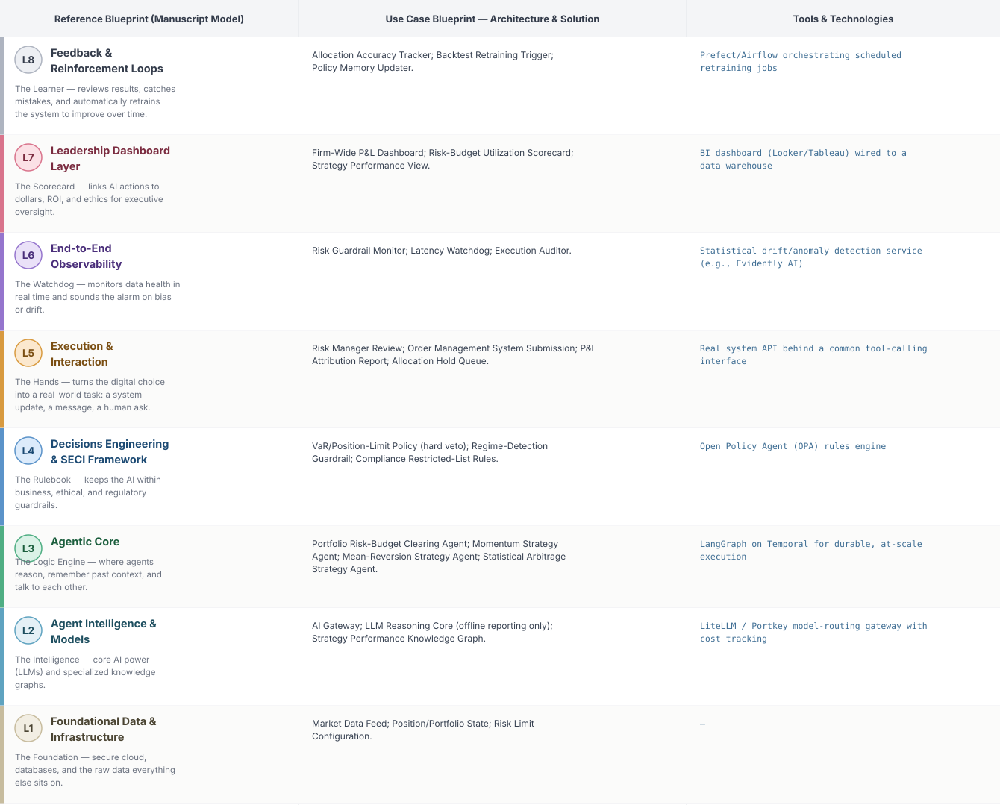
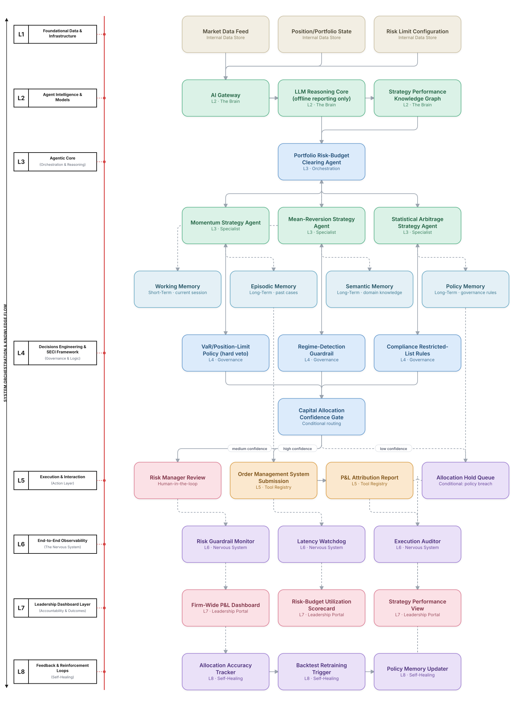

# Deep 8-Layer Regenerative Architecture: Trading Capital Allocation Decisioning

**Domain:** Financial Services &nbsp;|&nbsp; **Quick Reference counterpart:** [Algorithmic Trading Strategy Orchestration]({{ '/finance/03-algo-trading-strategy-orchestration/' | relative_url }}) (Market-Based / Auction Agents)

This deep-8 view preserves the Quick view's most important design decision — LLM reasoning stays entirely out of the latency-critical bid/execution loop, used only for offline reporting — and gives the independent Risk Guardrail absolute veto power from the start, not as advisory-only.

## 1. Problem Statement & Use Case

Multiple alpha strategies compete for the same risk budget and execution capacity. An early version routed borderline allocation cases through an LLM and blew the latency SLA; a separate near-miss saw aggregate strategy exposure briefly exceed firm limits when the risk guardrail was only advisory rather than a hard veto.

## 2. The 8-Layer Blueprint

## 3. Architecture Diagram (Flow View)

**Reading the diagram:** The Capital Allocation Confidence Gate governs allocation *decisions*, not live order execution — L4's VaR/position-limit policy has absolute veto power over any allocation regardless of what the market-based clearing mechanism decided, matching the Quick view's hard-learned lesson.

## 4. Agent-Level Architecture Stack

| Layer | Agent Name | Agent Purpose | Inputs / Outputs | Learning Stack | Production Stack |
|---|---|---|---|---|---|
| L2 | AI Gateway | Provides AI Gateway's reasoning/knowledge capability to the Agentic Core. | Agent requests → Model responses, usage telemetry | Claude API called directly | LiteLLM / Portkey model-routing gateway with cost tracking |
| L2 | LLM Reasoning Core (offline reporting only) | Provides LLM Reasoning Core (offline reporting only)'s reasoning/knowledge capability to the Agentic Core. | Agent requests → Model responses, usage telemetry | Claude API called directly | LiteLLM / Portkey model-routing gateway with cost tracking |
| L2 | Strategy Performance Knowledge Graph | Provides Strategy Performance Knowledge Graph's reasoning/knowledge capability to the Agentic Core. | Agent requests → Model responses, usage telemetry | Claude API called directly | LiteLLM / Portkey model-routing gateway with cost tracking |
| L3 | Portfolio Risk-Budget Clearing Agent | Portfolio Risk-Budget Clearing Agent — specialist agent in the Agentic Core's reasoning chain. | Task context, Working Memory → Reasoning output, next-step decision | LangGraph agent node + Claude API | LangGraph on Temporal for durable, at-scale execution |
| L3 | Momentum Strategy Agent | Momentum Strategy Agent — specialist agent in the Agentic Core's reasoning chain. | Task context, Working Memory → Reasoning output, next-step decision | LangGraph agent node + Claude API | LangGraph on Temporal for durable, at-scale execution |
| L3 | Mean-Reversion Strategy Agent | Mean-Reversion Strategy Agent — specialist agent in the Agentic Core's reasoning chain. | Task context, Working Memory → Reasoning output, next-step decision | LangGraph agent node + Claude API | LangGraph on Temporal for durable, at-scale execution |
| L3 | Statistical Arbitrage Strategy Agent | Statistical Arbitrage Strategy Agent — specialist agent in the Agentic Core's reasoning chain. | Task context, Working Memory → Reasoning output, next-step decision | LangGraph agent node + Claude API | LangGraph on Temporal for durable, at-scale execution |
| L4 | VaR/Position-Limit Policy (hard veto) | Enforces VaR/Position-Limit Policy (hard veto) as a governance gate before any action reaches the Action Layer. | Proposed action, policy rules → Pass/fail decision | Plain Python rule functions | Open Policy Agent (OPA) rules engine |
| L4 | Regime-Detection Guardrail | Enforces Regime-Detection Guardrail as a governance gate before any action reaches the Action Layer. | Proposed action, policy rules → Pass/fail decision | Plain Python rule functions | Open Policy Agent (OPA) rules engine |
| L4 | Compliance Restricted-List Rules | Enforces Compliance Restricted-List Rules as a governance gate before any action reaches the Action Layer. | Proposed action, policy rules → Pass/fail decision | Plain Python rule functions | Open Policy Agent (OPA) rules engine |
| L5 | Risk Manager Review | Executes Risk Manager Review as part of the Action & Execution layer once a decision is approved. | Approved decision → Executed action, system update | Mock REST endpoint (FastAPI) | Real system API behind a common tool-calling interface |
| L5 | Order Management System Submission | Executes Order Management System Submission as part of the Action & Execution layer once a decision is approved. | Approved decision → Executed action, system update | Mock REST endpoint (FastAPI) | Real system API behind a common tool-calling interface |
| L5 | P&L Attribution Report | Executes P&L Attribution Report as part of the Action & Execution layer once a decision is approved. | Approved decision → Executed action, system update | Mock REST endpoint (FastAPI) | Real system API behind a common tool-calling interface |
| L5 | Allocation Hold Queue | Executes Allocation Hold Queue as part of the Action & Execution layer once a decision is approved. | Approved decision → Executed action, system update | Mock REST endpoint (FastAPI) | Real system API behind a common tool-calling interface |
| L6 | Risk Guardrail Monitor | Continuously monitors for the failure mode Risk Guardrail Monitor is named to catch. | Live execution/outcome telemetry → Alert, health score | Scheduled Python script / simple threshold check | Statistical drift/anomaly detection service (e.g., Evidently AI) |
| L6 | Latency Watchdog | Continuously monitors for the failure mode Latency Watchdog is named to catch. | Live execution/outcome telemetry → Alert, health score | Scheduled Python script / simple threshold check | Statistical drift/anomaly detection service (e.g., Evidently AI) |
| L6 | Execution Auditor | Continuously monitors for the failure mode Execution Auditor is named to catch. | Live execution/outcome telemetry → Alert, health score | Scheduled Python script / simple threshold check | Statistical drift/anomaly detection service (e.g., Evidently AI) |
| L7 | Firm-Wide P&L Dashboard | Gives leadership real-time visibility via Firm-Wide P&L Dashboard. | Outcome + financial data → Executive-facing metric | Streamlit or Metabase dashboard | BI dashboard (Looker/Tableau) wired to a data warehouse |
| L7 | Risk-Budget Utilization Scorecard | Gives leadership real-time visibility via Risk-Budget Utilization Scorecard. | Outcome + financial data → Executive-facing metric | Streamlit or Metabase dashboard | BI dashboard (Looker/Tableau) wired to a data warehouse |
| L7 | Strategy Performance View | Gives leadership real-time visibility via Strategy Performance View. | Outcome + financial data → Executive-facing metric | Streamlit or Metabase dashboard | BI dashboard (Looker/Tableau) wired to a data warehouse |
| L8 | Allocation Accuracy Tracker | Closes the feedback loop via Allocation Accuracy Tracker, feeding outcomes back into memory. | Outcome-accuracy data, thresholds → Retraining trigger / updated memory | Cron job checking a threshold | Prefect/Airflow orchestrating scheduled retraining jobs |
| L8 | Backtest Retraining Trigger | Closes the feedback loop via Backtest Retraining Trigger, feeding outcomes back into memory. | Outcome-accuracy data, thresholds → Retraining trigger / updated memory | Cron job checking a threshold | Prefect/Airflow orchestrating scheduled retraining jobs |
| L8 | Policy Memory Updater | Closes the feedback loop via Policy Memory Updater, feeding outcomes back into memory. | Outcome-accuracy data, thresholds → Retraining trigger / updated memory | Cron job checking a threshold | Prefect/Airflow orchestrating scheduled retraining jobs |

## 5. Suggested Build Order (by Layer)

**Phase 1 — L1 + L2 + a stub L5, nothing else.** Fake algorithmic trading data in Postgres, a single Claude API call, and Momentum Strategy Agent producing a result that just gets printed, with Portfolio Risk-Budget Clearing Agent just passing data through untouched. No memory, no governance, no conditional routing yet.

**Phase 2 — build out L3, the Agentic Core.** Bring the remaining 2 agents online and build Portfolio Risk-Budget Clearing Agent's aggregation logic, and add Working + Episodic memory (Chroma). This is where the pattern is actually learned, not before.

**Phase 3 — add L4 and the conditional gate.** Wire in the governance engines as hard gates, then build the three-way Capital Allocation Confidence Gate routing into auto-execute / human review / hold.

**Phase 4 — complete L5.** Build the Risk Manager Review approval screen and the hold/escalate queue; this is the first point where a human is actually in the loop.

**Phase 5 — add L6 observability.** Drop in a drift/anomaly detection service and a data-quality check. This is usually the point where problems invisible in Phases 1–4 surface for the first time.

**Phase 6 — add L7 and L8.** Build the executive dashboard last, and the scheduled retraining/memory-update job. These teach the least new technical ground but close the loop the manuscript calls "regenerative."

---
[← Back to Deep 8-Layer index]({{ '/deep8/' | relative_url }}) &nbsp;|&nbsp; [← Back to home]({{ '/' | relative_url }})
