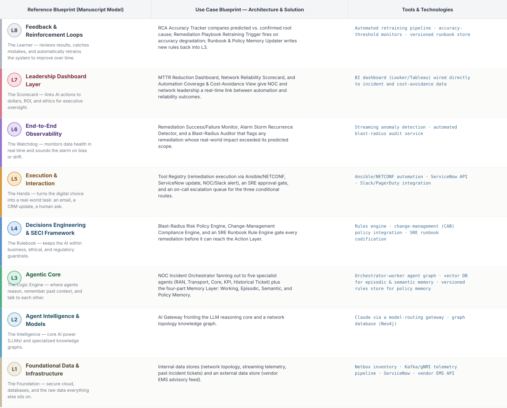

# Deep 8-Layer Regenerative Architecture: Network Fault RCA & Auto-Remediation

**Domain:** Telecommunications &nbsp;|&nbsp; **Quick Reference counterpart:** [Multi-Agent Network Fault RCA & Auto-Remediation](../../../telecom/01-network-fault-rca-remediation/README.md) (Orchestrator-Worker (Supervisor fan-out/fan-in))

This is the second pilot for the Deep 8-Layer view, chosen deliberately for contrast with the retention example: where retention's L3 is a linear Planner → Execution → Reflection → Confidence chain, this use case's L3 keeps its native orchestrator-worker fan-out (one orchestrator, five parallel specialist agents) — showing the 8-layer model accommodates different internal orchestration shapes rather than forcing every use case into the same L3 pattern.

## 1. Problem Statement & Use Case

A tier-1 operator's NOC receives thousands of correlated alarms per hour during a fault storm. Engineers spend 40–60 minutes correlating alarms to find the true root cause before remediation even starts, driving SLA breaches. Beyond the tactical fix (compress the correlation step), the deeper problem this deep-8 view addresses is the same one retention has: no governance layer stopping a high-blast-radius auto-remediation from making things worse, no executive visibility into what automation is actually saving in MTTR and cost-avoidance terms, and no closed loop that learns from confirmed root causes to get better at RCA over time.

## 2. The 8-Layer Blueprint

## 3. Architecture Diagram (Flow View)

**Reading the diagram:** L3's Agentic Core is deliberately drawn as orchestrator-then-workers (matching the Quick Reference pattern) rather than the retention example's linear plan-execute-reflect chain. The RCA Confidence & Blast-Radius Gate branches three ways — high confidence (auto-remediate), medium confidence or high blast-radius (SRE approval), low confidence (on-call escalation) — and L8 closes the loop by comparing predicted root cause against what engineers actually confirmed.

## 4. Agent-Level Architecture Stack

| Layer | Agent Name | Agent Purpose | Inputs / Outputs | Learning Stack | Production Stack |
|---|---|---|---|---|---|
| L2 | AI Gateway | Decouples the Agentic Core from the model provider; routes requests, controls prompts, tracks cost | Agent requests → Model responses, usage telemetry | Claude API called directly | LiteLLM / Portkey model-routing gateway |
| L3 | NOC Incident Orchestrator | Fans out an alarm burst to domain agents, aggregates hypotheses, ranks root cause by confidence | Alarm burst, Working Memory → Dispatched sub-tasks, aggregated RCA hypothesis | LangGraph supervisor node + Claude | LangGraph supervisor on Temporal, Kafka consumer group |
| L3 | RAN Alarm Correlation Agent | Deduplicates and correlates RAN alarms against topology | FM/PM alarms, topology graph → Correlated RAN fault hypothesis | Python + NetworkX graph correlation | Neo4j graph-traversal service |
| L3 | Transport/IP Topology Agent | Traces fiber/microwave/IP path failures via topology graph | Topology DB, telemetry → Transport fault hypothesis | Python + NetworkX | Neo4j + vendor SR-TE controller integration |
| L3 | Core Network Agent | Inspects 5GC/EPC VNF health via Kubernetes/OSS APIs | K8s pod status, signaling logs → Core fault hypothesis | kubectl API calls in a script | Kubernetes operator + OSS API integration |
| L3 | Performance-KPI Deviation Agent | Detects statistically abnormal KPI drops via time-series models | PM counters → KPI anomaly flag | Prophet (open source) on a CSV export | Prophet/Nixtla ensemble on streaming telemetry |
| L3 | Historical Ticket Similarity Agent | RAG search over past incident tickets for proven fixes | Incident description, ticket archive → Similar past ticket + suggested fix | Chroma + Claude embeddings | pgvector/Weaviate + embeddings pipeline |
| L4 | Blast-Radius Risk Policy Engine | Determines whether a proposed remediation is high blast-radius | Proposed remediation action → Risk tier | Plain Python rule functions | Open Policy Agent (OPA) |
| L4 | Change-Management Compliance Engine | Ensures remediation follows change windows / CAB policy | Proposed action, change calendar → Compliance pass/fail | Python rules checking a calendar file | Integration with ITSM change-management module |
| L4 | SRE Runbook Rule Engine | Encodes tacit SRE know-how as executable remediation rules | Fault hypothesis → Candidate remediation playbook | Python if/else rule set | OPA + versioned runbook store |
| L5 | SRE Approval Gate | Human checkpoint for medium-confidence or high-blast-radius remediations | Case context, risk score → Approve/reject | Streamlit approval screen | Retool or ChatOps (Slack approval workflow) |
| L5 | On-Call Escalation Queue | Catches low-confidence RCA; nothing executes until resolved | Held case + reason → Escalation ticket | Postgres table + manual polling | PagerDuty/ServiceNow integration |
| L6 | Remediation Success/Failure Monitor | Watches whether executed remediations actually resolved the fault | Remediation execution, post-action telemetry → Success/failure signal | Scheduled script comparing before/after KPIs | Streaming anomaly detection service |
| L6 | Alarm Storm Recurrence Detector | Detects whether the same alarm storm recurs after remediation | Alarm stream → Recurrence alert | Simple count-based script | Streaming pattern-matching service |
| L6 | Blast-Radius Auditor | Flags remediations whose real-world impact exceeded predicted scope | Predicted vs. actual blast radius → Audit flag | Manual comparison script | Automated blast-radius audit service |
| L8 | RCA Accuracy Tracker | Compares predicted vs. confirmed root cause | RCA hypothesis, confirmed root cause → Accuracy dataset | Scheduled script | Outcome-tracking pipeline + data warehouse |
| L8 | Remediation Playbook Retraining Trigger | Fires retraining when RCA accuracy degrades | Accuracy dataset, threshold → Retraining trigger | Cron job | Prefect/Airflow |
| L8 | Runbook & Policy Memory Updater | Writes new rules and outcomes back into Policy and Episodic Memory | Retrained output → Updated memory entries | Script rewriting a JSON file | Versioned policy store + vector DB write client |

## 5. Suggested Build Order (by Layer)

**Phase 1 — L1 + L2 + one worker only.** Fake alarm data in Postgres, a Claude API call, and just the RAN Alarm Correlation Agent producing a hypothesis that gets printed to a log — no orchestrator fan-out, no remediation yet.

**Phase 2 — build out L3's fan-out.** Add the NOC Incident Orchestrator and the remaining four worker agents running in parallel, plus Working + Episodic memory (Chroma). This is where the orchestrator-worker pattern is actually learned — watch for partial-failure handling when one worker times out.

**Phase 3 — add L4 and the conditional gate.** Wire in the three governance engines, then build the three-way RCA Confidence & Blast-Radius Gate.

**Phase 4 — complete L5.** Build the SRE approval screen and on-call escalation queue; connect the Remediation Execution Agent to a sandboxed network config target, never production equipment, until L6 is in place.

**Phase 5 — add L6 observability before trusting any auto-remediation.** This phase is non-negotiable before Phase 4's execution agent touches anything real — the Blast-Radius Auditor specifically exists to catch remediations that did more than intended.

**Phase 6 — add L7 and L8.** Build the MTTR/reliability dashboard and the RCA-accuracy retraining loop last.

---
[← Back to Deep 8-Layer index](../../README.md) &nbsp;|&nbsp; [← Back to home](../../../README.md)
