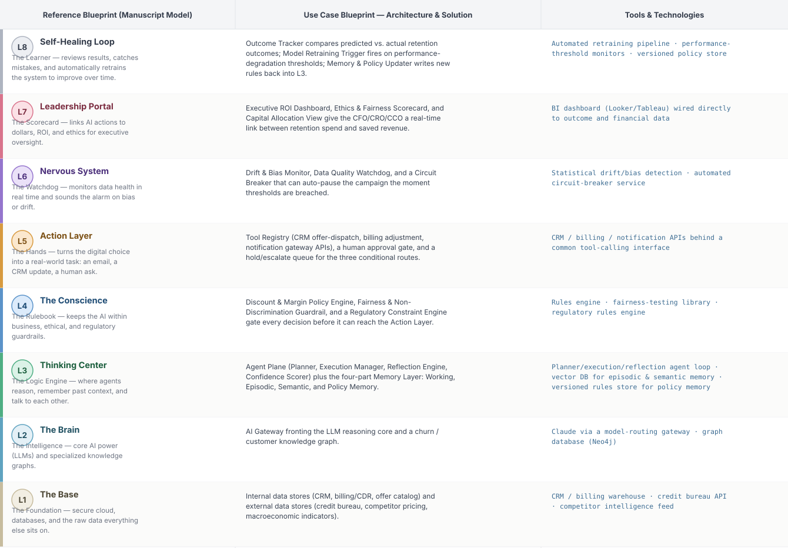

# Deep 8-Layer Regenerative Architecture: Customer Retention Investment Decisioning

**Domain:** Telecommunications &nbsp;|&nbsp; **Quick Reference counterpart:** [Customer Churn Prediction & Win-Back Orchestration](../../../telecom/05-churn-prediction-winback/README.md) (Orchestrator-Worker (Supervisor fan-out/fan-in))

This is the full 8-layer Integrated Decision Engineering Meta-Architecture treatment of the same underlying business problem as Telecom Use Case 05. Where the Quick Reference view shows *one execution pattern* (orchestrator-worker: a supervisor fanning out to parallel specialist agents), this view shows the *entire enterprise stack* that problem sits inside — governance, memory, observability, executive accountability, and the regenerative feedback loop — mapped through the manuscript's L1–L8 model.

## 1. Problem Statement & Use Case

A telecom/BSS-OSS operator loses hundreds of millions of dollars a year to preventable churn. Tactical retention bots score risk and dispatch offers, but treat retention as an isolated task-level workflow — disconnected from portfolio-level capital allocation, with no traceable governance layer to prevent retention offers from systematically favoring some customer segments over others, no real-time executive view of what retention spend is actually buying in ROI terms, and no closed feedback loop that learns which offers worked and recalibrates automatically. What's needed is the full Decision Engineering stack: accountable, auditable, and continuously-improving from raw CRM data up through the executive dashboard.

## 2. The 8-Layer Blueprint

## 3. Architecture Diagram (Flow View)

**Reading the diagram:** Dashed-border cards are external data stores; solid cream cards are internal systems of record. The memory row is explicitly split into Short-Term (Working Memory) and Long-Term (Episodic, Semantic, Policy Memory). The Confidence & Risk Gate branches three ways — high confidence (auto-execute), medium confidence (human review), low confidence (hold & escalate) — and the bottom band (L6 → L7 → L8) closes the regenerative loop back into L3's memory.

## 4. Agent-Level Architecture Stack

| Layer | Agent Name | Agent Purpose | Inputs / Outputs | Learning Stack | Production Stack |
|---|---|---|---|---|---|
| L2 | AI Gateway | Decouples the Agent Plane from the model provider; routes requests, controls prompts, tracks cost | Agent Plane requests → Model responses, usage telemetry | Claude API called directly | LiteLLM / Portkey model-routing gateway with cost tracking |
| L3 | Planner Module | Decomposes a goal (e.g., "reduce churn in segment X") into an ordered set of sub-steps | Goal, Working Memory context → Ordered task plan | LangGraph planning node + Claude API | LangGraph planning node on Temporal for durable execution |
| L3 | Execution Manager | Calls tools, validates results, retries on failure | Plan step, tool specs → Tool call results | LangGraph tool-calling node + mock FastAPI tools | LangGraph execution node + real Tool Registry APIs |
| L3 | Reflection Engine | Internal critic — reviews output against expectations before the Confidence Scorer | Execution results, Episodic Memory → Reviewed result, flagged discrepancies | Claude critique-prompt pattern, no persistence | Claude critique pattern + Episodic Memory read/write client |
| L3 | Confidence Scorer | Estimates certainty and risk; sole authority to route into the conditional gate | Reflection output, Policy Memory → Confidence score, routing decision | Simple rule-based heuristic scorer | Calibrated scoring model + Policy Memory read client |
| L4 | Discount & Margin Policy Engine | Encodes tacit expert know-how as executable discount/margin rules | Proposed offer terms → Pass/fail, adjusted terms | Plain Python rule functions | Open Policy Agent (OPA) |
| L4 | Fairness & Non-Discrimination Guardrail | Blocks offer patterns that would disadvantage a protected group | Offer + segment data → Fairness pass/fail, bias flag | Fairlearn (open source) | Fairlearn/Aequitas pipeline run on every model version |
| L4 | Regulatory Constraint Engine | Enforces consumer-protection and consent rules on customer-facing actions | Proposed action, consent data → Compliance pass/fail | Plain Python rule functions | Dedicated regulatory rules engine, legal-reviewed |
| L5 | Retention Manager Approval | Human checkpoint for medium-confidence or high-value decisions | Case context, confidence score → Approve/reject | Streamlit approval screen | Retool or custom internal approval UI |
| L5 | Hold & Escalate Queue | Catches low-confidence or policy-breach decisions until resolved | Held decision + reason → Escalation ticket | Postgres table + manual polling | Case/ticket queue (Jira Service Management) + alerting |
| L6 | Drift & Bias Monitor | Watches live offer-acceptance and fairness metrics for statistically significant drift | Execution + outcome telemetry → Drift/bias alert | Evidently AI (open source) | Evidently AI Enterprise or a custom pipeline on Grafana/Prometheus |
| L6 | Data Quality Watchdog | Checks incoming data for completeness/freshness before it reaches the Agent Plane | Raw data-store feeds → Data-quality score | Great Expectations (open source) | Great Expectations at scale, orchestrated by Airflow |
| L6 | Circuit Breaker / Auto-Pause | Can halt the whole campaign if Nervous System thresholds are breached | Drift/bias alerts → Pause/resume signal | A simple feature-flag toggle | Automated circuit-breaker service integrated with paging |
| L8 | Outcome Tracker | Compares predicted vs. actual retention outcomes | Executed decisions, billing/CRM outcomes → Outcome-accuracy dataset | Scheduled Python script reading Postgres | Outcome-tracking pipeline against a data warehouse |
| L8 | Model Retraining Trigger | Fires retraining when Outcome Tracker shows performance degradation | Outcome-accuracy dataset, thresholds → Retraining job trigger | Cron job checking a threshold | Prefect/Airflow orchestrating scheduled retraining jobs |
| L8 | Memory & Policy Updater | Writes newly learned rules and outcomes back into Policy and Episodic Memory | Retrained model output → Updated memory entries | Script rewriting a JSON policy file | Versioned policy store with approval gates + vector DB write client |

## 5. Suggested Build Order (by Layer)

**Phase 1 — L1 + L2 + a stub L5, nothing else.** Fake CRM data in Postgres, a single Claude API call, and a mock CRM endpoint that just prints the offer. No memory, no governance, no conditional routing yet. This proves the dumbest possible version of the pipeline end to end.

**Phase 2 — build out L3, the Agentic Core.** Split the single call into Planner → Execution Manager → Reflection Engine → Confidence Scorer, and add Working + Episodic memory (Chroma). This is where you actually learn agent orchestration, not before.

**Phase 3 — add L4 and the conditional gate.** Wire in the three governance engines as hard gates, then build the three-way Confidence & Risk Gate routing into auto-execute / human review / hold.

**Phase 4 — complete L5.** Build the Streamlit approval screen and the hold/escalate queue; this is the first point where a human is actually in the loop.

**Phase 5 — add L6 observability.** Drop in Evidently AI for drift/bias and Great Expectations for data quality. This is usually the point where you discover problems that were invisible in Phases 1–4.

**Phase 6 — add L7 and L8.** Build the executive dashboard last (Metabase against your Postgres decisions table) and the scheduled retraining/memory-update job. These teach the least new technical ground but close the loop the manuscript calls "regenerative."

---
[← Back to Deep 8-Layer index](../../README.md) &nbsp;|&nbsp; [← Back to home](../../../README.md)
