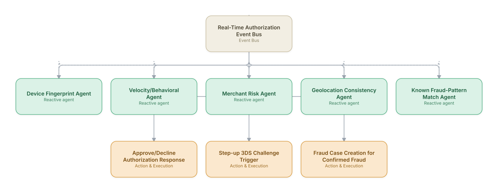

# 04. Fraud Detection - Card-Not-Present Transactions

**Domain:** Financial Services &nbsp;|&nbsp; **Architecture pattern:** [Event-Driven Reactive Swarm]({{ '/patterns/event-swarm/' | relative_url }})

> 🧠 **Deep dive available:** this use case also has a full [8-Layer Regenerative Architecture breakdown]({{ '/deep8/finance/04-card-not-present-fraud-detection/' | relative_url }}) — the same problem mapped through L1–L8, with an agent-level tools/technologies stack and a suggested build order by layer.

## 1. Problem Statement & Use Case

Card-not-present (e-commerce) fraud requires a decision within ~100ms at authorization time, evaluating device fingerprint, velocity, merchant risk, and behavioral signals simultaneously. A reactive swarm of specialized micro-agents subscribed to the transaction event stream can each contribute a fast partial signal that a real-time scorer combines, without the latency cost of a single monolithic model.

## 2. End-to-End Multi-Agent Architecture

The solution is implemented as a **Event-Driven Reactive Swarm** architecture. 
### 2.1 Agents & Sub-Agents

| Agent | Responsibility |
|---|---|
| Real-Time Scoring Aggregator | Combines all agent signals within the authorization time budget into a single risk score |
| Device Fingerprint Agent | Evaluates device/browser fingerprint reputation and consistency with account history |
| Velocity/Behavioral Agent | Checks transaction velocity and behavioral deviation from the cardholder's baseline |
| Merchant Risk Agent | Scores merchant category/reputation risk, including known fraud-prone merchants |
| Geolocation Consistency Agent | Flags impossible-travel or geo-IP/billing-address mismatches |
| Known Fraud-Pattern Match Agent | Matches against real-time-updated fraud signatures from the card network |

### 2.2 Architecture Diagram

> This diagram is organized as a **layered architecture**: Data &amp; Integration → Orchestration → Agent →
> Action &amp; Execution, plus a cross-cutting Observability &amp; Governance layer (tracing, audit log,
> guardrails, and any human review checkpoint — shown in lavender). See the
> [E2E Platform Architecture]({{ '/architecture/e2e-platform-architecture/' | relative_url }}) for how this
> layering looks across all 60 use cases at once. A [Mermaid text source](architecture.mmd) of the same
> diagram is also available in this folder.

## 3. Technologies Used (per step)

| Step / Layer | Technology |
|---|---|
| Event streaming | Kafka with sub-10ms consumer group processing |
| Agent runtime | In-memory feature-serving microservices (not LLM-based for the hot path — latency-critical) |
| Feature store | Real-time feature store (Feast/Tecton) for behavioral baselines |
| Aggregation model | Gradient-boosted ensemble combining agent signals, trained on labeled fraud outcomes |
| 3DS orchestration | EMVCo 3-D Secure step-up integration |
| Network intelligence | Visa/Mastercard real-time fraud signal feeds |
| Offline LLM layer | Claude used asynchronously for case investigation and fraud-pattern narrative generation post-decision |
| Monitoring | Real-time false-positive/false-negative dashboard with decline-rate business impact tracking |

## 4. Suggested Build Order

**Phase 1 — one reactive agent.** Get Device Fingerprint Agent subscribed to Real-Time Authorization Event Bus and reacting to real events, with no other agents listening yet. Prove the event-driven mechanics work under real event volume before adding more subscribers.

**Phase 2 — add the remaining agents.** Bring Velocity/Behavioral Agent, Merchant Risk Agent, Geolocation Consistency Agent, Known Fraud-Pattern Match Agent online as independent subscribers. Test what happens when multiple agents react to the *same* event — this is where swarm-specific bugs (duplicate actions, conflicting responses) show up.

**Phase 3 — add rate limits and blast-radius guardrails.** A reactive swarm with no shared coordination can act on the same trigger repeatedly; add per-agent and global rate limits before connecting real downstream actions.

**Phase 4 — observability and feedback.** Add distributed tracing across the event bus so a cascading reaction across multiple agents can be reconstructed after the fact, not just guessed at.

## 5. If We Rebuilt This: What Would Improve

- Confirmed the hot-path decision must stay in low-latency ML/rules, not LLM calls — an early experiment routing borderline cases through an LLM blew the latency SLA.
- Would add explicit false-positive cost tracking (declined legitimate transactions) as a KPI with equal weight to fraud-catch rate from the start.
- Add a feedback loop from confirmed-fraud/confirmed-legitimate chargebacks to continuously recalibrate each agent's weight in the aggregator.
- Geolocation agent needed VPN/proxy-awareness tuning — over-flagged legitimate VPN users initially, requiring a more nuanced risk tiering instead of a binary flag.

---
[← Back to Financial Services index]({{ '/finance/' | relative_url }}) &nbsp;|&nbsp; [← Back to home]({{ '/' | relative_url }})
