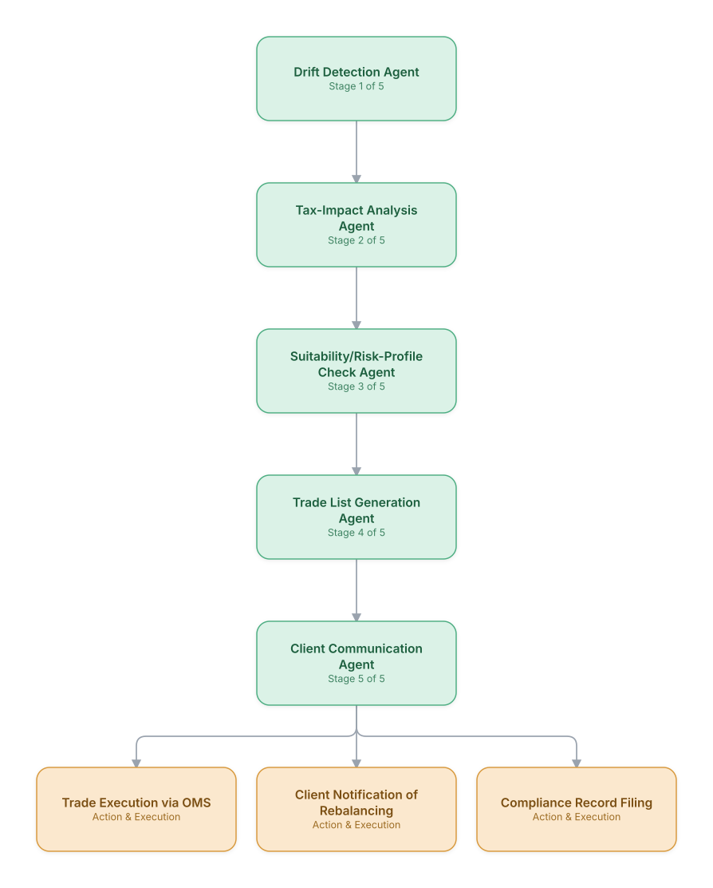

# 06. Wealth Management: Robo-Advisory Portfolio Rebalancing

**Domain:** Financial Services &nbsp;|&nbsp; **Architecture pattern:** [Sequential Pipeline](../../patterns/pipeline.md)

> 🧠 **Deep dive available:** this use case also has a full [8-Layer Regenerative Architecture breakdown](../../deep8/finance/06-robo-advisory-portfolio-rebalancing/README.md) — the same problem mapped through L1–L8, with an agent-level tools/technologies stack and a suggested build order by layer.

## 1. Problem Statement & Use Case

Automated investment advisory platforms need to continuously monitor client portfolios against target allocations, tax considerations, and changing risk profiles, then execute rebalancing trades — all while meeting fiduciary duty and suitability documentation requirements. A pipeline of specialized agents keeps this both scalable and auditable across millions of accounts.

## 2. End-to-End Multi-Agent Architecture

The solution is implemented as a **Sequential Pipeline** architecture. 
### 2.1 Agents & Sub-Agents

| Agent | Responsibility |
|---|---|
| Drift Detection Agent | Scans all client portfolios daily for allocation drift beyond configured bands |
| Tax-Impact Analysis Agent | Computes tax-loss harvesting opportunities and capital-gains impact of proposed trades |
| Suitability/Risk-Profile Check Agent | Confirms the rebalancing target still matches the client's current risk profile/goals |
| Trade List Generation Agent | Produces the minimal-turnover trade list to restore target allocation |
| Client Communication Agent | Generates a plain-language explanation of why and what is being rebalanced |

### 2.2 Architecture Diagram

> This diagram is organized as a **layered architecture**: Data &amp; Integration → Orchestration → Agent →
> Action &amp; Execution, plus a cross-cutting Observability &amp; Governance layer (tracing, audit log,
> guardrails, and any human review checkpoint — shown in lavender). See the
> [E2E Platform Architecture](../../architecture/e2e-platform-architecture.md) for how this layering looks
> across all 60 use cases at once. A [Mermaid text source](architecture.mmd) of the same diagram is also
> available in this folder.

## 3. Technologies Used (per step)

| Step / Layer | Technology |
|---|---|
| Portfolio monitoring | Daily batch job over custodian position feeds (Schwab/Fidelity API) |
| Tax optimization | Tax-lot-level optimization engine for loss-harvesting and wash-sale avoidance |
| Suitability check | Rules engine cross-referencing latest risk-questionnaire/IPS data |
| Trade generation | Portfolio optimization (mean-variance / risk-parity) with turnover minimization constraint |
| Orchestration | Airflow/Temporal daily pipeline processing accounts in batches |
| Communication | Claude generating client-facing rebalancing explanations from structured trade rationale |
| Execution | OMS/custodian trading API integration |
| Compliance | Fiduciary-duty documentation auto-filed per trade batch (Form ADV / suitability records) |

## 4. Suggested Build Order

**Phase 1 — the first two stages only.** Get Drift Detection Agent feeding Tax-Impact Analysis Agent correctly, with the rest of the pipeline stubbed out. Durability matters more than completeness here — make sure a crash mid-pipeline doesn't lose or duplicate work.

**Phase 2 — the full chain.** Add the remaining 3 stages in order, testing each newly-added stage against real output from the stage before it, not synthetic test data.

**Phase 3 — add retry and partial-failure handling.** Decide, stage by stage, what happens when that specific stage fails: retry, skip, or halt the whole pipeline. This decision is different per stage and shouldn't be a single global policy.

**Phase 4 — observability and feedback.** Add per-stage tracing so a slow or wrong pipeline run can be attributed to one specific stage, and track output quality over time to catch silent degradation in an early stage before it compounds downstream.

## 5. If We Rebuilt This: What Would Improve

- Would add an explicit human-advisor review step for large or unusual rebalances (e.g., >$X or >Y% turnover) rather than full automation for every account tier.
- Tax-impact analysis needed wash-sale rules across the client's entire household (not just one account) — a costly gap discovered after early tax season.
- Client communication drafts initially felt robotic; iterated with real advisors to make explanations feel personalized, not templated.
- Would build a dry-run/simulation mode into the pipeline from the start so compliance could validate trade-list logic against edge cases before go-live.

---
[← Back to Financial Services index](../README.md) &nbsp;|&nbsp; [← Back to home](../../../README.md)
