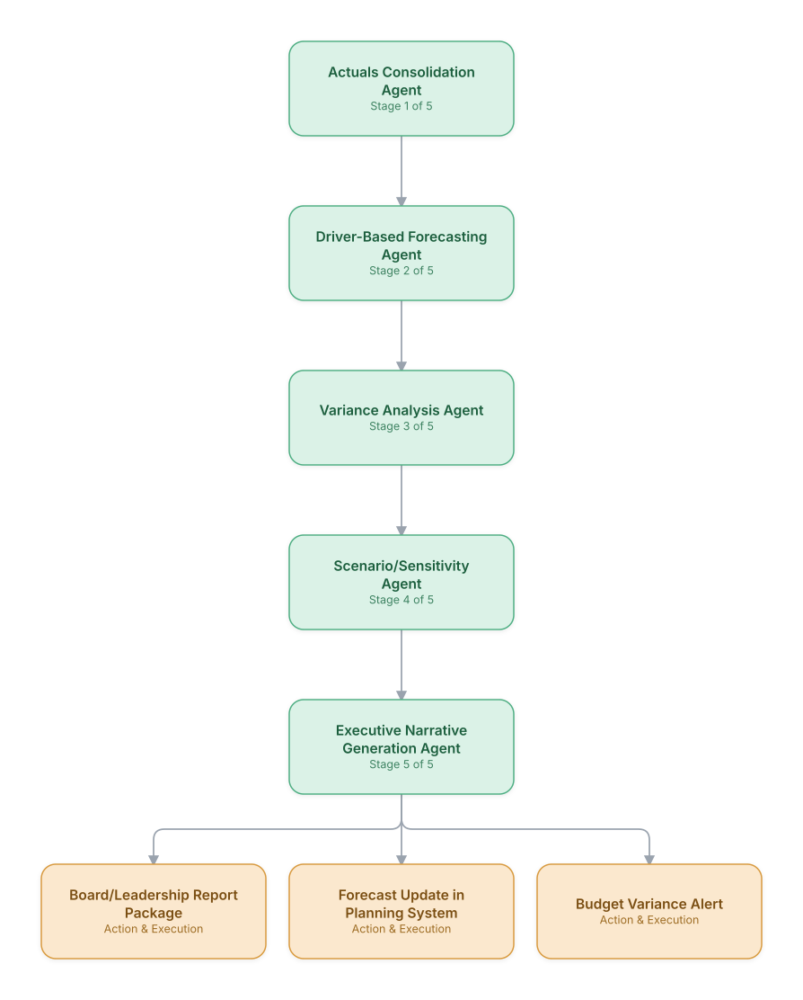

# 10. Financial Planning & Analysis (FP&A) Forecasting

**Domain:** Financial Services &nbsp;|&nbsp; **Architecture pattern:** [Sequential Pipeline]({{ '/patterns/pipeline/' | relative_url }})

> 🧠 **Deep dive available:** this use case also has a full [8-Layer Regenerative Architecture breakdown]({{ '/deep8/finance/10-fpna-forecasting/' | relative_url }}) — the same problem mapped through L1–L8, with an agent-level tools/technologies stack and a suggested build order by layer.

## 1. Problem Statement & Use Case

Corporate FP&A teams spend weeks each quarter consolidating actuals across business units, building forecasts, and preparing variance-explanation narratives for leadership. Manual Excel-based consolidation is error-prone and slow to adapt when business drivers change mid-quarter. An automated pipeline can consolidate, forecast, and narrate variances continuously rather than only at quarter-end.

## 2. End-to-End Multi-Agent Architecture

The solution is implemented as a **Sequential Pipeline** architecture. 
### 2.1 Agents & Sub-Agents

| Agent | Responsibility |
|---|---|
| Actuals Consolidation Agent | Pulls and consolidates actuals from ERP/GL across business units into a unified structure |
| Driver-Based Forecasting Agent | Updates rolling forecasts using business drivers (headcount, pipeline, macro indicators) |
| Variance Analysis Agent | Identifies and explains material variances between forecast and actuals per line item |
| Scenario/Sensitivity Agent | Generates upside/downside scenarios based on key driver sensitivity |
| Executive Narrative Generation Agent | Drafts the leadership-ready summary connecting numbers to business explanations |

### 2.2 Architecture Diagram

> This diagram is organized as a **layered architecture**: Data &amp; Integration → Orchestration → Agent →
> Action &amp; Execution, plus a cross-cutting Observability &amp; Governance layer (tracing, audit log,
> guardrails, and any human review checkpoint — shown in lavender). See the
> [E2E Platform Architecture]({{ '/architecture/e2e-platform-architecture/' | relative_url }}) for how this
> layering looks across all 60 use cases at once. A [Mermaid text source](architecture.mmd) of the same
> diagram is also available in this folder.

## 3. Technologies Used (per step)

| Step / Layer | Technology |
|---|---|
| Data consolidation | ERP integration (SAP/Oracle) + data warehouse (Snowflake) consolidation layer |
| Forecasting | Driver-based forecasting models (statistical + ML ensemble) per P&L line |
| Variance analysis | Automated variance decomposition (price/volume/mix analysis) |
| Scenario modeling | Monte Carlo sensitivity analysis on key driver assumptions |
| Orchestration | dbt + Airflow pipeline with agent-based narrative steps |
| Narrative generation | Claude generating variance explanations grounded in the decomposition output |
| Reporting | Automated board-deck generation (pptx skill) from templated slide structure |
| Planning system | Integration with Anaplan/Adaptive Insights for forecast updates |

## 4. Suggested Build Order

**Phase 1 — the first two stages only.** Get Actuals Consolidation Agent feeding Driver-Based Forecasting Agent correctly, with the rest of the pipeline stubbed out. Durability matters more than completeness here — make sure a crash mid-pipeline doesn't lose or duplicate work.

**Phase 2 — the full chain.** Add the remaining 3 stages in order, testing each newly-added stage against real output from the stage before it, not synthetic test data.

**Phase 3 — add retry and partial-failure handling.** Decide, stage by stage, what happens when that specific stage fails: retry, skip, or halt the whole pipeline. This decision is different per stage and shouldn't be a single global policy.

**Phase 4 — observability and feedback.** Add per-stage tracing so a slow or wrong pipeline run can be attributed to one specific stage, and track output quality over time to catch silent degradation in an early stage before it compounds downstream.

## 5. If We Rebuilt This: What Would Improve

- Variance narratives were much more trusted by finance leadership once grounded in structured decomposition (price/volume/mix) rather than free-form LLM explanation — added this structure after early skepticism.
- Would move from quarterly to continuous (weekly) consolidation cadence from the start; the value of catching variance early was clear immediately after launch.
- Add business-unit-level self-service query agent so FP&A isn't the bottleneck for every ad hoc leadership question.
- Driver-based forecast accuracy varied a lot by business unit maturity; would set differentiated confidence-interval reporting per unit rather than a uniform point forecast.

---
[← Back to Financial Services index]({{ '/finance/' | relative_url }}) &nbsp;|&nbsp; [← Back to home]({{ '/' | relative_url }})
